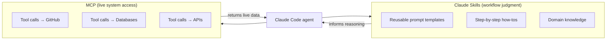
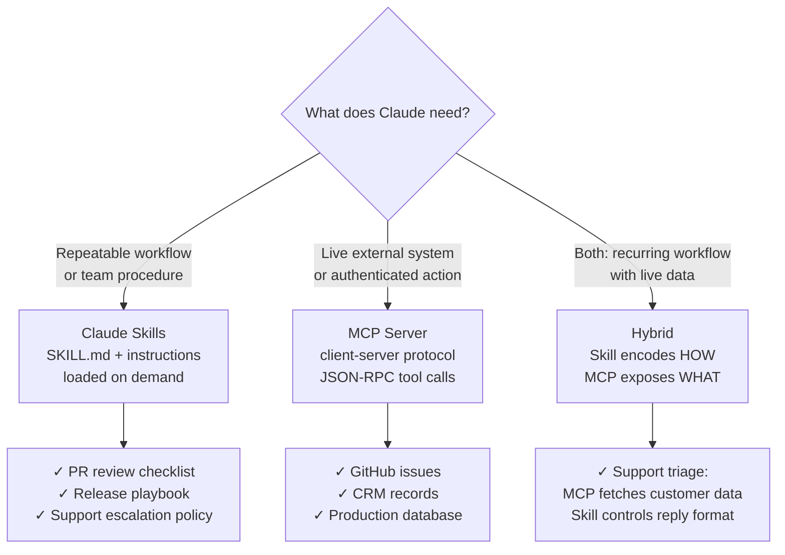

# Choose Claude Skills for workflows and MCP for live systems

Use Claude Skills when you need Claude to follow a repeatable way of working; use MCP when Claude needs access to a live tool, API, database, or application. Skills package instructions, scripts, and references into folders Claude loads on demand, while MCP is a client-server protocol for connecting assistants to external systems ([Anthropic Skills announcement](https://www.anthropic.com/news/skills), retrieved 2026-05-13; [Anthropic MCP announcement](https://www.anthropic.com/news/model-context-protocol), retrieved 2026-05-13).

The missed point is that Skills and MCP are not rivals. Skills encode judgment: how your team reviews PRs, writes incident notes, or runs a release. MCP exposes access: the GitHub issue, the customer record, the database row. Production agents usually need both, but not in the same layer.

<!-- alt: Diagram contrasting Claude Skills (reusable workflow templates and domain knowledge) with MCP (live tool calls to GitHub, databases, and APIs), both feeding the same Claude Code agent. -->

## Use Skills to preserve reusable workflow judgment

Claude Skills are filesystem folders centered on `SKILL.md`. Anthropic describes them as specialized folders with instructions, scripts, and resources that Claude can load dynamically for specific tasks ([Introducing Agent Skills](https://www.anthropic.com/news/skills), retrieved 2026-05-13). The docs call out progressive disclosure: Claude scans metadata first, loads the full Skill when relevant, and only opens extra resources or scripts when needed ([Agent Skills overview](https://platform.claude.com/docs/en/agents-and-tools/agent-skills/overview), retrieved 2026-05-13).

That makes a Skill the right default when the missing capability is procedural. Use it for repo review rules, editorial style, release checklists, migration playbooks, or support escalation policy. Anthropic's engineering write-up frames the same pattern as organized folders that agents can discover and load to perform better at specific tasks ([Equipping agents for the real world with Agent Skills](https://www.anthropic.com/engineering/equipping-agents-for-the-real-world-with-agent-skills), retrieved 2026-05-13). The May 22, 2026 SkillOpt paper also treats agent skills as reusable procedural knowledge that can be improved over time, which is much closer to workflow memory than connector plumbing ([SkillOpt](https://arxiv.org/abs/2605.23904), retrieved 2026-05-26).

<RunPromptCell>
prompt: |
  # Create a minimal Claude Code skill for repo-specific PR reviews
  mkdir -p .claude/skills/pr-review
  cat > .claude/skills/pr-review/SKILL.md <<'EOF'
  ---
  name: pr-review
  description: Review pull requests for security regressions, missing tests, and rollout risk.
  ---

  # PR Review
  - Read the diff before commenting.
  - Flag security, data-loss, and auth issues first.
  - End with PASS, CHANGES, or BLOCK.
  EOF
expected_output: |
  .claude/skills/pr-review/SKILL.md exists and [Claude Code](/blog/cursor-3-2-vs-claude-code-workflow) can discover the skill when PR review is requested.
</RunPromptCell>

## Use MCP to expose live systems and authenticated actions

MCP is the right default when Claude needs current external state. Anthropic introduced it as an open standard for connecting AI assistants to systems where data lives, and the official docs define the architecture around clients, servers, and apps ([Introducing the Model Context Protocol](https://www.anthropic.com/news/model-context-protocol), retrieved 2026-05-13; [What is MCP?](https://modelcontextprotocol.io/docs), retrieved 2026-05-13).

That means MCP is for querying GitHub issues, reading CRM records, calling internal services, writing tickets, or exposing organization tools across more than one assistant surface. The quickstart shows the practical cost: even a basic MCP server has an executable, runtime, transport, tool schema, and client configuration ([Build an MCP server](https://modelcontextprotocol.io/quickstart), retrieved 2026-05-13). That overhead is wasted for static instructions, but justified when the agent crosses a live application boundary.

The recent release cadence reinforces the point. The official Python SDK shipped v1.27.1 on May 8, 2026, and the [MCP registry](/blog/mcp-server-registry-security) shipped v1.7.9 on May 12, 2026 ([modelcontextprotocol/python-sdk v1.27.1](https://github.com/modelcontextprotocol/python-sdk/releases/tag/v1.27.1), retrieved 2026-05-26; [modelcontextprotocol/registry v1.7.9](https://github.com/modelcontextprotocol/registry/releases/tag/v1.7.9), retrieved 2026-05-26). Treat MCP like infrastructure with versions and operations, not like a prompt snippet.

## Combine them when workflow repeats but data changes

The strongest pattern is hybrid: a Skill tells Claude how to perform the workflow, and MCP supplies the live reads and writes. Anthropic's code-execution-with-MCP post makes the same direction concrete, arguing that agents can use MCP tool access without pushing every intermediate detail into the model context, and gives a 150,000-token to 2,000-token example for code-mediated tool exploration ([Code execution with MCP](https://www.anthropic.com/engineering/code-execution-with-mcp), retrieved 2026-05-13).

Use this decision rule:

| Scenario | Better default | Why |
| --- | --- | --- |
| Repo-specific review checklist or release playbook | Skill | Stable procedure, low integration overhead |
| Querying GitHub, Slack, CRM, or production metrics | MCP | Needs live state and authenticated actions |
| Support triage with current customer data and house style | Hybrid | MCP fetches records; Skill controls reasoning and format |

Anthropic's March 24, 2026 Claude Code advanced-patterns session puts MCP beside subagents, hooks, and large-repo context strategies for teams scaling Claude Code into real engineering work ([Claude Code Advanced Patterns](https://www.anthropic.com/webinars/claude-code-advanced-patterns), retrieved 2026-05-26). In Paperclip environments, that is also where [[paperclip-create-plugin]] becomes relevant, while [[course/mcp-from-first-principles-to-production/03-tools-resources-prompts]] covers the mechanics of the live boundary.

## Avoid overbuilding the wrong layer

Do not use MCP as a glorified knowledge base. If the information can live in markdown, scripts, templates, or reference files, a Skill is usually cheaper and easier to audit. Do not use Skills as pseudo-connectors either. Skills can contain scripts and resources, but they do not replace authenticated live integrations ([Agent Skills overview](https://platform.claude.com/docs/en/agents-and-tools/agent-skills/overview), retrieved 2026-05-13).

The clean boundary is simple: Skills are memory for how to work; MCP is access to what is changing. Teams that shove process into MCP overbuild infrastructure. Teams that shove live integration into Skills create brittle connectors. Keep memory and access separate, then compose them when the workflow needs both.

## KnowledgeCheck

Question: Your team wants Claude to fetch the latest Jira ticket, read the customer's current plan from billing, then write the reply in your support style with your escalation policy. Which design fits best?

A. Skill only  
B. MCP only  
C. Hybrid: Skill for workflow and MCP for live systems  
D. Neither

Answer: C. The live systems belong behind MCP, while the repeatable support workflow, escalation logic, and writing conventions belong in a Skill.

If that is the architecture you are trying to build, the next useful step is [[mcp-from-first-principles-to-production]]. The course-level skill is learning where to draw the boundary between workflow memory and live integration so your agent stack stays cheap, auditable, and adaptable.
