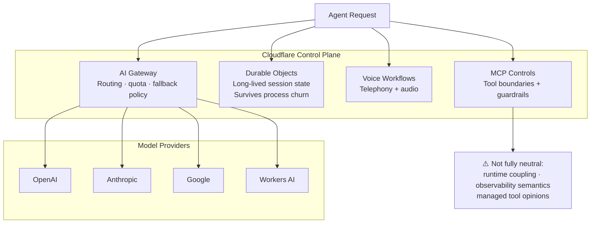

# When Cloudflare fits as an agentic cloud control plane

Cloudflare is becoming a serious candidate for agent infrastructure when the thing you are optimizing is not raw model quality, but the control plane around models: routing, durability, session state, tool boundaries, observability, and safe execution. The April-May platform wave made that visible by connecting AI Gateway, Agents, Project Think, Durable Objects, voice workflows, and MCP-adjacent control surfaces into one operator story.

The right question is not whether Cloudflare "won" the neutral agent layer. It is narrower: when is Cloudflare the right place to run provider-neutral agent infrastructure, and when does the abstraction become a liability?

## When Cloudflare is the right fit

*Alt: Architecture diagram showing Cloudflare's agentic control plane — AI Gateway routing across OpenAI, Anthropic, Google, and Workers AI, with Durable Objects for session state, voice workflows, and MCP controls, plus a callout on partial neutrality tradeoffs.*

Cloudflare is a strong fit when the product problem is operational orchestration rather than model research. If you need to route requests across OpenAI, Anthropic, Google, and Workers AI, Cloudflare gives you a place to centralize that policy without forcing the application to know about every backend directly. That matters when fallback behavior, retries, quota management, and traffic shaping are part of the application contract instead of an afterthought.

It is also a good fit when the agent itself needs durable execution. Durable Objects and Project Think are useful precisely because they make long-lived state, session continuity, and background work part of the runtime boundary. If the agent needs to survive process churn, keep tool state, or coordinate multiple steps across time, Cloudflare has already collapsed those concerns into the platform layer rather than asking you to glue together Redis, queues, and separate workflow infrastructure.

The third fit case is around controlled external surfaces: voice, MCP, and web-facing content. If your agent needs a narrow tool boundary, a managed way to expose content for agent consumption, or guardrails around enterprise integrations, Cloudflare is attractive because the security and routing story lives next to the execution story.

## Where Cloudflare is not automatically neutral

This is the section most launch coverage skips. Cloudflare is not a blank provider-agnostic abstraction. It has opinions, and those opinions matter.

First, there is runtime coupling. If your orchestration strategy assumes portability across cloud providers or self-hosted runtimes, Cloudflare's edge-first model can become the thing you are optimizing around instead of the thing you are abstracting away. That is acceptable when you buy into the edge boundary; it is a problem when you need the platform to disappear.

Second, observability is not free neutrality. Gateway policy, routing logs, trace semantics, and platform-specific guardrails can make Cloudflare's view of the system richer, but also narrower. If your team already has a vendor-neutral tracing standard or wants to keep a single observability plane across multiple clouds, Cloudflare can become one more semantic island.

Third, managed MCP controls are helpful only if you are comfortable with the platform deciding how those boundaries are enforced. Teams that need very explicit tool whitelisting, self-hosted connectors, or custom governance pipelines may find the managed layer too opinionated.

Finally, model abstraction can hide useful differences. A provider-neutral routing layer is valuable for reliability, but some teams depend on model-specific behaviors: tool-calling quirks, long-context ergonomics, response formatting, or provider-native observability and eval hooks. If those differences matter to your product, Cloudflare should be treated as a control plane, not as a universal translation layer.

## Decision rubric

Use Cloudflare when most of these are true:

- You want one routing layer across multiple model providers.
- Your agent requires durable state, session continuity, or long-running execution.
- You are comfortable with edge-native runtime assumptions.
- You want managed guardrails around external tools and enterprise integrations.
- You are optimizing for operator simplicity more than maximal portability.

Avoid Cloudflare when most of these are true:

- You need to move the same runtime across clouds without redesign.
- You rely on model-specific features that a provider abstraction would hide.
- You already have a mature cross-cloud observability and governance stack.
- Your security team wants every MCP/tool boundary to be self-hosted and fully bespoke.
- You need the platform to be invisible, not opinionated.

## The pilot that proves or disproves the fit

The best first pilot is not a full migration. It is a bounded slice:

1. Route one low-risk agent workflow through Cloudflare AI Gateway.
2. Put session state in a Durable Object.
3. Add one external tool boundary through the smallest viable MCP surface.
4. Measure retry behavior, trace clarity, and whether the abstraction hides anything your team needs.

If that pilot improves operational clarity without hiding important model behavior, Cloudflare is probably a fit. If it introduces opaque semantics or forces repeated workarounds, the platform is too opinionated for your stack.

## Draft outline

1. Why the "agentic cloud" framing matters now
2. Where Cloudflare is genuinely strong
3. Where neutrality stops
4. A decision rubric for operators
5. What teams should pilot first

## Working thesis

Cloudflare fits best when the control plane is the product, the workload is edge-adjacent, and the team values durability, routing, and guardrails over total model portability.

Cloudflare fits worst when the team needs model-specific features, deep portability across clouds, or independent observability semantics that do not depend on the edge provider's own runtime and policy layers.

## Evidence to fold in

- AI Gateway for provider routing and fallback behavior
- Durable Objects and Project Think for stateful, long-running execution
- Voice-agent control surfaces for real-time interaction flows
- Markdown-for-Agents / content negotiation for agent-readable surfaces
- Managed MCP / tool boundary concerns and the security story around them

## Next write pass

Expand this scaffold into a 2,000-3,000 word decision guide with:

- a concrete "choose Cloudflare if..." checklist
- a clear "do not choose Cloudflare if..." section
- one architecture diagram paragraph mapping OpenAI, Anthropic, Google, and Workers AI through the same control plane
- one counter-position section on lock-in, observability, and model-specific feature loss
- a short implementation checklist for the first 30-day pilot
