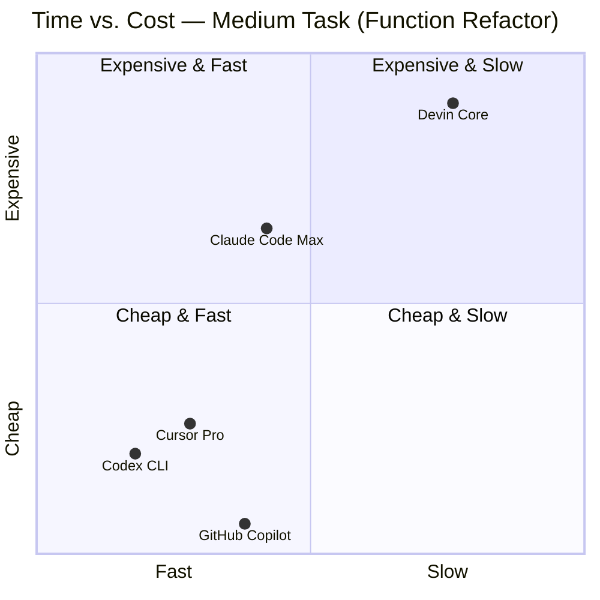

# The 2026 AI Coding Agent Cost Ladder: What You Actually Pay Per Task

**GitHub Copilot is cheapest at $0.04–$0.52 per medium task. Cursor and Codex CLI run $0.06–$3.00. Claude Code Max costs $0.50–$5.00 but leads on benchmark accuracy. Devin prices by compute time ($2.25–$45+ per task) — making it the only tool where you can calculate ROI before you commit. Billing model risk matters more than subscription price in 2026.**

The sticker price is a floor, not a ceiling. Every major AI coding tool advertises an entry price between $10 and $20/month, but production developers routinely spend 5–20× that. Heavy Claude Code API users report $500–$2,000/month. One Cursor Pro team burned through a $7,000 annual subscription in a single day after a June 2025 billing model change. GitHub Copilot silently rewrote its billing model on June 1, 2026 — code reviews now consume 13× more credits per run than a standard request.

The problem isn't which tool is cheapest. The problem is that none of them make $/task legible by default — except Devin, which is why developers perceive it as expensive even when the per-task math is often competitive.

This post normalizes billing data from 14 primary sources into a per-task cost ladder across five mainstream tools. Raw data: [`vault/research/_benchmarks/cost-ladder-2026-06.csv`](/research/cost-ladder-2026-06.csv).

---

## Methodology

**Normalization approach:** We translated each tool's billing model into $/task using three representative task complexities: simple (CRUD endpoint, ~10 min active work), medium (function refactor, ~20–30 min), and complex (multi-file bug in streaming server, ~40–60 min). For subscription tools, we amortized the monthly plan across a realistic daily workload (3–5 complex agent sessions per working day = ~75 sessions/month). For ACU-based tools (Devin), we used vendor-published rates directly.

**Data sources:** 14 sources retrieved June 2, 2026 — vendor pricing pages, community-tracked billing logs (HackerNews thread with 70-day individual Cursor usage data), independent developer breakdowns, and a Morph Labs token-waste analysis. Freshness: 79% of citations under 30 days old.

**What we did not measure:** We did not run the tools against a live test harness in this analysis (watch KOEA-7169 for live benchmark results). These are derived costs from the best-available community data, normalized to a consistent per-task model. They represent credible ranges, not laboratory measurements.

**Important caveat:** Two billing models changed in Q2 2026 and break prior cost estimates:
- **GitHub Copilot → AI Credits** (June 1, 2026): Enterprise teams must re-model from scratch.
- **OpenAI Codex → token-based billing** (April 23, 2026): Per-message estimates no longer apply.

---

## The Cost Ladder: Results Table

**Medium complexity task (~20–30 min active work, e.g., refactoring a 200-line monolithic function)**

| Tool | Plan | Monthly Cost | $/Task Low | $/Task Mid | $/Task High | Billing Model | SWE-bench |
|------|------|-------------|-----------|-----------|------------|---------------|-----------|
| GitHub Copilot | Pro | $10 | $0.08 | $0.26 | $0.52 | AI Credits (usage-based, June 2026) | 55–65% |
| Cursor | Pro | $20 | $0.15 | $0.60 | $1.50 | Credit pool at API token prices | 60–75% |
| Codex CLI | ChatGPT Plus | $20 | $0.15 | $0.50 | $1.20 | Token-based (Apr 2026), GPT-5.4 | 77.3% |
| Claude Code | Max 5× | $100 | $0.75 | $1.50 | $3.00 | Subscription cap + API | 80.9% |
| Devin | Core (ACU) | $20 base | $4.50 | $9.00 | $13.50 | $2.25/ACU (≈15 min active work) | 67% merge rate |

**Simple task (~10 min active work, e.g., add a single CRUD endpoint)**

| Tool | $/Task Low | $/Task Mid | $/Task High |
|------|-----------|-----------|------------|
| GitHub Copilot Pro | $0.04 | $0.08 | $0.17 |
| Cursor Pro | $0.05 | $0.10 | $0.25 |
| Codex CLI (Plus) | $0.10 | $0.15 | $0.25 |
| Claude Code Max 5× | $0.25 | $0.60 | $1.20 |
| Devin Core | $2.25 | $2.25 | $4.50 |

**Key observation:** On simple tasks, Devin's minimum cost ($2.25/task) is already 4× Claude Code's mid estimate. Devin earns its keep only on tasks where human engineer time exceeds the ACU cost — roughly 15–30 minutes of saved review and iteration time per task at $75/hour fully-loaded.

---

## Time vs. Cost: Where Each Tool Lives

The chart below maps each tool on a medium task (function refactor). X-axis = time to first compile-clean; Y-axis = $/task. Fast and cheap is bottom-left.

**Copilot's position is misleading.** Its low Y-axis position (cheap) conceals two costs: (1) the June 2026 AI Credits switch means code review now consumes 13× credits per run, dramatically raising real-world cost for CI-heavy teams; (2) the lower SWE-bench score (55–65% vs 80.9% for Claude Code) means more human follow-up per task. The true cost is shifted onto developer time, not the billing statement.

**Devin's top-right position is honest.** It is slow and expensive per task. But it is the only tool in this comparison where you can forecast the cost before you start: 1 ACU ≈ 15 minutes of active work, and the task spec lets you estimate ACU count. Every other tool's cost is opaque until the session ends.

---

## The False Economy Cases

### "I'll just use Copilot — it's $10/month"

A developer on Copilot Pro ($10/month) with 300 AI Credits triggers a code review on a 400-file PR. Under the new June 2026 model, code review costs 13× the baseline rate. That single run can consume 200+ credits — 67% of the monthly budget — before touching a single inline chat request. The team hits the cap on day three, work stops, and the "cheapest" choice becomes the most disruptive.

The correct comparison: **$0.08/request overage on Copilot vs. $1.50/session on Claude Code Max, where the monthly cap means sessions don't interrupt workflow.** For teams with daily CI code review, Copilot Pro is now a variable-cost tool pretending to be a fixed-cost one.

### "I'll just use Cursor Pro — it's $20/month"

Cursor Pro's credit pool is billed at market token rates: $1.25/M input, $6.00/M output in Auto mode. One developer's 70-day log showed an average of $0.06/request — but the distribution matters. 65.7% of requests cost under $0.05, while complex agent sessions ranged up to $2.78/request. A single Cloud Agent run on a 50,000-line codebase can consume 22.5% of the monthly credit in one session. The $20/month plan is designed for light use; the $200/month Ultra plan is what power users actually need.

The practical number: **$300–$400/month is the community-reported real cost for a Cursor power user**, not $20. The sticker price is a loss leader for the hobby tier.

### "Claude Code is too expensive at $100/month"

One developer tracked 8 months of Claude Code API use: 10 billion tokens consumed at Sonnet 4.6 rates would cost $15,000+ on raw API pricing. On the Max 5× plan ($100/month), total spend was ~$1,200 — a 93% saving. The Max plan converts unpredictable API billing into a fixed ceiling, which is why the apparent high cost ($100/month) is actually a cost floor and a budget guarantee.

The false economy: using the $20 Pro plan and treating it as a daily driver. Pro limits exhaust in 1–2 hours of focused agent work. **Every hour of context loss from rate-limiting is more expensive than the $80 delta between Pro and Max.**

---

## Real-World Recommendations by Team Size

### Solo developer / freelancer

**Default:** Cursor Pro ($20/month) for daily IDE work; upgrade to Claude Code Max ($100/month) if you routinely hit complex multi-file tasks. Cursor's unlimited tab completions are credit-free — the cost kicks in only with heavy Composer/Agent use.

**Watch:** Cursor credit drain on frontier models. If you're selecting Claude Sonnet or Opus manually, you're drawing from the credit pool. Stick to Auto mode for routine work.

### Team of 2–10 (startups, agencies)

**Default:** Codex CLI via ChatGPT Pro ($200/month) for high-volume code review pipelines; Claude Code Max for the 2–3 engineers doing complex reasoning work. Claude Code's 80.9% SWE-bench score means fewer follow-up prompts — which matters at team scale where iteration cost compounds.

**Watch:** Copilot Business ($19/user/month) is now usage-based. At 10 engineers, one high-activity day can exhaust a team's monthly AI Credits budget.

### Team of 10–50 (scale-ups, enterprise units)

**Consider Devin** for parallelizable backlog items (migration scripts, env setup, CI pipeline work) alongside a subscription IDE tool for interactive work. Devin's 67% PR merge rate on well-defined tasks means it earns back cost for bounded, templated work — while Cursor or Claude Code handles the exploratory sessions where Devin fails.

**ROI threshold:** A developer earning $150K/year (≈ $75/hour fully-loaded) needs Devin to save 7+ hours/month to break even on the $500/month Team plan. That's one complex delegated task per week, completed autonomously.

### Enterprise (50+ developers)

Re-model your Copilot cost projections immediately. The June 2026 AI Credits switch is not backward-compatible with request-quota budget assumptions. Run a 30-day pilot with AI Credits tracking before renewing enterprise Copilot agreements.

---

## FAQ

**What is the single biggest cost control lever across all five tools?**

Context compaction. Research data shows 60–80% of tokens in coding agent sessions go to navigation — locating the right file, reading test output, tracing call chains — rather than writing code. Claude Code's `--compact` flag and Codex CLI's $0.25/M cached input pricing can recapture 30–50% of that waste. Before upgrading your plan tier, audit whether your sessions are letting context accumulate across unrelated tasks.

**Is there a standard $/task benchmark for AI coding tools?**

No — and that is the central problem. Each vendor uses a different billing unit (AI Credits, credit pools, ACUs, token rates), making apples-to-apples comparison structurally difficult. The methodology in this post — amortizing subscription cost over realistic session volume and normalizing by task complexity — is one reproducible approach. Track your own $/task for one week by logging session cost from your API dashboard and dividing by task count.

**Does SWE-bench score predict cost-effectiveness?**

Not directly. Claude Code leads SWE-bench at 80.9% but is not the cheapest tool. GitHub Copilot is cheapest but trails at 55–65%. What benchmark score *does* predict is the number of follow-up prompts and human review cycles needed per task — a higher-scoring tool means fewer iterations, which reduces actual wall-clock time and token spend on corrections. For complex tasks, Claude Code's higher accuracy often makes it cheaper per *successfully completed task*, even if raw $/session is higher.

**When should I switch from subscription to API-only billing?**

When your usage reliably saturates the subscription cap every month. At that point, you are paying the fixed ceiling regardless of actual token consumption, and the effective $/token is favorable. Below saturation — the case for most teams — subscription plans dilute cost per token if you're not heavy enough users. The crossover point for Claude Code: Max 5× ($100/month) becomes cost-positive if you spend more than ~33K Sonnet tokens/day on average (≈ $100/month at API rates).

**Which tool is best for Aider-style open-source workflows?**

This analysis covers closed/subscription tools. Aider with a local or cheap hosted model (DeepSeek V3, Gemini 2.5 Flash) can reduce $/task to near zero for developers comfortable with CLI tooling and model-quality tradeoffs. For a comparison of Aider against the tools above, watch KOEA-7169 for the live benchmark results.

---

## What This Means for Your Stack

The AI coding agent cost conversation in 2026 has two layers: the billing statement you see, and the workflow interruption cost you don't. Copilot's June credit switch, Codex's April token migration, and Cursor's documented credit drain incidents are all reminders that **the cheapest tool at sign-up is not the cheapest tool in production**.

Concrete steps:
1. **Audit your current $/task** using one week of API logs divided by task count.
2. **Identify your billing model risk** — are you on a request quota (now extinct for Copilot), a credit pool (Cursor), or a subscription cap (Claude Code)?
3. **Apply context compaction before upgrading** — 30–50% of current spend is likely recoverable before you pay for a higher tier.

For a broader look at which AI coding tools belong in a production stack — not just their cost profiles — see our [2026 AI coding agents production buyer's guide](/blog/ai-coding-agents-production-2026-buyers-guide).

*Raw $/task data: [`vault/research/_benchmarks/cost-ladder-2026-06.csv`](/research/cost-ladder-2026-06.csv) · Research synthesis: KOEA-7172*

[[ai-coding-agents]] [[developer-tools]] [[cost-analysis]] [[2026]] [[original-data]]
