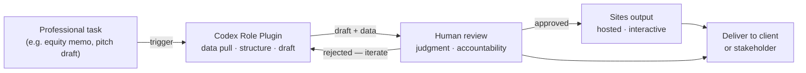

# How to Use OpenAI Codex as a Non-Developer — Without Mistaking the Plugins for Agents

OpenAI crossed 5 million weekly active Codex users on June 2, 2026 — up 6× since the desktop app launched in February [1]. The new headline: knowledge workers now account for 20% of that base and are growing three times faster than developers [1]. To meet that demand, OpenAI shipped six role-specific plugins and a Sites feature that turns Codex output into a hosted interactive website.

This is a meaningful expansion. For analysts, creatives, sales professionals, and bankers who have been watching AI coding tools from a distance, it is also the clearest signal yet that Codex is no longer a developer-only tool.

But the framing around the launch matters. These plugins are not agents. They are structured workflow accelerators — carefully assembled bundles of context, instructions, and integrations aimed at specific job functions. Understanding that distinction is what separates teams that will extract real value from Codex in the next 18 months from those that will overpromise, underdeliver, and walk back.

```takeaways
- 5M weekly active Codex users, up 6× since February; knowledge workers growing 3× faster than developers [1].
- 6 role plugins shipped June 2, 2026: data analytics, creative production, sales, product design, equity investing, investment banking.
- Sites and Annotations expand output formats — but neither adds autonomous decision-making.
```

## What the 6 Role Plugins Actually Do

Each plugin bundles a job-specific prompt system, integrations with relevant data sources, and scoped tool access [1]. Here is what each one covers — and what it cannot do without a professional in the loop:

| Plugin | Accelerates | Cannot replace |
|---|---|---|
| Data Analytics | Data querying, chart generation, pattern surfacing | Hypothesis selection, stakeholder-specific framing |
| Creative Production | Drafts, script outlines, image briefs, copy variants | Brand voice judgment, client approval, tone decisions |
| Sales | Prospect research, email drafts, pipeline summaries | Relationship calls, negotiation judgment, trust-building |
| Product Design | Wireframe descriptions, copy variants, feature scoping | User research synthesis, roadmap trade-offs, PM sign-off |
| Equity Investing | Financial data pulls, memo drafts, sector summaries | Investment recommendation sign-off, fiduciary accountability |
| Investment Banking | Deal structure docs, data room prep, comp table drafts | Client mandate, regulatory representation, deal judgment |

The equity investing and investment banking plugins are the most consequential — and the most easily oversold. A Codex plugin can draft a CIM or surface comparable transactions [1]. It cannot carry the legal standing of an analyst's recommendation. The human's name goes on the document; the professional's judgment must precede it.

```takeaways
- Plugins are prompt bundles with integrations, not autonomous workflows.
- For regulated roles (investing, banking), the plugin accelerates research — professional accountability does not transfer.
- Creative and sales plugins save hours on drafts; judgment on what to send and to whom stays with the practitioner.
```

## Sites and Annotations: What They Add

The **Sites** feature is the most practically useful addition for non-developers. Codex can now publish its output — a dashboard, a report, an internal tool, a prototype — as a hosted interactive website via partners Wix, Base44, Replit, Lovable, Figma, and Emergent [2]. It ships in ChatGPT Business workspaces by default; Enterprise admins can enable via role-based access control [2].

In practice: a product manager can ask Codex to produce a competitive analysis and get a shareable, interactive webpage — not a static PDF and not a local HTML file requiring developer hand-off. The output is real. The interactivity is real. The site is not a live production application; it is output hosting with interactive formatting.

**Annotations** let users designate specific portions of documents — passages, cells, sections — and issue targeted commands against that selection [1]. For knowledge workers who routinely revise sections of long documents (equity memos, project briefs, pitch decks), this reduces the prompting overhead of specifying what to edit. It is precision, not autonomy.

## The Loop You Cannot Automate

OpenAI's own CRO, Denise Dresser, framed the challenge precisely: "The challenge now is helping companies integrate these systems into the infrastructure and workflows that power their businesses." [1]

Infrastructure and workflows are run by people with accountability. Across all six plugins, four categories of work remain irreducibly human:

**Regulatory judgment.** Equity and investment banking work operates under securities law. An AI output has no standing with FINRA or the SEC. A plugin-drafted memo requires a licensed professional's review before it represents anyone's position.

**Client relationships.** Sales and creative work is built on interpersonal trust. A plugin-generated email draft still requires someone to decide whether to send it, when, and in what relationship context.

**Ethical accountability.** Design decisions have downstream product consequences. The plugin that generates wireframe variants cannot weigh accessibility trade-offs, carry product liability, or own the ethical implications of a design choice.

**Contextual authority.** Analytics outputs become decisions when a person with domain authority endorses them. The Codex plugin surfaces patterns; the analyst interprets them in organizational and strategic context.



Skipping the Review node is where adoption failures happen. The loop is the product.

See also: [[prompt-engineering-is-becoming-harness-engineering]] for why the design of the prompt bundle inside a plugin matters more than the underlying model.

## Three Integration Patterns That Work Today

**Draft-then-review cadence.** Use the plugin to generate a first-pass deliverable — memo, analysis, pitch section. Treat the output as a junior draft requiring senior review, not a finished product. Measure time-to-first-draft, not time-to-completion. This reframe alone prevents the most common adoption failure: expecting the plugin to eliminate review.

**Data pull + human framing.** The analytics and equity plugins are strongest at data retrieval and structuring. Hand off the data-gathering task to Codex; retain the framing and interpretation for the human who will present the findings to stakeholders. The plugin does not know your audience.

**Sites for async stakeholder communication.** Instead of a PDF attachment, use Sites to publish a living dashboard or brief that stakeholders can interact with. Combine with Annotations to iterate rapidly based on their feedback before the next meeting.

<RunPromptCell
  model="claude-sonnet-4-6"
  prompt="You are helping a product manager use a Codex plugin to scope a new feature. The PM has a rough feature idea. Write a structured Codex prompt that: (1) defines the job to be done, (2) specifies the output format as a wireframe description plus user story, (3) explicitly instructs Codex NOT to make build-or-buy decisions — those remain with the PM."
  expectedOutput="A structured prompt that separates the AI drafting task from the human decision-making task, with clear output format and explicit human-decision boundary"
/>

<KnowledgeCheck
  question="What does the Codex Sites feature produce?"
  answers={["A live production web application deployable to AWS", "A hosted interactive website published via partner platforms like Wix or Replit", "A local HTML file for developer hand-off", "A PDF with embedded JavaScript interactivity"]}
  correct={1}
/>

## What This Signals About OpenAI's Strategy

The $4 billion OpenAI Deployment Company JV — launched approximately three weeks before this release — is the structural frame [1]. OpenAI is not just building models; it is building a deployment layer for enterprise workflow integration. The knowledge worker growth rate (3× faster than developers) is the market signal justifying that infrastructure investment.

The six plugins are a land-and-expand play. A firm that adopts the equity investing plugin for memo drafts is now inside OpenAI's enterprise sales motion. The Sites partners (Wix, Replit, Lovable, Figma, Emergent) extend that motion into publishing, design, and development workflows — moving Codex from a tool in a developer's terminal to a platform embedded across professional functions.

For teams building AI literacy — the Academy's audience — the right response is not to wait for "true agentic" Codex. It is to learn the current plugins well enough to know exactly where to apply professional judgment. That skill — knowing where the AI stops and you begin — is what the next 18 months will reward.

See also: [[codex-cli-vs-cursor-composer-2]] for how the Codex CLI compares to IDE-first agents for developer-facing workflows.
