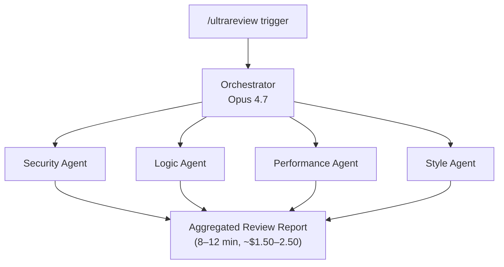

# Run Claude Code Opus 4.7 in Production in 2026: The Complete Guide

Claude Code Opus 4.7 is the right pick when code correctness matters more than speed or cost: SWE-bench Verified 87.6%, SWE-bench Pro 64.3% — best in class as of April 2026. It launched April 16 at $5/$25 per MTok — identical list price to Opus 4.6 — but a new tokenizer makes real-world workloads 15–35% more expensive before any usage changes. For teams doing high-stakes multi-file work, that premium buys the strongest production code correctness available today.

Here's what most teams running Opus 4.7 miss: the community controversy — the "beautiful broken apps," the sticker shock, the [HN complaint threads](https://news.ycombinator.com/item?id=47793411) — all trace back to one design decision. The model shifted from "helpful assistant" to "precise operator." It now executes instructions literally rather than inferring implicit context. That single shift is responsible for both the 87.6% SWE-bench Verified score and the 1.5–3× real-world cost increase casual users report. Teams getting 10× leverage from Opus 4.7 adapted their prompting to the new model. Teams getting sticker shock did not.

This guide covers everything that actually changes your day-to-day Claude Code workflow: the new capabilities, the honest cost math, six failure modes we've documented, and when Codex CLI and Cursor Composer are the right tool instead.


---

## What's New in Opus 4.7 vs 4.6

Opus 4.7 launched GA on April 16, 2026 under model ID `claude-opus-4-7`. [GitHub Changelog confirmed](https://github.blog/changelog/2026-04-16-claude-opus-4-7-is-generally-available/) same-day availability across Claude Code, the API, Bedrock, Vertex, and Cursor — no waitlist or phased rollout, unlike Opus 4.6.

**Three Claude Code-specific additions:**

**`xhigh` effort tier** — a new fifth tier between `high` and `max`. Claude Code defaults to `xhigh` during planning phases. The calibration note from [Anthropic's release notes](https://platform.claude.com/docs/en/release-notes/overview): "Low-effort Opus 4.7 is roughly equivalent to medium-effort Opus 4.6." That means the effort ladder shifted — running `low` effort on 4.7 to save tokens doesn't give you the equivalent of `low` on 4.6. Set effort by phase, not globally:

| Phase | Recommended effort | Rationale |
|---|---|---|
| Planning | `xhigh` | Quality compounds downstream |
| Execution | `high` | Specialists work from clear plans |
| Verification | `xhigh` | Catch issues before ship |
| Exploration | `medium` | Cost-sensitive, low-stakes |
| Critical evals | `max` | Correctness-critical |

**Task budgets** — a soft token ceiling the model self-moderates toward. Unlike `max_tokens` (a hard ceiling the model cannot see), task budgets are a suggestion the model works within:

```json
{
  "task_budget": {
    "type": "tokens",
    "total": 128000
  }
}
```

Requires the `task-budgets-2026-03-13` beta header. Minimum recommended: 20,000 tokens. Rule of thumb from [Caylent's production analysis](https://caylent.com/blog/claude-opus-4-7-deep-dive-capabilities-migration-and-the-new-economics-of-long-running-agents): "Start at 2–3× the tokens a competent human engineer would need." Set too low and the model refuses outright — see Failure Mode 5.

**`/ultrareview` command** — spawns four parallel specialist agents (security, logic, performance, style) in a single pass. This is Opus 4.7's native preference for parallel specialist dispatch, made accessible as a CLI command. Before: one review agent tried to check all four domains sequentially. Now: four specialists fire in parallel and each goes deep on their domain.



**Vision at 3× resolution.** Images up to 2,576 px on the long edge vs ~800 px on 4.6. [Vellum's benchmark analysis](https://www.vellum.ai/blog/claude-opus-4-7-benchmarks-explained) puts visual-acuity at 98.5% vs 54.5% for Opus 4.6. Screenshot-based UI debugging and design-to-code workflows are first-class Claude Code inputs now.

**Breaking API changes** that return HTTP 400 on Opus 4.7 (not on 4.6):
- `temperature`, `top_p`, `top_k` removed entirely
- Fixed `budget_tokens` thinking → `adaptive` mode only
- `thinking.display` defaults to `"omitted"` — add `"summarized"` explicitly if you surface reasoning to users

Successor note: Claude Opus 4.8 launched May 28, 2026 at identical pricing with a superset of 4.7 capabilities. For net-new deployments started after June 2026, 4.8 is recommended. This guide covers 4.7 because it's the model most Claude Code production systems ran during the April–May 2026 window.

---

## Real Cost Analysis: Three Workflow Types

List price is identical to Opus 4.6: $5/$25 per MTok input/output. The cost story is in the tokenizer.

Opus 4.7 ships a new tokenizer that encodes 1.0–1.35× more tokens for the same input text — a silent cost increase before any model behavior changes. Teams that migrated 4.6 prompts to 4.7 without benchmarking first have reported unexpected cost spikes, per [Ofox.ai's production post-mortem](https://ofox.ai/blog/claude-opus-4-7-production-reliability-fix-2026/).

The following estimates are derived from tokenizer math and research data. These are not internally measured figures — benchmark your own workloads before committing:

| Workflow | Input est. (post-tokenizer) | Output est. | Opus 4.7 est. | Opus 4.6 equiv. |
|---|---|---|---|---|
| Single-file bug fix (~15 min) | ~18K tokens | ~4K tokens | **~$0.19** | ~$0.14 |
| Multi-file refactor (~45 min) | ~100K tokens | ~28K tokens | **~$1.20** | ~$0.85 |
| `/ultrareview` pass (4 agents) | ~200K tokens | ~40K tokens | **~$2.00** | ~$1.40 |

**Where the 1.5–3× community figure comes from.** The tokenizer adds 15–35%. But casual users also hit what [Claudefa.st's guide](https://claudefa.st/blog/guide/development/opus-4-7-best-practices) calls the "ambiguity tax": vague prompts require more iterations when the model stops inferring unstated context. Add xhigh effort defaults on planning phases and adaptive thinking overhead, and the real-world cost of an under-tuned 4.7 workflow lands at 1.5–3× the equivalent 4.6 run.

For precise prompts with explicit acceptance criteria, the increase is more like 20–50% — primarily the tokenizer and effort-tier changes, with fewer wasted iterations. The cost leverage formula: every hour spent converting implicit context to explicit acceptance criteria saves 3–5× its cost in reduced iterations.

---

## Memory, Plan Mode, and Long-Context Workflows

The 1M token context window is GA on Opus 4.7 — no beta header required, unlike the `context-1m-2025-08-07` header period on 4.6. Standard account limits apply.

The higher-leverage change is the **Detailed Plan Pattern**. Opus 4.7's literal execution means a front-loaded plan is no longer optional — it's the primary quality lever. An effective plan must include:
- Intent + scope boundaries (what the agent will and will not touch)
- Relevant files with line numbers
- Acceptance criteria per task
- Specialist agent assignments
- Verification steps before completion

Claude Code's `/team-plan` → `/build` pipeline enforces this structure:
1. `/team-plan` — auto-detects session type, outputs structured task files
2. `/build` — dispatches specialists with mandatory plan-reading, preventing scope drift

**Context recovery protocol.** Set checkpoints at 50K tokens, then every 10K. Marathon runs that hit the context wall with no graceful degradation are the viral failure mode — see "Failure 3" below. LibraryHook auto-sync prevents context loss on session crash.

**Fast mode nuance.** Fast mode for Opus 4.7 arrived as a research preview on May 12, 2026 via `fast-mode-2026-02-01` beta header. Max plan Claude Code users defaulted to Opus 4.6 in fast mode through mid-May, switching to Opus 4.7 only after the May 12 update. If you're on a Max plan and noticed quality changes around that date, that's the cause.

---

## Tool Use and MCP Integration Patterns

Opus 4.7 does not autonomously spawn parallel agents — the plan file must specify specialist assignments explicitly. Specialists read the full plan, execute scoped work, use `TaskUpdate` to signal completion, and gates enforce sequential verification. This is the architecture behind the 14% improvement in complex multi-step workflows at fewer tool errors vs 4.6, per [Anthropic's release announcement](https://www.anthropic.com/news/claude-opus-4-7).

**Running `/ultrareview` in practice:**

```bash
# Stage your changes first
git add -p

# Run the four-specialist review
claude /ultrareview --scope security,logic,performance,style

# Expected output: four parallel agents, 8-12 minutes
# Each produces: findings list, severity ratings, specific line references
# Estimated cost: $1.50-2.50 per pass
```

**MCP server integration.** Opus 4.7's 77.3% MCP-Atlas score makes it the right model for MCP-heavy pipelines. Key production pattern: scope MCP server access per specialist agent — don't give every agent access to every server. The model's literal execution makes overly broad tool access a source of unexpected side effects rather than helpful flexibility.

**`/rewind` on failure.** Double-tap `esc` or use `/rewind` to strip a failed attempt and re-prompt with the failure as learning context. Use this instead of continuing a polluted conversation — with literal execution, a conversation containing a failed attempt will anchor on that failure in subsequent turns.

---

## Six Failure Modes We've Documented

Compiled from [Ofox.ai's production post-mortem](https://ofox.ai/blog/claude-opus-4-7-production-reliability-fix-2026/), [HN thread 47793411](https://news.ycombinator.com/item?id=47793411), and community synthesis from [Botmonster's reception analysis](https://botmonster.com/ai/claude-opus-4-7-x-reddit-reception/).

**Failure 1 — Service-side outages (recoverable).** API returns 5xx or 529 (overloaded). Elevated error rates hit the Anthropic status page on May 22 and May 25, 2026. Fix: exponential backoff — 30s → 60s → 120s, max 3 attempts.

**Failure 2 — Silent model-side regressions (the hard one).** API returns HTTP 200 but quality degrades. Community documented "launch-week 4.7 was excellent, week-two 4.7 was meaningfully worse" — surface-level pattern matching, dropped instructions across turns. Retry logic cannot fix this: "retrying gets you a different bad answer." Fix: deploy daily quality canaries using three known-answer prompts before routing production traffic. Detect the regression before it hits real work.

**Failure 3 — Marathon run context exhaustion.** Long sessions hit the context wall with no graceful degradation, producing the viral "[68 minutes, millions of tokens, app broken… but god it was beautiful](https://botmonster.com/ai/claude-opus-4-7-x-reddit-reception/)" failure mode. Fix: context checkpoints at 50K and every 10K, `/rewind` after failures, never continue a polluted conversation.

**Failure 4 — Vague prompt underperformance.** Prompts that relied on "obviously also add tests" fail silently — the model executes exactly what you specified. The helpful-assistant behavior that inferred implicit context is gone. Fix: convert implicit context to explicit acceptance criteria before the session starts. Replace "don't guess" with positive examples of what correct output looks like.

**Failure 5 — Task budget refusal.** Budgets set too low trigger outright rejection rather than graceful degradation. Minimum: 20,000 tokens. Fix: start at 2–3× estimated human engineer token usage for the task.

**Failure 6 — Adaptive thinking not engaging.** The model self-allocates reasoning depth but sometimes underestimates task complexity. The former workaround (disabling adaptive thinking) is no longer available — it's mandatory on 4.7. Fix: set `/effort xhigh` and add explicit complexity signals to the prompt ("this requires analyzing 14 call sites across 6 modules").

**Recommended fallback chain:**
```
Primary:   claude-opus-4-7  (claude-opus-4-8 for post-May-28 deployments)
Fallback:  exponential backoff on 5xx/529 (3 attempts)
Emergency: claude-sonnet-4-6  (latency-critical degraded mode)
```

---

## Opus 4.7 vs Codex CLI vs Cursor Composer 2.5

The benchmark comparison, using data from [DataCamp's model analysis](https://www.datacamp.com/blog/gpt-5-5-vs-claude-opus-4-7) and [Artificial Analysis](https://artificialanalysis.ai/models/claude-opus-4-7):

| Benchmark | Opus 4.7 | Codex CLI / GPT-5.4 | Cursor Composer 2.5 |
|---|---|---|---|
| SWE-bench Verified | **87.6%** | ~80% | 61.3% |
| SWE-bench Pro | **64.3%** | 57.7% | — |
| Terminal-Bench | 69.4% | **82.7%** | — |
| MCP-Atlas (multi-tool) | **77.3%** | — | — |
| Speed | ~67 tok/s | ~120 tok/s | ~200 tok/s |
| Input cost | $5/MTok | $3/MTok | ~$0.80/MTok |

For full workflow comparisons, see [Codex CLI vs Cursor Composer 2](/blog/codex-cli-vs-cursor-composer-2) and [Cursor 3.2 vs Claude Code workflow](/blog/cursor-3-2-vs-claude-code-workflow). The [AI coding agents production buyers guide](/blog/ai-coding-agents-production-2026-buyers-guide) covers the full selection framework.

**Use Opus 4.7 / Claude Code when:**
- Correctness-critical multi-file refactors — 87.6% SWE-bench Verified is the benchmark that matters here
- Multi-agent MCP pipelines where tool orchestration is the bottleneck (77.3% MCP-Atlas)
- Headless CI integration via the Agent SDK
- Visual input workflows — 3× resolution makes design-to-code viable
- You need auditable, reproducible agent runs with plan artifacts

**Use Codex CLI when:**
- Terminal-native work where speed matters more than correctness depth
- Terminal-Bench tasks — 82.7% vs 4.7's 69.4% is a real gap on this benchmark class
- Budget-constrained batch workloads — roughly 40% cheaper at $3/MTok input

**Use Cursor Composer 2.5 when:**
- IDE-first interactive development where inline diff review and autocomplete are the daily workflow
- Team is VS Code or JetBrains-native and IDE UX is the primary friction point
- Price sensitivity is high — Cursor's underlying model is approximately 86% cheaper per token than Opus 4.7

**The BrowseComp regression.** Opus 4.7 dropped 4.4 points on BrowseComp vs 4.6 — web research and browsing-heavy agent workflows are measurably weaker. For pipelines with research legs, route those to Sonnet 4.6 or use a hybrid routing pattern. "Claude Code for everything" defaults cost you measurably here.

---

## Migration Checklist from Opus 4.6

Before upgrading production Claude Code workflows, per the [official migration guide](https://platform.claude.com/docs/en/release-notes/overview):

- [ ] Remove `temperature`, `top_p`, `top_k` from all API calls
- [ ] Switch `thinking: {type: "enabled", budget_tokens: N}` → `thinking: {type: "adaptive"}`
- [ ] Add `thinking.display: "summarized"` if you surface reasoning to users
- [ ] Benchmark tokenizer token counts on your actual production prompts — budget for 15–35% cost increase
- [ ] Audit prompts for implicit context — convert to explicit acceptance criteria
- [ ] Replace negative instructions ("don't guess") with positive examples
- [ ] Set task budgets at 2–3× estimated task token cost, minimum 20K tokens
- [ ] Deploy quality canaries before routing production traffic

---

## Runnable Example: Effort-Per-Phase Pattern

```bash
# Set model and effort for planning phase
claude /model claude-opus-4-7
claude /effort xhigh

# Generate a structured plan — outputs PLAN.md with intent, scope,
# file references, acceptance criteria, and specialist assignments
claude /team-plan

# Drop to high effort for execution — specialists work from the plan
claude /effort high
claude /build

# Back to xhigh for verification before shipping
claude /effort xhigh
claude /verify
```

Expected output from `/team-plan`: a `PLAN.md` broken into scoped sections per specialist role. `/build` reads this and dispatches each specialist with only the plan section relevant to their work, preventing scope drift and reducing the total token cost vs a monolithic agent session.

---

**KnowledgeCheck:** You're migrating a production Claude Code pipeline from Opus 4.6 to 4.7. The pipeline includes `temperature: 0.2` and `thinking: {type: "enabled", budget_tokens: 4096}` in the API calls. What two changes are required, and what unexpected cost will you encounter if you don't benchmark your token counts first?

<details>
<summary>Answer</summary>

Remove `temperature: 0.2` — the parameter is gone on Opus 4.7 and returns HTTP 400. Replace `thinking: {type: "enabled", budget_tokens: 4096}` with `thinking: {type: "adaptive"}` — fixed budget_tokens is no longer supported. The unexpected cost: Opus 4.7's new tokenizer encodes 15–35% more tokens for the same input text. The same prompts that cost X tokens on 4.6 cost up to 1.35X on 4.7, with identical list price, so real per-request cost increases silently before you've changed anything about how you use the model.

</details>

---

The prompting patterns that unlock Opus 4.7's production ceiling — explicit scope boundaries, acceptance criteria per task, MCP server integration — are exactly what the [[course/claude-tool-use-from-zero]] course covers. If the "precise operator" behavioral shift is the gap between your current Claude Code results and what the benchmarks promise, start there.
