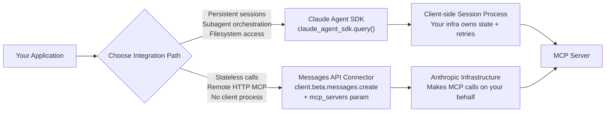

# Wire Claude Agent SDK to an MCP Server: Minimal Production Setup (2026)

The Claude Agent SDK and Anthropic's Messages API MCP connector are two separate production paths. The Agent SDK (`claude_agent_sdk.query()`) maintains a persistent session process; the Messages API connector (`client.beta.messages.create` with `mcp_servers`) lets Anthropic's infrastructure call your remote MCP server on every request — no client process, no sticky sessions. Most production teams need the connector, not the SDK.

Most tutorials treat these as synonyms. They are not. The Agent SDK is a persistent-session runtime designed for long-running agents with filesystem access, subagent orchestration, and background tasks. The Messages API MCP connector is a stateless HTTP parameter — Anthropic's servers make the MCP calls on your behalf, and the result lands in your response like any other tool result. Building an MCP client process when all you needed was the connector is the most common over-engineering mistake in production Anthropic deployments right now.

## Two Paths, One Protocol


*Alt: Flowchart showing two Anthropic MCP integration paths — the Agent SDK maintaining a persistent client-side session versus the Messages API connector routing through Anthropic's infrastructure for stateless calls.*

[[glossary/model-context-protocol|MCP (Model Context Protocol)]] is now the default integration layer for production AI agents. Its spec `2025-11-25` ships Streamable HTTP as the standard remote transport, and the upcoming `2026-07-28` release candidate eliminates protocol-level sessions entirely — stateless servers can run behind round-robin load balancers with no sticky routing required.[^1] Both Anthropic paths converge on MCP; they differ in *who* runs the MCP client.

| Dimension | Messages API MCP connector | Agent SDK |
|---|---|---|
| **Who runs the MCP client** | Anthropic's servers | Your process |
| **Session model** | Stateless (one request) | Persistent session |
| **Transport** | Remote HTTP only | stdio, HTTP, SDK |
| **Filesystem access** | ✗ | ✓ (sandboxed) |
| **Subagents** | ✗ | ✓ |
| **File checkpointing** | ✗ | ✓ |
| **Billing (subscriptions)** | Pay-as-you-go | Separate Agent SDK credit (from June 15, 2026) |
| **Right default for** | API-first, stateless workloads | Long-running agents, coding tasks |
| **Min. code to wire** | ~15 lines | ~25 lines |

This table reflects a synthesis of the official Agent SDK overview[^2] and MCP connector documentation[^3], and the billing credit announcement.[^4]

## Path 1: The Messages API MCP Connector (Stateless Default)

The `mcp_servers` parameter on `client.beta.messages.create` is the fastest production path when your MCP server is a remote HTTP endpoint. Anthropic handles the client-side MCP protocol, tool negotiation, and transport — your code sees only the final text result.

```python
import anthropic

client = anthropic.Anthropic()

response = client.beta.messages.create(
    model="claude-opus-4-7",
    max_tokens=2048,
    messages=[{
        "role": "user",
        "content": "Summarize the top 3 open issues assigned to me in GitHub."
    }],
    mcp_servers=[{
        "type": "url",
        "url": "https://your-mcp-server.example.com/mcp",
        "name": "github",
        "authorization_token": "Bearer YOUR_OAUTH_TOKEN",
        "allowed_tools": ["list_issues", "get_issue"]  # scope to minimum
    }],
    betas=["mcp-client-2025-04-04"]
)

print(response.content[-1].text)
```

**What's happening:** The `mcp_servers` parameter accepts remote HTTP MCP servers. Anthropic's API layer connects, negotiates the tool list, executes tool calls as needed, and returns the synthesized answer. The `allowed_tools` field scopes which tools Claude can invoke — critical for production safety. An `authorization_token` is passed on your behalf as an HTTP header to the MCP server.

**Constraints to know before shipping:**
- Remote HTTP endpoints only. Local stdio servers are not supported through this path.[^3]
- Not available on Amazon Bedrock or Vertex AI — direct Anthropic API only.
- If your MCP server returns more than 20 tools, Claude's context fills fast. Scope with `allowed_tools` or implement server-side tool filtering.

## Path 2: The Agent SDK (Persistent Sessions)

The [[glossary/claude-agent-sdk|Agent SDK]] (`claude_agent_sdk`) wraps the Claude Code runtime as a Python/TypeScript library. Use it when you need persistent file state, multi-step agent loops, subagents, or background tasks. Starting June 15, 2026, Agent SDK usage on Pro/Max/Team/Enterprise subscriptions draws from a separate monthly credit, separate from interactive limits.[^4]

```python
import asyncio
from claude_agent_sdk import query, ClaudeAgentOptions

async def main():
    async for message in query(
        prompt="Analyze the test failures in the last CI run and propose a fix.",
        options=ClaudeAgentOptions(
            mcp_servers={
                # Attach a remote HTTP MCP server
                "github": {
                    "type": "http",
                    "url": "https://your-mcp-server.example.com/mcp",
                    "headers": {"Authorization": "Bearer YOUR_OAUTH_TOKEN"}
                },
                # Or a local stdio server
                "playwright": {
                    "command": "npx",
                    "args": ["@playwright/mcp@latest"]
                }
            },
            allowed_tools=[
                "mcp__github__list_check_runs",
                "mcp__github__get_check_run",
                "Read",        # built-in: safe file reads
                "Bash"         # built-in: shell commands
            ]
        )
    ):
        if hasattr(message, "result"):
            print(message.result)

asyncio.run(main())
```

**What's happening:** `query()` starts a Claude Code session in process. MCP servers are attached as named keys in the `mcp_servers` dict — the SDK manages the client transport (stdio or HTTP). `allowed_tools` lists the specific tool names Claude can call; unscoped sessions expose all tools by default, which is a production anti-pattern.

The Agent SDK also exposes `get_mcp_status()` and `reconnect_mcp_server()` on the session object,[^2] making it usable for long-lived agents that need to handle transient MCP server disconnects.

## Why the 98% Token Savings Number Actually Matters Here

Both paths face the same context-window tax: each MCP server's tool schema costs 500–1,500 tokens before Claude processes your first user message.[^5] At 10 tools × 1,000 tokens = 10,000 tokens pre-consumed. At 50 tools, you have exceeded a meaningful fraction of the standard 200k context window before the task starts.

Anthropic's engineering team measured a 98%+ token reduction when agents write code that calls MCP APIs instead of loading all tool definitions upfront.[^6] The practical translation for production teams:

1. **Use `allowed_tools` to restrict the visible tool surface** — 3 tools instead of 30 saves ~27,000 tokens per call.
2. **Implement a `search_tools` meta-tool** that returns filtered tool definitions on demand, rather than pre-loading all schemas.
3. **Use the Agent SDK's code execution** for bulk data: fetch raw data from MCP, filter in-process, return a small result to the model.

This is not a nice-to-have. At production call volumes, the difference between 50 exposed tools and 5 is the difference between a context-efficient agent and one that consistently hallucinates tool arguments as its attention dilutes.

See [[blog/2026-05-12-rag-with-mcp-connectors]] for a detailed treatment of retrieval-focused MCP patterns, and [[blog/2026-05-13-claude-skills-vs-mcp]] for when to reach for Claude Skills instead of MCP connectors.

## Production Hardening Checklist

Before you ship either path to production:

**Security**
- `allowed_tools` is set — never leave it unscoped in production.
- MCP server requires OAuth 2.1 with PKCE if handling user data. Only [8.5% of registry servers currently implement it](https://nimblebrain.ai/mcp/mcp-security/state-of-mcp-security)[^7] — verify your server is not in the other 91.5%.
- Remote MCP servers are HTTPS-only with pinned certificates.
- Audit what the MCP server exposes: 15.4% of registry servers have no public source code.[^7]

**Reliability**
- Handle `mcp_error` response types in the Messages API path — the connector surfaces them explicitly.
- For Agent SDK sessions, implement `reconnect_mcp_server()` retry logic for transient failures.
- On the `2025-11-25` spec, Streamable HTTP still requires sticky sessions for multi-step workflows.[^1] The upcoming `2026-07-28` spec eliminates this — plan your load balancer strategy accordingly.

**Cost**
- Subscription users: Agent SDK credit splits June 15, 2026. Separate budget tracking is required for Agent SDK vs interactive usage.[^4]
- API key users: no credit split; standard token pricing applies to both paths.

**Billing for subscription teams (June 15, 2026)**

| Usage type | Subscription billing |
|---|---|
| Agent SDK (`claude_agent_sdk`) | Agent SDK credit |
| `claude -p` CLI | Agent SDK credit |
| Third-party apps built on Agent SDK | Agent SDK credit |
| Interactive Claude Code (terminal/IDE) | Standard subscription |
| Claude chat conversations | Standard subscription |

Source: [Anthropic support article](https://support.claude.com/en/articles/15036540-use-the-claude-agent-sdk-with-your-claude-plan)[^4]

## Runnable Example

Here is a minimal end-to-end test using the Messages API connector against any publicly accessible MCP server:

```bash
curl https://api.anthropic.com/v1/messages \
  -H "x-api-key: $ANTHROPIC_API_KEY" \
  -H "anthropic-version: 2023-06-01" \
  -H "anthropic-beta: mcp-client-2025-04-04" \
  -H "content-type: application/json" \
  -d '{
    "model": "claude-opus-4-7",
    "max_tokens": 512,
    "messages": [{"role": "user", "content": "List the 3 most recent commits."}],
    "mcp_servers": [{
      "type": "url",
      "url": "https://YOUR_MCP_SERVER/mcp",
      "name": "git",
      "allowed_tools": ["list_commits"]
    }]
  }'
```

Expected response shape:
```json
{
  "content": [{"type": "text", "text": "The 3 most recent commits are: ..."}],
  "stop_reason": "end_turn"
}
```

If `stop_reason` is `tool_use` rather than `end_turn`, Claude returned a raw tool-use block — increase `max_tokens` or check that the MCP server is returning valid tool results.

## Knowledge Check

**Which Claude API path should you use when your workload is a single-turn request — user message in, synthesized answer out — connected to a hosted HTTP MCP server?**

A) Agent SDK with `mcp_servers` dict and `allowed_tools` list  
B) Messages API with the `mcp_servers` beta parameter  
C) Messages API with `tools` and a custom `tool_use` handler  
D) Agent SDK with `claude -p` and a local stdio server

<details>
<summary>Answer</summary>

**B — Messages API with the `mcp_servers` beta parameter.** Stateless, single-turn workloads with remote HTTP MCP servers are the target case for the connector. The Agent SDK (A, D) is for persistent sessions; a manual `tool_use` handler (C) re-implements what the connector already does for you.

</details>

Anthropic's acquisition of Stainless in May 2026[^8] signals the next step: generated MCP servers from OpenAPI specs, with per-client adaptation for Claude Code, Cursor, and OpenAI Agents. The distribution layer is converging on spec-in, MCP-server-out — teams that wire the connector today are on the right side of that shift. See also [[blog/2026-05-31-claude-prompt-caching-roi-2026]] for how prompt caching stacks with the Agent SDK to cut costs further.

Want to build a production agent end-to-end? The [[course/claude-agent-sdk-production]] course covers session management, multi-server MCP topology, and the security model in depth — including the OAuth 2.1 wiring that 91.5% of teams skip.

---

**About the author:** Koenig AI Academy covers production AI agent infrastructure for engineering teams. We publish benchmarks, architecture walkthroughs, and practitioner guides grounded in primary sources.

---

[^1]: [MCP 2026-07-28 Release Candidate — blog.modelcontextprotocol.io](https://blog.modelcontextprotocol.io/posts/2026-07-28-release-candidate) — May 21, 2026. Retrieved 2026-06-05.
[^2]: [Agent SDK overview — code.claude.com](https://code.claude.com/docs/en/agent-sdk/overview) — Retrieved 2026-06-05.
[^3]: [MCP connector — docs.anthropic.com](https://docs.anthropic.com/en/docs/agents-and-tools/mcp-connector) — Retrieved 2026-06-05.
[^4]: [Use the Claude Agent SDK with your Claude plan — support.claude.com](https://support.claude.com/en/articles/15036540-use-the-claude-agent-sdk-with-your-claude-plan) — Retrieved 2026-06-05.
[^5]: [MCP Servers Are Eating Your Context Window — linkedin.com](https://www.linkedin.com/posts/scott-askinosie_ai-machinelearning-mcp-activity-7394785430899974145-MNtr) — June 2026. Retrieved 2026-06-05.
[^6]: [Code execution with MCP: building more efficient AI agents — anthropic.com](https://www.anthropic.com/engineering/code-execution-with-mcp) — Retrieved 2026-06-05.
[^7]: [State of MCP Security in 2026 — nimblebrain.ai](https://nimblebrain.ai/mcp/mcp-security/state-of-mcp-security) — March 2026. Retrieved 2026-06-05.
[^8]: [Anthropic acquires Stainless — anthropic.com](https://www.anthropic.com/news/anthropic-acquires-stainless) — May 2026. Retrieved 2026-06-05.
