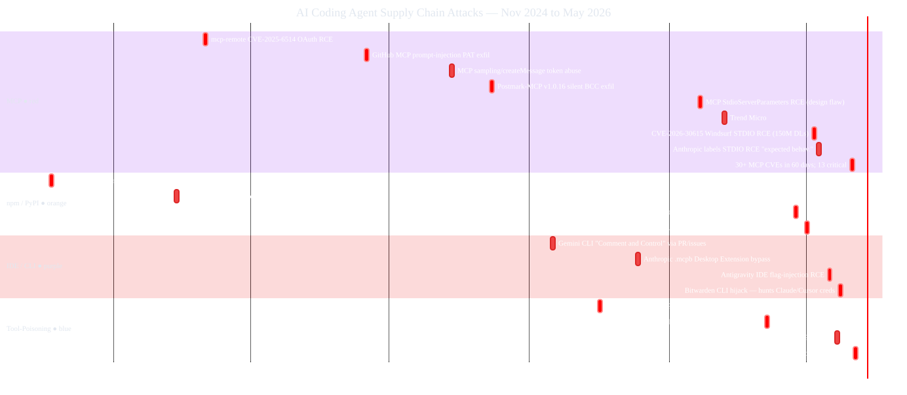
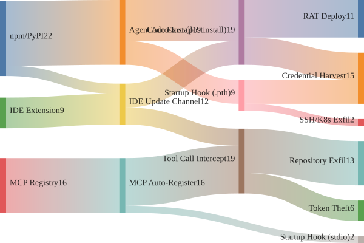
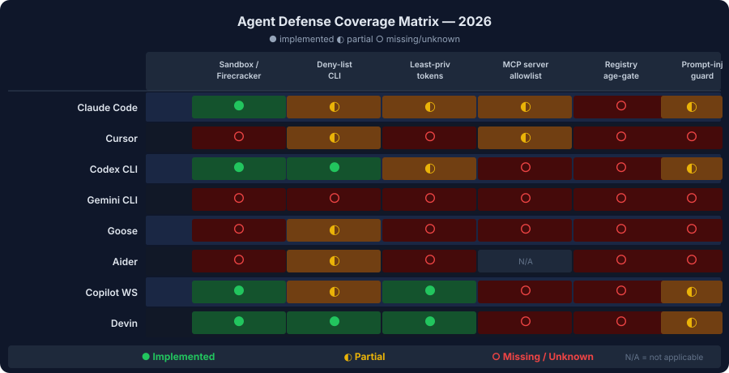

# Treat AI coding agents as software supply chains with keyboards

AI coding agents did not invent supply-chain risk. They made it faster, quieter, and easier to operationalize. In 2026, the important shift is that an agent can read an issue, install a package, register an [MCP](/blog/mcp-2026-roadmap-explained) server, run a tool, and touch real infrastructure before a human has inspected the dependency or the generated command. That is why the threat model for [Claude Code](/blog/cursor-3-2-vs-claude-code-workflow), Cursor, [Codex CLI](/blog/2026-05-17-codex-cli-vs-cursor-composer-2), Gemini CLI, and similar tools now looks less like "autocomplete risk" and more like "continuous integration running on your laptop."[^1][^2][^12]

Most teams still frame the problem as bad prompts or overpowered models. The more useful frame is narrower: **agents collapse the time between retrieval and execution**. A compromised package, an exposed MCP server, or a poisoned tool response no longer waits for a distracted developer to type `npm install` or skim a README. The agent does the operational work immediately. That changes the economics of the same old supply-chain attacks.[^6][^7][^8]

## Agents remove the pause that used to save you

The unique risk is not that coding agents can access tools. It is that they treat tools as part of the default workflow. Trend Micro's LiteLLM write-up describes exactly why that matters: the malicious `litellm` releases used a `.pth` file that executed on every Python interpreter startup, without requiring an explicit import.[^6] Once an agent or CI job installed the bad version, the code ran before a human had a meaningful chance to inspect anything.

The Bitwarden CLI compromise shows the same pattern on the npm side. StepSecurity found that `@bitwarden/cli@2026.4.0` added a `preinstall` hook that downloaded Bun, launched an obfuscated stealer, and explicitly targeted AI coding tool configuration files, including `~/.claude.json` and MCP configs.[^7] That is a supply-chain compromise tuned for developer agents, not just for generic JavaScript environments.

The same "remove the pause" dynamic shows up in MCP. Supabase's own security guidance warns that a malicious support ticket can plant instructions inside database content so that an MCP client such as Cursor reads the ticket and then tries to run a sensitive query on behalf of the operator.[^8] Supabase's follow-up post makes the point more bluntly: prompt injection remains the primary risk even in read-only mode, because natural-language tools can still be steered through untrusted data.[^9]

This is why the "human in the loop" story is weaker than many teams think. Anthropic's sandboxing post exists because approval fatigue is real: the company says Claude Code users were seeing enough prompts that sandboxing was needed to reduce them while still enforcing filesystem and network boundaries.[^12] NIST's February 5, 2026 concept paper on agent identity and authorization makes the same policy-level point from another angle: once agents are given access to diverse tools and data sets, you need explicit controls for authorization, auditing, and prompt-injection resistance, not just faith in the operator to notice something odd.[^14]

## MCP is the fastest-growing attack surface because it turns internal systems into natural-language APIs

MCP is attractive because it standardizes tool access. That is also what makes it dangerous when deployed loosely. Trend Micro found 492 MCP servers exposed without client authentication or traffic encryption, with 1,402 tools behind them and more than 90% offering direct read access to their connected data source.[^1] That is not a theoretical protocol flaw. That is an exposed inventory of natural-language entry points into databases, cloud services, and internal APIs.

GitHub MCP prompt injection is the cleanest illustration of how an "innocent" tool call becomes an exfil path. Docker showed that a malicious public issue can inject instructions when an agent calls `list_issues`, after which the agent uses a broad GitHub token to retrieve private repository contents and leak them into a public pull request.[^3] Invariant's write-up reaches the same conclusion: the protocol flow looks legitimate, but the trust boundary is wrong because the issue body is treated as inert data when it is really executable instruction text for the model.[^4]

OX Security's April 15, 2026 research argues that the blast radius is broader than any one client. Their finding is not "Windsurf has a bug." It is that Anthropic's MCP design choices ripple across an ecosystem with 150M+ downloads, 7,000+ exposed servers, and multiple downstream CVEs and registry-poisoning paths.[^2] Whether you accept all of OX's framing or not, the important correction for this blog is precise attribution: the 150M+ figure belongs to the affected MCP ecosystem broadly, not to any single IDE exploit.[^2]

Unit 42 extends that picture beyond issue bodies. Their `sampling/createMessage` examples show how a malicious MCP server can drive hidden secondary prompts, resource theft, covert `writeFile` activity, or persistent behavior hijacking while the user believes the assistant is performing a routine tool interaction.[^5] That matters because many teams still think of MCP as "just a connector layer." It is better understood as a runtime trust layer that can inject instructions through tools, tool outputs, and remote state.

Anthropic's Desktop Extensions make the distribution side easier still. The company describes `.mcpb` bundles as one-click packages that contain the server plus dependencies, with installation reduced to download, double-click, and approve.[^13] That is useful product design. It also means the old friction of manual config editing, dependency installation, and terminal setup is intentionally disappearing. Security gets better only if extension review, allowlisting, and enterprise controls rise at the same speed.[^13] For the protocol-level background behind why that matters, [[course/mcp-from-first-principles-to-production]] is the right refresher.

## npm and PyPI attacks still hit hardest because install-time execution is enough

If you need one reason to stop treating agent supply-chain security as niche, start with LiteLLM. Trend Micro's March 27 advisory says the malicious `litellm` releases included a `.pth` file and Python code that auto-executed on interpreter startup, harvested SSH keys, cloud credentials, Kubernetes secrets, and other environment data, then exfiltrated it to attacker infrastructure.[^6] This is exactly the kind of package compromise that becomes worse when an agent is asked to "just install the dependency and run the test suite."

Bitwarden is the npm version of the same lesson with a more modern attack chain. StepSecurity says the compromised package used npm Trusted Publishing through a hijacked GitHub workflow, added install-time network behavior, and treated Claude Code, Cursor, Codex CLI, and Aider as first-class exfiltration targets.[^7] The attacker did not need a novel AI exploit. They needed a routine software supply-chain foothold and a realistic assumption that AI-assisted developer environments would contain valuable tokens.

The common failure mode is easy to describe:

1. A package appears to be the legitimate tool the workflow expects.
2. Install-time hooks or interpreter startup behavior execute before review.
3. The package steals local credentials, cloud secrets, or repo tokens.
4. The attacker uses those stolen credentials to pivot into CI, GitHub Actions, or cloud control planes.[^6][^7]

That sequence used to require a human developer to trigger it manually. In agentic workflows, the "install and try it" step becomes normal operating behavior. That is why the right baseline is not merely "use safer prompts." It is "assume dependency installation is a privileged action even when an LLM requested it for a reasonable reason."

## Prompt injection becomes supply-chain risk once agents can move data across systems

The next escalation is what happens when prompt injection and tool access meet enterprise systems. VentureBeat's April 2026 reporting on Capsule Security's research describes two parallel cases: ShareLeak in Microsoft Copilot Studio and PipeLeak in Salesforce Agentforce.[^10] The issue is not that the model says something silly. The issue is that untrusted form or SharePoint content can alter downstream agent behavior and drive data movement through legitimate enterprise connectors.[^10]

For Microsoft, the vulnerability also has a formal identifier. NVD lists CVE-2026-21520 as an information disclosure issue in Copilot Studio that lets an unauthenticated attacker view sensitive information over the network.[^11] VentureBeat's more operational point is the one engineering teams should care about: patching the narrow bug did not eliminate the broader exfiltration pattern because the deeper problem is how these agents ingest untrusted content and then act with privileged connectors.[^10]

This is where Supabase's guidance is especially useful. Their example is simpler than an enterprise CRM, but the pattern is identical: malicious data stored in the system becomes agent instruction later, when a developer or support operator asks the MCP client to read it.[^8][^9] That is the supply-chain angle. The poisoning does not have to happen in npm or PyPI. It can happen in any upstream content source that the toolchain later treats as trusted context.

NIST's identity-and-authorization paper is relevant here because it frames the problem as a control issue, not a model-quality issue. Once an agent can cross from one system into another using inherited permissions, the failure mode is identity abuse plus workflow hijack.[^14] That is why the right defensive question is not "can the model understand this prompt?" It is "what identity, network path, and tool scope does this agent inherit if it misunderstands the prompt?"

Some incident roundups reach for industrial-control examples here. The documented enterprise cases already make the point without stretching beyond the evidence. Once agent workflows can read untrusted content and call privileged tools, enterprise data exfiltration is already a real-world problem.[^8][^10][^11]

## The defense stack that matters is boring, specific, and enforceable

The best mitigations in these incidents are not mysterious. They are the same controls you already trust in software delivery, adapted to agent workflows.

First, keep MCP private unless there is a hard reason not to. Trend Micro's recommendation is explicit: do not expose MCP servers to the public internet without an added authentication layer, and prefer OAuth delegation patterns that preserve user context.[^1] Supabase says the same thing for self-hosted MCP: keep it behind VPN or SSH tunnel access and do not expose it directly to the internet.[^8]

Second, restrict what the agent can do when it connects. Supabase recommends development-only usage, read-only mode for real data, project scoping, and limited feature groups.[^8] Those sound like product toggles, but they are really permission-boundary controls. If your agent only needs schema inspection, it should not have write-capable SQL tools.

Third, treat dependency installation as a privileged act. StepSecurity's remediation guidance for the Bitwarden incident includes pinning exact versions and using `npm ci --ignore-scripts` in CI to stop install hooks from executing automatically.[^7] The Trend Micro LiteLLM advisory points in the same direction from the Python side: if the compromised package ever ran, rotate the affected credentials because the safe assumption is that secrets were harvested already.[^6]

Fourth, put the agent inside a real sandbox. Anthropic's sandboxing work is useful precisely because it enforces both filesystem and network isolation. Their argument is direct: without network isolation a compromised agent can exfiltrate files; without filesystem isolation it can modify sensitive local state and escape the intended boundary.[^12] This is the correct pattern for coding agents generally, not just for Claude Code, and it is the same operational shape we cover in [[course/production-agents-claude-agent-sdk-mcp-connector]].

Fifth, scope identity as if the model will eventually be tricked. NIST's project framing emphasizes identification, authorization, auditing, and prompt-injection mitigation for software and AI agents.[^14] In practice that means short-lived credentials, explicit role scoping, no shared omnipotent PATs, and connector access that maps to a narrow user or project context instead of an admin-wide account.

Here is the short operational checklist I would actually enforce on a team shipping with coding agents:

- No production MCP servers exposed to the public internet.[^1][^8]
- No write-capable database MCP in day-one development workflows unless the project explicitly needs it.[^8][^9]
- Exact dependency pinning for agent runtimes and MCP servers; no silent minor-version drift.[^6][^7]
- `npm ci --ignore-scripts` or equivalent in automation wherever feasible.[^7]
- OS-level or container-level filesystem and network isolation for the agent runtime.[^12]
- Short-lived, least-privilege tokens for GitHub, cloud, and SaaS connectors.[^3][^4][^14]

## The contrarian takeaway: registries are still the root, but agents amplify the blast radius

The lazy version of this conversation says agents are dangerous because they execute commands. The stronger version is more specific. Agents are dangerous because they normalize unattended retrieval plus execution across packages, MCP tools, and enterprise connectors. The attack surface is not just the model. It is every upstream thing the model is allowed to install, read, or invoke.

So yes, registries and tool directories remain the root problem. LiteLLM and Bitwarden were classic supply-chain failures with AI-specific targeting layered on top.[^6][^7] But it is also true that agent UX turns those failures into faster incidents by erasing the pause between "fetch" and "run." That is why the right roadmap is a two-sided one: better registry hygiene and signing upstream, plus stricter sandboxing, identity scoping, and tool review downstream.

If you are building or governing agent workflows now, start with [[course/mcp-from-first-principles-to-production]] for the protocol and deployment model, then use the comparison framework in [[course/picking-a-frontier-model-2026-q2]] to decide which agent environments deserve the highest-trust credentials. Teams putting agents into production should also work through [[course/production-agents-claude-agent-sdk-mcp-connector]] so sandboxing, connector scoping, and observability are part of the first implementation rather than the incident response.
