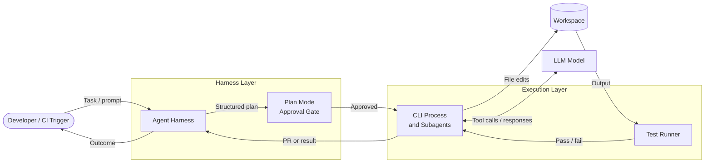
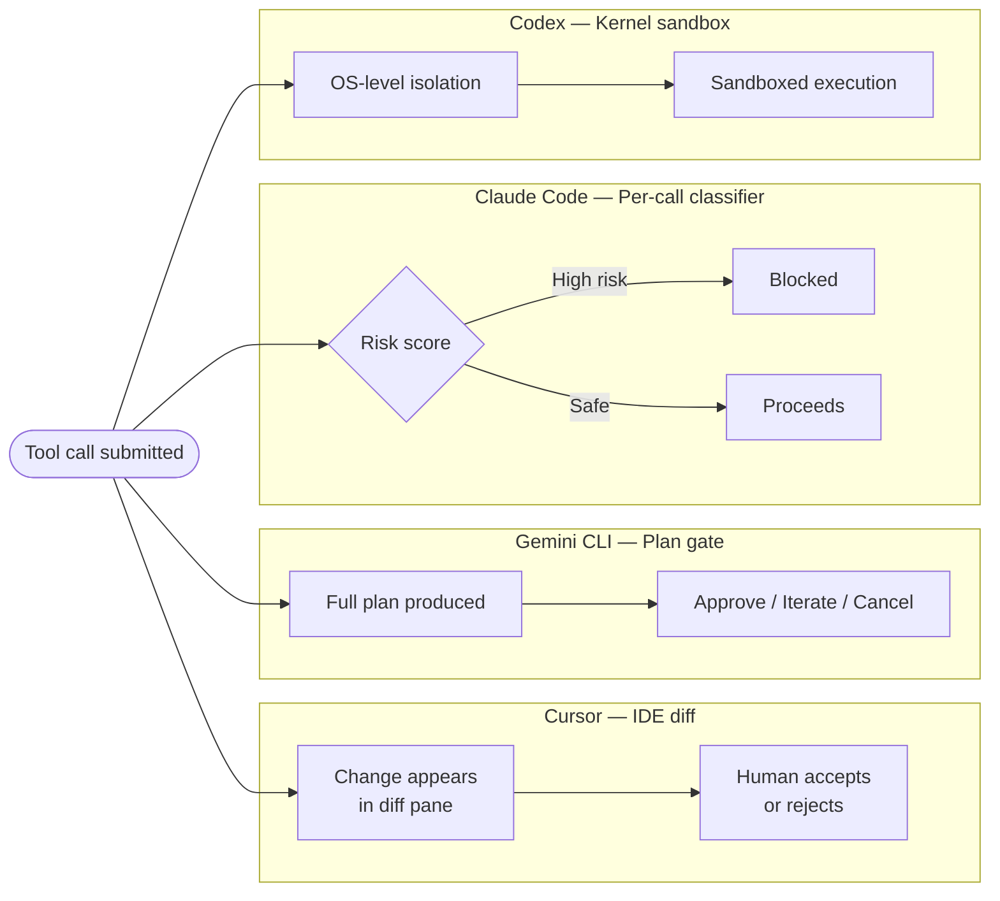

Every few weeks another benchmark lands showing one AI coding tool beating another on SWE-bench. The numbers matter at the margins, but they have almost nothing to do with whether your team ships faster on Monday.

What actually determines daily productivity is something harder to benchmark and easier to overlook: the workflow harness. Which agent can build a coherent picture of your repository without manual curation? Which one produces a plan you can review before a single file is touched? Which one can run your test suite in a loop and decide whether its own change is safe? Which one can hand off a task to a background process and let you pick up the result hours later?

These are not model questions. They are workflow-primitive questions. In 2026, Codex, Claude Code, Cursor, and Gemini CLI have converged on the same surface-level capabilities — subagents, plan mode, MCP, hooks. The divergence that matters is how completely and usably each tool implements five core primitives. That is what this piece maps.

## The five primitives

1. **Repo context** — How does the agent build understanding of your codebase? Where does that understanding live, and who can edit it?
2. **Plan generation** — Can the agent produce a reviewable plan before touching files? How collaborative is that planning stage?
3. **Approval gates** — How granular, auditable, and automated are the controls over what the agent is allowed to do?
4. **Test verification** — Can the agent run your test suite and use the results to verify or correct its own work?
5. **Background execution** — Can tasks be delegated asynchronously, allowing you to pick up a result — or a PR — later?

No tool wins every primitive. The right tool is the one whose strengths overlap with the primitives your workflow stresses most.

---

## Primitive 1: Repo context

**Claude Code** organizes context around a five-layer `CLAUDE.md` hierarchy: managed settings (highest priority) → command line → local project → shared project → user defaults. Hooks, skills, and rules directories layer on further. The design is explicit and auditable — a senior engineer can read the hierarchy and know exactly what the agent has been told. The weakness is the same: the active configuration at runtime is not visible from any single file. You reconstruct it by tracing the cascade.

**Codex CLI** takes a task-scoped approach. Each task runs in a Git worktree, isolating the agent's context to a clean branch. For the cloud service, repo context travels with the task itself — the agent and the repository are colocated in an OS-level sandbox. This is excellent for one-shot delegated tasks where context isolation is a feature, not a limitation. It is less suited to deeply exploratory sessions where you want the agent to accumulate understanding across multiple turns.

**Gemini CLI** leads on raw context capacity: a 1M-token context window makes it practical for monorepos where the other tools require you to curate what gets fed in. The PTY shell model sets it further apart — most CLI agents break when they hit interactive prompts. Gemini CLI spawns a virtual terminal, snapshots its state, and renders output inline, so tools like `vim`, `htop`, or interactive install scripts work without breaking the session. Conversation checkpointing lets you save and resume complex sessions exactly where you left off. [[1]](#ref-4)

**Cursor** is strongest when context freshness matters more than explicit configurability. Its RAG-like filesystem indexing continuously builds a representation of your codebase that updates as files change. Team repo settings propagate the same context across all team members. You do not need to maintain a `CLAUDE.md` or curate a prompt — the editor is always the source of truth.

**The call:** Teams with complex multi-project configuration should lean toward Claude Code's explicit hierarchy. Monorepo teams should evaluate Gemini CLI's context window. Teams that want minimal setup with always-fresh context should start with Cursor.

---

## Primitive 2: Plan generation

**Claude Code** cycles through three modes via Shift+Tab: Default → Auto-Edit → Plan. In Plan mode the agent is read-only — it can explore the codebase and produce a plan, but it cannot write files until you approve and switch modes. Subagents can be spawned to parallelize planning across large tasks. The mode cycle is fast and keyboard-native, which suits interactive pair-programming sessions.

**Codex CLI** is task-first: you define a scoped task, the agent plans and executes within that scope. The CLI presents a structured agent loop with explicit confirmation before writes (in the appropriate safety mode). For the cloud service, the planning phase is less interactive — you dispatch a task description and receive a PR.

**Gemini CLI** has the most structured plan UX of the four. Pressing Shift+Tab or typing `/plan [goal]` enters Plan mode, where the agent produces a detailed strategy and presents it for formal review. You can press Ctrl+X to open the plan directly in your external editor and modify it inline. Then you make an explicit decision: Approve (start implementation), Iterate (provide feedback or edit the plan file), or Cancel. For teams with audit requirements, AfterTool hooks can archive every approved plan to an external store (the docs show an example uploading to a GCS bucket on `exit_plan_mode`). [[3]](#ref-3)

**Cursor Composer 2** integrates planning into the IDE diff flow. The agent produces changes in a composer pane with full diff visibility before any file is saved. The planning stage is less formalized than Gemini's — there is no explicit approve/iterate modal — but IDE context makes the diff immediately interpretable alongside the surrounding code.

**The call:** Teams with formal audit requirements should look at Gemini CLI's plan archiving hooks. Teams that want fast interactive planning should look at Claude Code's mode cycle or Cursor's in-editor diff flow.

---

## Primitive 3: Approval gates

This is the most consequential primitive for production engineering teams. The spectrum runs from "agent has full autonomy" to "every action requires human confirmation."

**Claude Code** introduced Auto mode in March 2026 (research preview, Team plan). Instead of asking for approval at every step or skipping checks entirely, a classifier inspects each tool call before it runs. Actions classified as high-risk — mass file deletion, potential data exfiltration — are blocked. Safe actions proceed without interruption. This is the most granular approval model of the four: per-tool-call, automated, with human-interpretable blocking decisions. Three other modes (default interactive, auto-edit, confirm-everything) cover the rest of the spectrum. [[4]](#ref-4)

**Codex CLI** takes the most hardened approach to approval: OS-level kernel sandboxing. The agent is not merely instructed to behave — it is kernel-isolated. The three safety modes (auto-approve, confirm-on-write, confirm-everything) determine what the agent can do within that sandbox. For the cloud service, the sandbox wraps the entire task execution; you receive a PR to review rather than approving individual steps. This is the strongest enterprise story for regulated environments where "the agent told itself not to do bad things" is not a sufficient compliance answer. [[5]](#ref-5)

**Gemini CLI** approves at the plan level rather than the tool-call level. You review and approve the full plan before implementation starts. During execution, YOLO mode (`-y` flag or Ctrl+Y) skips further prompts. The AfterTool hook system enables post-execution audit logging, but the gate is earlier and coarser-grained than Claude Code's per-call classifier.

**Cursor** relies on the IDE review model as its approval mechanism. Changes appear in a diff view; you accept or reject each change in context. There are no explicit approval modes or sandbox constraints — the control surface is the editor itself.

**The call:** Regulated environments should evaluate Codex's kernel sandbox. Teams that want automated, granular gating without constant interruptions should evaluate Claude Code's auto mode. Teams comfortable with plan-level review should look at Gemini CLI.

---

## Primitive 4: Test verification

A coding agent that cannot close its own verification loop forces the human back into the terminal after every suggestion. The four tools differ significantly on how autonomous the test loop can be.

**Claude Code** runs test suites natively in the terminal and can use results to guide subsequent edits. Agent Teams can spawn a dedicated testing subagent running in parallel with implementation, so verification does not block forward progress on other parts of the task.

**Codex CLI** is built around structured task verification loops — the agent loop is designed to run a command, observe output, and iterate. Explicit configuration profiles define what commands the agent is allowed to run, which matters in team environments with security constraints. The kernel sandbox means test commands run in an isolated environment, preventing side effects from escaping the task scope.

**Gemini CLI** handles test verification through its PTY shell. Because the shell is fully interactive, any test runner works — not just the subset that produces clean stdout output. Long-running test suites can be backgrounded via `list_background_processes` / `read_background_output`, allowing the agent to continue planning or working on other files while tests run. [[3]](#ref-3)

**Cursor** is the most manual here. The agent suggests changes, you run tests in the IDE's integrated terminal, and redirect based on results. There is no autonomous test-verify loop — the human is in the loop on every iteration. This is a deliberate design choice that fits teams that want visibility into every step, but it does not scale to long autonomous sessions.

**The call:** Teams running large test suites that need non-blocking async verification should look at Gemini CLI's background process model. Teams running structured, short verification loops should look at Codex or Claude Code.

---

## Primitive 5: Background execution

Background execution is the gap between "an AI that helps you while you watch" and "an AI that works while you sleep."

**Codex's cloud service** is the most mature production story here. You dispatch a task — from Slack, from a GitHub issue, from a webhook — and the agent executes in a fully sandboxed environment. Eight parallel subagents can run without coordination overhead. The output is a GitHub PR, ready for review. This is purpose-built for async delegation: triage, dependency upgrades, test generation, incident runbooks. [[6]](#ref-6)

**Claude Code's Agent Teams** (experimental, `CLAUDE_CODE_EXPERIMENTAL_AGENT_TEAMS=1`, Team/Enterprise plans) let multiple Claude Code sessions share a task list and coordinate on larger tasks. As of mid-2026 this is still experimental, but the architecture — shared context, explicit handoffs, parallel subagents — points toward the same async delegation model that Codex already ships in production.

**Gemini CLI** supports background processes natively and evolved its background execution story significantly at Google I/O 2026, where Google announced Antigravity CLI — a Go-based successor that carries over Gemini CLI's agent harness while adding a server-side component for async multi-agent workflows. You kick off background agents and pick up results later from desktop or web, using Gemini 3 with 1M+ context. [[7]](#ref-7)

**Cursor** is foreground-first. Background agent features via the Cursor cloud are less mature than the other three. Cursor is strongest when a human is actively steering — it is not the tool you dispatch for an overnight task.

**The call:** Teams with async delegation workflows today should evaluate Codex's cloud service. Teams building toward async and already invested in the Claude ecosystem should watch Agent Teams closely. Teams interested in Gemini's background model should evaluate Antigravity CLI.

---

## Decision matrix

| Primitive | Codex | Claude Code | Gemini CLI | Cursor |
|---|---|---|---|---|
| **Repo context** | Task-scoped worktrees | Layered CLAUDE.md hierarchy | 1M context + PTY shell | RAG-indexed, always fresh |
| **Plan generation** | Task-first loop | Mode-cycle (Plan/Auto-Edit/Default) | Formal Approve/Iterate/Cancel + editor | IDE diff flow |
| **Approval gates** | Kernel sandbox + 3 modes | Per-call classifier (auto mode) | Plan-level gate + hooks | IDE review |
| **Test verification** | Structured loops, sandboxed | Parallel subagents | PTY + background processes | Human-in-loop |
| **Background execution** | Cloud service, 8 agents, Slack → PR | Agent Teams (experimental) | Antigravity CLI (server-side) | Weakest |

**Pick Codex** when background async delegation and GitHub-native PR output are the primary requirement, or when kernel-level sandbox isolation is a compliance need.

**Pick Claude Code** when per-call approval granularity matters, when your team has complex multi-project CLAUDE.md configuration, or when you are building toward multi-agent workflows on Anthropic's model stack.

**Pick Gemini CLI** when raw context window size is the bottleneck (monorepos, large codebases), when you need the most structured plan review UX, or when your test suite requires interactive terminal tools that other CLI agents break on.

**Pick Cursor** when the team lives in the IDE and wants always-fresh RAG context without configuration overhead, and when human-in-the-loop review at the diff level is the preferred control model.

---

## The real question

Before evaluating tools, write down which of these five primitives your team's workflow actually stresses today — not in theory, not in the version of the workflow you plan to have in six months.

If your developers spend most of their time in the terminal on long autonomous tasks, the approval-gate and background-execution primitives matter most. If they are iterating rapidly on product features in an IDE, repo context freshness and plan review UX matter more. If you are running coding agents as part of a CI/automation loop, test verification and background execution dominate.

Most comparison articles compress all five primitives into one question: "which agent is smartest?" That framing is obsolete. The model quality gap among the top tools is small and narrowing. The workflow-harness gap is large and the one your team will live with every day.

Map your primitives first. Then pick the tool.
