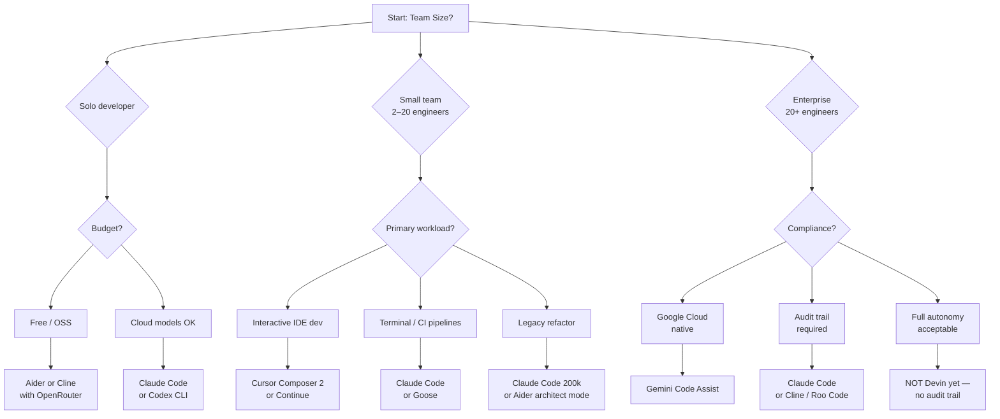

# Choose the Right AI Coding Agent for Production in 2026

In 2026, the right AI coding agent for production work depends on five axes: autonomy level, pricing model, IDE integration, MCP support, and audit trail. Claude Code and Codex CLI lead for terminal-native teams with custom pipelines. Cursor Composer 2 wins for IDE-first interactive workflows. Devin and Replit Agent are not yet production-grade for enterprise without significant governance work.

Most buyers in 2026 are making the wrong call because they trust benchmark leaderboards. A model that tops SWE-bench can fail 60% of the time inside your actual agent pipeline — because benchmark harnesses bear no relation to your repo, your CI, or your tool surface. [Our research shows contamination inflates SWE-bench scores by ~27 percentage points][benchmarks-blog] and the same model swings 46 points across different harnesses. The only honest buying signal is trace-based evaluation on your own tasks.

This guide compares all 12 serious contenders across the five dimensions that actually matter for production deployment. Skip to the [TL;DR table](#tldr-comparison-table) for the quick verdict, or jump to [the decision tree](#decision-tree-which-tool-for-which-team) if you already know the axes.

---

## TL;DR Comparison Table

| Tool | Autonomy (1–5) | Pricing | IDE Integration | MCP Support | Audit Trail |
|---|---|---|---|---|---|
| **Claude Code** | 4 | Token (pay-as-you-go) | Terminal + VS Code ext | Native | Full (session transcripts) |
| **Codex CLI** | 3 | Token (pay-as-you-go) | Terminal-only | Partial | Partial (log files) |
| **Cursor Composer 2** | 4 | Per-seat ($20–$40/mo) | Native IDE | Partial | Partial (Composer history) |
| **Aider** | 3 | Free + model costs | Terminal-only | None (any model) | Full (git commits) |
| **Continue** | 2 | Free + model costs | VS Code / JetBrains | Native | Partial |
| **Cline** | 4 | Free + model costs | VS Code | Native | Full (step-by-step log) |
| **Roo Code** | 4 | Free + model costs | VS Code | Native | Full |
| **Windsurf (Cascade)** | 3 | Per-seat ($15–$25/mo) | Native IDE | None | Partial |
| **Goose (Block)** | 3 | Free + model costs | Terminal | Native | Partial |
| **Gemini Code Assist** | 2 | Per-seat ($19–$45/mo) | VS Code / JetBrains / Web | Partial | Partial |
| **Devin** | 5 | Per-task ($2–$20+) | Web + GitHub | None | None (black-box) |
| **Replit Agent** | 5 | Per-seat ($20–$25/mo) | Replit IDE only | None | None |

**Autonomy scale:** 1 = inline autocomplete only; 2 = single-file edits with human confirm; 3 = multi-file edits with review step; 4 = repo-wide autonomous with branch isolation; 5 = fully autonomous end-to-end task execution.

50-word verdict per tool

**Claude Code:** The strongest programmable agent for production pipelines. Native MCP, full session transcripts, and the Agent SDK for custom harnesses. Best-in-class for teams that want to own their loop control. Expensive at scale without prompt caching. Requires Claude API account. [[course/claude-tool-use-from-zero]]

**Codex CLI:** OpenAI's lightweight terminal agent. Sub-100ms first-token, excellent shell reasoning, minimal setup. No MCP, limited audit trail. Best for OpenAI-native teams who want a fast CLI without the Cursor IDE dependency. Open-source on GitHub.

**Cursor Composer 2:** The IDE-first choice. Parallel background agents, server-side state persistence (survives crashes), and a polished code-review UI. Per-seat pricing is efficient at low usage but expensive at high task volume. MCP support is experimental. [[course/cursor-composer-2]]

**Aider:** The community favourite for repo-wide edits with clean git history. Works with any model via OpenRouter. Architect mode for complex refactors. Zero MCP support means you build tool integrations manually. Steepest learning curve of the free options.

**Continue:** The safest open-source choice for teams nervous about autonomous agents. Model-agnostic, privacy-preserving, and excellent for inline context-aware completions. Low autonomy by design — you approve every suggestion. JetBrains support is a differentiator.

**Cline:** Fastest path to a fully-autonomous local agent. Creates files, runs shell commands, browses the web — all without confirmation prompts if you want. Native MCP. Audit trail is excellent: every step logged. Requires strong branch discipline.

**Roo Code:** A more conservative Cline fork with better multi-model routing and tighter permission models. If you want Cline's MCP breadth but with explicit approval gates, Roo Code is the fork. Growing community, active maintenance.

**Windsurf (Cascade):** Codeium's IDE with a mid-tier autonomous agent. Better context coherence than early Cline, weaker extensibility than Claude Code. Per-seat pricing. No MCP. Worth evaluating for teams already in the Codeium ecosystem.

**Goose (Block):** Block (Square)'s open-source terminal agent. Native MCP toolkit, free, model-agnostic. Lighter autonomy than Cline. Strong for teams that want MCP breadth without IDE lock-in. Smaller community than Aider or Continue.

**Gemini Code Assist:** Google's enterprise-grade assistant. Deep Google Workspace and Cloud integration. Lower autonomy than Claude Code or Cursor — it is still primarily a completions + review tool. Best for Google Cloud-native organizations.

**Devin:** The highest-autonomy agent available, but with no audit trail. $500+/month, fully async, runs in its own VM. Enterprise-unshippable today because diff review requires reading the entire task log rather than inspecting a branch. Use for well-specified greenfield tasks only.

**Replit Agent:** Purpose-built for Replit's cloud IDE. The simplest path from prompt to running app — if you never leave Replit. No audit trail, no MCP, Replit-only. Not a production tool for teams with existing codebases.

---

## The 5 Dimensions That Matter in 2026

The five axes in the table above were chosen because they predict production deployment risk, not benchmark performance. Here's why each matters.

### 1. Autonomy Level

Autonomy is a risk multiplier, not a capability signal. A fully-autonomous agent (level 5) that writes to main without review is not more productive — it is more dangerous. The correct framing is: *how much human oversight does this agent remove, and does your team have the governance infrastructure to compensate?*

Level 4 agents (Claude Code, Cursor, Cline, Roo Code) are the practical ceiling for production teams in 2026. They can complete repo-wide tasks autonomously, but they write to feature branches, log every action, and surface a reviewable diff before merging. Level 5 agents (Devin, Replit) operate in isolated environments where the human only sees the final output — which is fine for throwaway prototypes, but requires a full diff-review discipline for anything touching production.

### 2. Cost Model

Per-seat SaaS pricing (Cursor, Windsurf, Gemini, Replit) is efficient at low task volume and predictable for finance. Token-based pricing (Claude Code, Codex CLI) becomes cheaper above ~30 substantial tasks per day per developer but requires cost tracking infrastructure.

The hidden cost is supervision time. A cheaper agent that requires more review per output has a higher true cost than an expensive agent that produces cleaner diffs. [Multi-agent orchestration has a real cost that's easy to underestimate][multi-agent-cost-blog] — factor in human review minutes, not just API dollars.

### 3. IDE Integration

Terminal-only agents (Claude Code, Codex CLI, Aider, Goose) are more composable but require stronger CLI discipline. IDE-native agents (Cursor, Windsurf, Gemini, Continue, Cline) reduce the context-switching cost for interactive development. The choice correlates strongly with team workflow: teams with strong CI/CD and automated testing tend to prefer terminal agents; teams with designer-developer collaboration tend to prefer IDE-native.

One underrated axis: whether the agent state survives a crash. Cursor's background agents run server-side — your loop restarts after a crash. Claude Code's harness is local — [your loop dies with the shell session][cursor-claude-code-blog], but you own the restart logic.

### 4. MCP Support

MCP (Model Context Protocol) is the open standard for connecting agents to external tools without bespoke integrations. Agents with native MCP support — Claude Code, Cline, Roo Code, Goose, Continue — can share server implementations across tools. An MCP server built for Claude Code works in Cline, works in Goose, and increasingly works in any MCP-compliant client.

Teams ignoring MCP support are accumulating integration debt. When you build a bespoke Jira connector for a non-MCP agent, you rebuild it for every tool you adopt. MCP is the interoperability bet that pays compound interest. [The 2026 MCP server ecosystem is already large enough that native support is a must-have][mcp-server-blog], not a nice-to-have.

### 5. Audit Trail

Enterprise deployment of AI coding agents is gated on auditability, not capability. The question legal and security teams ask is: *who approved this change, what did the agent do, and can you show me the full reasoning trace?*

Tools with full audit trails (Claude Code session transcripts, Cline step logs, Roo Code approval gates, Aider git commit history) pass this gate. Tools without (Devin's black-box VM, Replit Agent's end-state-only output) do not — not because they are less capable, but because regulators and security teams cannot accept "trust the agent." [The supply-chain threat surface for AI coding agents is large][supply-chain-blog] — prompt injection in MCP servers, dependency confusion in npm packages, malicious PyPI installs — and a full audit trail is the minimum mitigation.

---

## The 12 Tools in Depth

### Claude Code

Claude Code is Anthropic's terminal-first AI coding agent, built on the Agent SDK and native MCP support. It occupies the "programmable professional" tier: high autonomy, full auditability, and maximum composability for teams that want to own their infrastructure.

**Strengths:** Native MCP (hundreds of servers available), full session transcripts for audit, the Agent SDK for building custom multi-agent harnesses, and Anthropic's strongest model (Opus 4.7 for complex reasoning, Haiku 4.5 for speed). The extended 200k-token context window handles large legacy codebases cleanly.

**Weaknesses:** Token-based pricing without caching can be expensive at scale. No built-in IDE — you need the VS Code extension or terminal discipline. Loop state dies with the shell session, requiring explicit restart logic in automated pipelines.

**Who it's for:** Teams building custom agent workflows, CI-integrated code generation, security-conscious enterprises that need full audit trails, and developers comfortable in the terminal.

**Pricing snapshot:** Pay-as-you-go on Anthropic API. Haiku 4.5: ~$0.25/$1.25 per M input/output tokens. Opus 4.7: ~$15/$75. Claude Max subscription ($100/month) for heavy interactive use.

**Concrete workflow:** Push a failing test, Claude Code identifies the root cause via MCP-connected GitHub, writes the fix to a feature branch, runs the test suite, and posts the PR — all without leaving the terminal. Full trace available in `~/.claude/projects/` for audit.

Read more: [[blogs/cursor-3-2-vs-claude-code-workflow]] | [[blogs/gpt-5-5-vs-claude-opus-4-7-agentic-coding]] | [[course/claude-tool-use-from-zero]]

### Codex CLI

OpenAI's open-source terminal agent — lightweight, fast, and designed for developers who want AI assistance without an IDE. Codex CLI runs in "suggest" mode by default (shows the proposed shell command before running) and can be elevated to "auto" mode for automated pipelines.

**Strengths:** Sub-100ms first-token latency, excellent shell command reasoning, minimal setup (single npm install), and open-source so you can audit the harness. GPT-4.1 Mini makes it the cheapest major-vendor option per task.

**Weaknesses:** No MCP support (as of June 2026), limited audit trail beyond log files, and no repo-wide context window comparable to Claude's 200k. Tightly coupled to OpenAI's model lineup.

**Who it's for:** OpenAI-native teams who want a fast CLI without IDE lock-in, DevOps engineers automating shell workflows, teams running OpenAI models on AWS Bedrock.

**Pricing snapshot:** GPT-4.1 Mini: ~$0.15/$0.60 per M tokens. GPT-5.5: ~$2/$8 per M tokens (via Bedrock or direct API).

**Concrete workflow:** `codex "add a GitHub Actions step to run type-check before deploy"` — Codex reads the existing workflow YAML, proposes the diff, applies it after confirmation.

Read more: [[blogs/codex-cli-vs-cursor-composer-2]] | [[blogs/2026-04-30-gpt-5-5-in-codex]]

### Cursor Composer 2

Cursor's IDE-native agent, released with the Composer 2 technical report in early 2026. It introduced parallel background agents, server-side state persistence, and a polished review interface. The strongest choice for teams that live in an IDE and want high autonomy without leaving it.

**Strengths:** Server-side agent state survives IDE crashes. Parallel subagents for concurrent tasks. CursorBench shows strong performance on interactive dev tasks. Deep repository indexing for large codebases. BugBot for automated PR review.

**Weaknesses:** Per-seat pricing becomes expensive at high task volume. MCP support is experimental, not production-ready. Audit trail is Composer history — sufficient for most teams, but not the full reasoning trace enterprises need.

**Who it's for:** Individual developers and small teams doing intensive interactive development, design-developer collaboration workflows.

**Pricing snapshot:** Hobby $0/month (limited), Pro $20/month, Business $40/seat/month.

**Concrete workflow:** Trigger a Composer 2 background agent from a GitHub issue, it runs in parallel with your active editing session, returns a PR for review when done.

Read more: [[blogs/2026-05-28-cursor-3-composer-2-workflow-patterns]] | [[blogs/2026-05-12-copilot-workspace-vs-cursor-bg-vs-claude-code]] | [[course/cursor-composer-2]]

### Aider

The community favourite — open-source, model-agnostic, and optimised for whole-repo multi-file edits with clean git history. Aider has 20k+ GitHub stars and strong presence in the LocalLLaMA community for its compatibility with open-weight models.

**Strengths:** Works with any model (Anthropic, OpenAI, Ollama, OpenRouter). Architect mode for complex multi-file refactors. Clean git commit history — every agent change is a reviewable commit. The most battle-tested free option.

**Weaknesses:** Zero MCP support — tool integrations are manual. Steepest learning curve of the free options. No built-in autonomy for multi-step pipeline tasks.

**Who it's for:** Privacy-conscious teams using local models, cost-sensitive developers, teams that want full git history of every agent change.

**Pricing snapshot:** Free. Pay only for the model API you choose (or nothing with Ollama).

**Concrete workflow:** `aider --model openrouter/qwen/qwen-3.5 "refactor the auth module to use the new JWT library"` — Aider plans the edit across 8 files, proposes each change, commits each step.

Read more: [[blogs/seven-cli-comparison]]

### Continue

The conservative open-source IDE agent — model-agnostic, privacy-preserving, and designed for teams that want AI assistance without surrendering autonomy control. Continue integrates deeply with VS Code and JetBrains, with local model support via Ollama.

**Strengths:** Privacy-first (can run fully offline with local models). Strong VS Code and JetBrains plugins. Native MCP client — works with the same server ecosystem as Claude Code. Low autonomy by design keeps humans in the loop.

**Weaknesses:** Low autonomy (level 2) means it's an assistant, not an agent — it won't initiate multi-step task completion independently. Less suited for automated pipelines.

**Who it's for:** Teams with strict data-residency requirements, enterprise environments with model firewall policies, developers who want AI-assisted coding without autonomous execution.

**Pricing snapshot:** Free + your model costs. Enterprise self-hosted tier available.

**Concrete workflow:** Highlight a function, Continue explains it inline, suggests a refactor, and shows the diff — human approves each step.

### Cline

Formerly Claude Dev, now Cline — the fastest path to a fully-autonomous local agent. Cline runs as a VS Code extension and can create files, run shell commands, browse the web, and execute multi-step tasks without requiring confirmation at each step.

**Strengths:** Native MCP support with a large community of servers. Full step-by-step audit log. High autonomy (level 4) — configurable from fully automatic to approval-gated. Works with any API-compatible model.

**Weaknesses:** The high autonomy default requires strong branch discipline — a misconfigured Cline can modify files you didn't intend. Learning curve for MCP server setup.

**Who it's for:** Power users who want maximum local agent autonomy without per-seat pricing, developers comfortable auditing step logs.

**Pricing snapshot:** Free + model API costs.

**Concrete workflow:** "Implement the user authentication flow from the spec doc." Cline reads the spec via MCP, writes the backend routes, writes the frontend components, runs the tests, and reports back.

### Roo Code

A Cline fork with tighter permission models, better multi-model routing, and explicit approval gates. If Cline's default autonomy level makes your security team nervous, Roo Code is the right fork — same MCP breadth, more conservative execution defaults.

**Strengths:** Configurable approval gates per action type (file write, shell command, web browse). Multi-model routing — use a cheap model for planning, expensive model for execution. Active maintenance and growing community.

**Weaknesses:** Smaller community than Cline. Fork maintenance lag — some upstream Cline features arrive late.

**Who it's for:** Enterprise teams that need Cline-level capability with explicit human-in-the-loop checkpoints.

**Pricing snapshot:** Free + model API costs.

**Concrete workflow:** Same as Cline, but each action class requires explicit approval — you approve "write file" broadly, but individually approve "run shell command."

### Windsurf (Cascade)

Codeium's IDE agent. Cascade offers better context coherence than early Cline builds and a polished IDE experience, but weaker extensibility than Claude Code for custom pipelines. No MCP support as of June 2026.

**Strengths:** Strong context coherence across long sessions. Polished IDE UX similar to Cursor. Enterprise pricing available.

**Weaknesses:** No MCP support. Proprietary tool connectors only. Per-seat pricing without a free tier for substantial use.

**Who it's for:** Teams already using Codeium's autocomplete who want to upgrade to an autonomous agent without switching IDEs.

**Pricing snapshot:** Free tier (limited), Pro $15/month, Teams $25/seat/month.

**Concrete workflow:** Cascade maintains context across a 2-hour refactor session, tracking which files were changed and why, and proposing coherent follow-up edits.

### Goose (Block)

Block's (Square's) open-source terminal agent — native MCP toolkit, model-agnostic, and designed for teams that want MCP breadth without IDE lock-in. Less community traction than Aider but stronger MCP-first architecture.

**Strengths:** Native MCP toolkit with several first-party servers (GitHub, filesystem, shell). Model-agnostic. Fully open-source. Good for automated pipeline integration.

**Weaknesses:** Smaller community. Lower autonomy ceiling than Claude Code or Cline. Less mature than Aider for multi-file repo edits.

**Who it's for:** Teams that need MCP-native terminal agents without paying Anthropic API rates, open-source-first teams.

**Pricing snapshot:** Free + model costs.

**Concrete workflow:** Goose receives a task via the GitHub MCP server, reads the relevant files, writes the fix, and pushes the branch — using the same MCP servers as your Claude Code workflow.

### Gemini Code Assist

Google's enterprise coding assistant — deep Google Workspace and Cloud integration, available in VS Code, JetBrains, and the Cloud Shell Editor. Strong for Google Cloud-native organizations; limited for teams outside that ecosystem.

**Strengths:** Deep Google Cloud integration (GKE, BigQuery, Cloud Run). Native in Cloud Shell Editor. Long context (1M tokens via Gemini 2.5 Pro). Enterprise compliance certifications.

**Weaknesses:** Lower autonomy than Claude Code or Cursor — still primarily a completions and review tool, not a fully autonomous agent. MCP support is partial. Limited for teams outside Google Cloud.

**Who it's for:** Google Cloud-native organizations, enterprises with Workspace standardization, teams on Google Cloud credits.

**Pricing snapshot:** Standard $19/user/month, Enterprise $45/user/month.

**Concrete workflow:** Ask Gemini Code Assist to "generate a Cloud Run deployment spec for this FastAPI app." It reads the codebase and produces a Terraform config with Cloud Run, Artifact Registry, and Secret Manager resources.

### Devin

Cognition's fully-autonomous agent — the highest-autonomy option available, running in its own sandboxed VM with internet access. Devin can complete long-horizon tasks (days, not hours) without human check-ins.

**Strengths:** The only level-5 autonomous agent with commercial availability. Can complete genuinely long-horizon tasks. Useful for well-specified greenfield development.

**Weaknesses:** No audit trail — the enterprise-fatal gap. You see the final output, not the reasoning trace or intermediate decisions. $500+/month. Opaque execution makes diff review prohibitively slow for anything touching production. Not suitable for teams that need compliance.

**Who it's for:** Venture-backed startups building greenfield products who can accept the audit-trail gap; specific high-value tasks where async autonomy is worth the supervision cost.

**Pricing snapshot:** Core $500/month, Teams $1500/month.

**Concrete workflow:** "Build a REST API for user management with JWT auth, PostgreSQL, and full test coverage." Devin disappears for 3–4 hours and returns with a working implementation — which you must review in its entirety before accepting.

### Replit Agent

Replit's purpose-built agent — the simplest path from a prompt to a running application, within the Replit ecosystem. Not a production tool for teams with existing codebases.

**Strengths:** Zero setup. Runs and deploys in the same environment. Fast for simple applications. Accessible to non-technical users.

**Weaknesses:** Replit IDE only — cannot touch your existing codebase. No MCP, no audit trail, no git integration worth calling production-grade. Per-seat pricing without a free tier for serious use.

**Who it's for:** Educators, prototypers, non-technical founders building simple apps — not production engineering teams.

**Pricing snapshot:** Core $25/month, Teams $20/seat/month.

**Concrete workflow:** "Build a simple task manager app with a React frontend and Node backend." Replit Agent scaffolds, runs, and deploys it in one session — within Replit's infrastructure.

---

## Decision Tree: Which Tool for Which Team?

Use this flowchart to cut to the right shortlist for your team.

**Decision rules:**
1. If your team needs a full audit trail for compliance, eliminate Devin and Replit Agent immediately.
2. If you're on Google Cloud, evaluate Gemini Code Assist first — the native integration offsets the lower autonomy.
3. If you need MCP interoperability (sharing servers across tools), shortlist Claude Code, Cline, Roo Code, or Goose.
4. If cost is the primary constraint, Aider with Ollama or OpenRouter is effectively free.
5. For CI-integrated autonomous pipelines, Claude Code's Agent SDK is the only production-grade option with full harness control. See [[blogs/2026-05-30-multi-agent-cli-workflow-harness-2026]] for the multi-agent harness pattern.

For multi-agent orchestration patterns at scale, see [[blogs/2026-05-31-multi-agent-orchestration-real-cost-2026]].

---

## What's Overhyped + What's Underrated

### Overhyped: Fully-autonomous "Devin-style" agents for general production code

The marketing is compelling — give an agent a GitHub issue and get back a merged PR, no human involved. The reality in 2026: fully-autonomous agents are enterprise-unshippable for most production code because the audit trail gap makes compliance impossible.

When a CVE is introduced in production, the question "what did the agent do and why?" needs a traceable answer. Devin's black-box VM doesn't provide one. This isn't a capability argument — Devin can write good code. It's a governance argument: production deployment requires a reasoning trace, and the market hasn't built that into level-5 agents yet.

The right use case for Devin-style agents in 2026 is bounded, well-specified greenfield tasks where the entire output is reviewed before it touches any production system.

### Overhyped: Benchmark leaderboards as buying signals

SWE-bench scores are almost useless for production buying decisions. [Contamination inflates scores by ~27 percentage points][benchmarks-blog]; harness effects cause the same model to swing 46 points across different test frameworks. The model that ranks #1 on a leaderboard may rank #4 on your specific task distribution.

The only honest signal is trace-based evaluation: run candidate agents on 20–50 real tasks from your backlog, score each tool call (correct, recovered, failed), and compare pass rates — not benchmark percentages. See [[blogs/2026-05-31-local-model-benchmarks-lie-agent-trace-evaluation]] for the methodology.

### Underrated: Terminal-first CLI tools for teams with strong CI/CD

Aider, Codex CLI, and Claude Code are systematically underrated by teams that default to IDE-native tools. For organizations that have invested in strong CI/CD — pre-commit hooks, type checking, test coverage requirements, automated secret scanning — terminal agents slot directly into the pipeline and don't require an IDE license.

The productivity gain from a terminal agent comes from *composability*, not from IDE UX. You can script Claude Code into a GitHub Actions workflow, chain multiple Aider invocations in a Makefile, or orchestrate Codex CLI runs from a Python harness. IDE-native agents can't do any of this cleanly.

See [[blogs/ai-coding-agent-workflow-primitives-2026]] for the composable workflow patterns, and [[blogs/2026-05-30-multi-agent-cli-workflow-harness-2026]] for the full multi-agent harness setup.

### Underrated: MCP as the interoperability moat

Teams that have invested in MCP-native agents (Claude Code, Cline, Roo Code, Goose) are building compound value that non-MCP teams aren't. Each MCP server you deploy — GitHub, Jira, your internal APIs, Supabase — is instantly available to every MCP-compliant agent in your stack.

Teams using non-MCP agents (Cursor, Windsurf, Devin, Replit) rebuild integrations from scratch for each tool. When they switch agents (and they will), the integrations break. MCP support in 2026 is the equivalent of REST API support in 2010: teams ignoring it are accumulating a form of technical debt that will become visible at the worst time.

Read more: [[blogs/2026-05-31-mcp-server-adoption-2026]]

---

## 6-Month Outlook: Q3/Q4 2026 Predictions

**1. MCP becomes table stakes.** By Q4 2026, agents without native MCP support will begin losing enterprise evaluations to MCP-native alternatives on interoperability alone. Cursor is under pressure to ship production-grade MCP (their experimental implementation is not there yet). Windsurf will either ship MCP or concede the enterprise tier to Claude Code and Cline.

**2. Audit trail regulation arrives.** At least one major regulatory body (likely EU AI Act implementation guidance) will publish explicit requirements for AI coding agent audit trails in production systems. This will accelerate the exit of Devin and Replit Agent from enterprise shortlists and create a purchasing criterion that Claude Code, Cline, and Roo Code are already positioned to meet.

**3. Open-weight models cross the viability threshold for production agents.** Qwen 3.5 and Llama 4's successors are close enough to Claude Haiku quality that Aider and Goose with local models become viable for mid-tier tasks. Expect a wave of cost-sensitive teams migrating away from cloud API pricing for routine code tasks.

**4. Per-seat pricing commoditises.** Cursor, Windsurf, and Gemini Code Assist are all in the $15–$45/seat range. By Q4 2026, competitive pressure will push at least one major IDE agent below $10/seat or introduce a meaningful free tier. Token-based agents (Claude Code, Codex CLI) become relatively more attractive for high-volume teams.

**5. Multi-agent harnesses become the default for senior engineers.** The pattern of "one orchestrator agent delegating to multiple specialist agents" — already working in our [[blogs/2026-05-30-multi-agent-cli-workflow-harness-2026]] — will move from power-user territory to standard practice for teams with >5 engineers. Expect Cursor, Claude Code, and Codex CLI to ship better native orchestration UX in Q3.

For model capability predictions specifically, see [[course/picking-a-frontier-model-2026-q2]].

---

## FAQ

**Which AI coding agent works best without an IDE?**

Claude Code, Codex CLI, and Aider are the three strongest terminal-native options in 2026. Claude Code has the deepest MCP integration and the richest agent SDK for building custom harnesses. Codex CLI is OpenAI's lightweight answer — sub-100ms first-token latency and excellent shell-command understanding. Aider remains the community favourite for repo-wide multi-file edits with clean git history, especially when combined with open-weight models via OpenRouter.

**What is MCP support and why does it matter for coding agents?**

MCP (Model Context Protocol) is an open standard for connecting AI agents to external tools — databases, GitHub, Jira, file systems — without bespoke per-tool integrations. Agents with native MCP support (Claude Code, Cline, Continue, Goose) can share the same server ecosystem and avoid vendor lock-in. Teams ignoring MCP support are accumulating integration debt that compounds with each tool change.

**Is Devin AI worth it for small teams?**

No — not yet. Devin's $500/month entry price, combined with a missing enterprise audit trail and autonomy level that still requires significant human review of the output, makes it cost-inefficient for teams under 20 engineers. For most small teams, Aider or Claude Code delivers 80% of the value at 5% of the cost.

**How do I audit AI coding agent output before merging?**

The minimum safe pattern: (1) agents write to feature branches, never directly to main; (2) automated checks run — type-check, unit tests, secret-scan, dependency-diff; (3) a human or secondary review agent inspects the full diff and agent trace before PR merge. See [[blogs/ai-coding-agent-supply-chain-threat-atlas-2026]] for MCP and npm risk mitigations. For enterprise compliance, also see [[course/secure-coding-with-claude]].

**What is the cheapest AI coding agent in 2026?**

Aider with an open-weight model (Qwen 3.5, Llama 4 Scout via OpenRouter) is effectively free beyond compute. For cloud-model quality, Codex CLI on GPT-4.1 Mini is roughly $0.002–0.008 per task. Claude Code on Haiku 4.5 is comparable. Avoid per-seat SaaS pricing for high-volume tasks.

**Which agent handles legacy codebases best?**

Claude Code with extended context (200k tokens) and Cursor Composer 2 with its whole-repo indexing are the two strongest choices for large legacy refactors. Aider also handles multi-file edits cleanly with its architect mode.

**Can I use multiple AI coding agents on the same team?**

Yes, and most successful engineering teams in 2026 do. Common pattern: Claude Code or Codex CLI for automated pipeline tasks; Cursor or Continue for interactive IDE development; Copilot Workspace for PR-scoped reviews. Standardize on the governance model first.

**What is the difference between Cline and Continue?**

Cline prioritises autonomy — it can create files, run shell commands, and browse the web without confirmation. Continue is conservative: inline completions with human approval gates. Cline is faster for greenfield exploration; Continue is safer for teams that want agent-assisted rather than autonomous editing.

**Does Windsurf still exist after the Cognition acquisition rumours?**

As of June 2026, Windsurf (Codeium) operates independently. The acquisition rumours in Q1 2026 were not confirmed. Windsurf's Cascade agent remains a strong mid-tier option for teams already in the Codeium ecosystem.

**What happens when an AI coding agent makes a mistake in production?**

The answer depends on your guardrail architecture. Minimum safe pattern: agents write to feature branches only, pre-commit hooks reject secrets and obvious regressions, all merges require human sign-off. See [[blogs/2026-05-30-multi-agent-cli-workflow-harness-2026]] for the full harness pattern.

---

## Start Building

If you're ready to deploy an AI coding agent in production, the fastest path to a correct governance model is our [[course/claude-tool-use-from-zero]] — it covers agent trace evaluation, MCP server setup, branch isolation policy, and the multi-agent harness pattern that prevents the most common failure modes.

For model selection beyond the coding agent layer, see [[course/picking-a-frontier-model-2026-q2]].

---

*Sources: [Claude Code docs](https://docs.anthropic.com/en/docs/claude-code/overview) · [Codex CLI GitHub](https://github.com/openai/codex) · [Cursor Composer 2 technical report](https://cursor.com/blog/composer-2-technical-report) · [Aider](https://aider.chat) · [Continue](https://continue.dev) · [Cline](https://github.com/cline/cline) · [Roo Code](https://github.com/RooVetGit/Roo-Cline) · [Windsurf](https://codeium.com/windsurf) · [Goose](https://block.github.io/goose/) · [Gemini Code Assist](https://cloud.google.com/products/gemini/code-assist) · [Devin](https://devin.ai) · [Replit Agent](https://replit.com/ai) · [MCP spec](https://modelcontextprotocol.io/introduction) · [Sierra benchmarking research](https://sierra.ai/blog/benchmarking-ai-agents) · [Claude Code sandboxing](https://www.anthropic.com/engineering/claude-code-sandboxing)*

[benchmarks-blog]: /blogs/2026-05-31-local-model-benchmarks-lie-agent-trace-evaluation
[multi-agent-cost-blog]: /blogs/2026-05-31-multi-agent-orchestration-real-cost-2026
[cursor-claude-code-blog]: /blogs/cursor-3-2-vs-claude-code-workflow
[mcp-server-blog]: /blogs/2026-05-31-mcp-server-adoption-2026
[supply-chain-blog]: /blogs/ai-coding-agent-supply-chain-threat-atlas-2026

<!-- Schema JSON-LD -->

