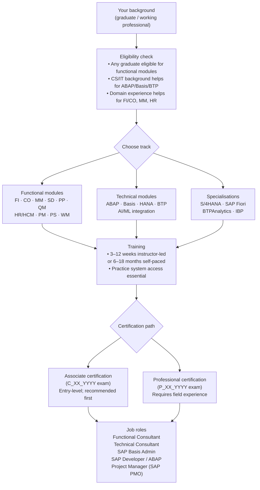

# All About SAP Courses: Overview, Eligibility, Duration, and Fee Structure

SAP (Systems Applications and Products) is the world's most widely deployed ERP platform. Hundreds of thousands of companies run SAP globally — which means SAP-certified professionals are in continuous demand across finance, logistics, human resources, manufacturing, and technology roles.

This guide covers the SAP training landscape: what eligibility is expected, how long courses take, what certifications exist, and how to choose a learning path based on your career target.

## SAP Course Overview

SAP training is module-specific. You don't study "SAP" — you study a specific functional area such as SAP FI (Financial Accounting), SAP MM (Materials Management), or a technical area such as SAP ABAP (programming) or SAP Basis (system administration).

The official training provider is the SAP Learning Hub, which offers:
- **Instructor-led training (ILT)** — classroom or virtual-live sessions
- **SAP Learning Hub subscriptions** — on-demand e-learning and practice systems
- **SAP Certification Exams** — vendor-proctored, module-specific

Authorised training partners (including Koenig Solutions) deliver SAP training with hands-on system access, which the official Learning Hub subscriptions alone do not always provide.

## SAP Learning Path: From Eligibility to Job Role

The diagram below maps the full journey from background check through module selection to certification and employment outcome.

*Figure 1 — SAP learning path from eligibility to job role. Functional and technical tracks are independent starting points; specialisations (S/4HANA, BTP) are typically added after a base module. Associate certification is the entry gate for most consulting and implementation roles.*

## Eligibility Requirements

SAP courses have no formal educational prerequisites at the basic level — any graduate can enrol. In practice:

| Track | Recommended background |
|---|---|
| Functional (FI, CO, MM, SD, PP) | Any degree; domain work experience in finance, procurement, sales, or production accelerates comprehension |
| Technical (ABAP, Basis) | CS, IT, or engineering background; programming experience for ABAP |
| SAP HANA / BTP | Database or cloud architecture experience preferred |
| SAP S/4HANA Migration | Prior ECC experience (functional or technical) strongly recommended |

Most training providers accept candidates immediately after graduation, though employers prefer candidates with 1–2 years of domain experience for functional roles.

### What if I don't have domain experience?

No domain experience is not a disqualifier — it changes your preparation timeline, not your eligibility. Functional modules like SAP MM (Materials Management) and SAP SD (Sales & Distribution) have the shallowest learning curves for non-specialists because their underlying concepts — purchase orders, goods receipts, invoices, delivery notes — are familiar from everyday business operations. Finance modules like SAP FI require slightly more background, but many candidates self-study accounting principles in parallel with training and still pass the Associate exam within three months of starting.

If you are a recent graduate without domain experience, pair your training with a practice system from day one and budget 3–6 extra weeks of hands-on lab time before the exam. The SAP Associate certification tests configuration screens and transaction sequences — not textbook recall — so the gap between domain-experienced and domain-fresh candidates is almost entirely a function of system practice hours, not prior job history. Candidates from non-finance, non-technical backgrounds regularly land junior consultant roles within six months of certification, particularly in cities with active SAP implementation projects such as Bengaluru, Pune, and Hyderabad.

## Course Duration by Module

| Module | Typical training duration | Format |
|---|---|---|
| SAP FI (Financial Accounting) | 4–6 weeks | ILT or self-paced |
| SAP CO (Controlling) | 3–4 weeks | ILT or self-paced |
| SAP MM (Materials Management) | 3–5 weeks | ILT or self-paced |
| SAP SD (Sales & Distribution) | 3–5 weeks | ILT or self-paced |
| SAP ABAP (Programming) | 6–10 weeks | ILT recommended (hands-on) |
| SAP Basis (System Admin) | 4–6 weeks | ILT recommended |
| SAP HANA (Database) | 2–4 weeks | ILT or self-paced |
| SAP S/4HANA (end-to-end) | 8–16 weeks | ILT or blended |
| SAP BTP (Business Technology Platform) | 4–8 weeks | Self-paced + labs |

Durations reflect instructor-led intensity. Self-paced through SAP Learning Hub typically takes 2–3× longer due to schedule flexibility.

<KnowledgeCheck
  question="Which SAP module typically requires the longest instructor-led training duration?"
  options={[
    "SAP CO (Controlling) — 3–4 weeks",
    "SAP HANA (Database) — 2–4 weeks",
    "SAP S/4HANA end-to-end — 8–16 weeks",
    "SAP SD (Sales & Distribution) — 3–5 weeks"
  ]}
  correctIndex={2}
  explanation="SAP S/4HANA end-to-end training takes 8–16 weeks in instructor-led format because it spans multiple functional and technical areas, covering the full migration scope from legacy ECC. Shorter modules like CO (3–4 weeks) or HANA (2–4 weeks) cover narrower, more focused skill sets."
/>

## Fee Structure

SAP training fees vary significantly by provider, region, and delivery format.

| Provider type | Approximate fee range (INR) | Includes |
|---|---|---|
| SAP official (Learning Hub) | ₹75,000–₹2,00,000/year | E-learning + practice system access |
| Authorised training partner (ILT, India) | ₹40,000–₹1,20,000 per module | Instructor, labs, study materials |
| Online bootcamp / bootcamps | ₹15,000–₹50,000 | Video content only; no live system |
| Certification exam | ₹25,000–₹50,000 per attempt [^3] | Proctored exam only; not training |

*Training fee ranges are approximate estimates based on 2026 India market rates. Exam fees sourced from [^3]. Contact providers directly for current and exact pricing.*

**Key consideration**: SAP certification exams are separate from training fees. Budget for training + at least one certification exam attempt. Some authorised partners include the first exam voucher in the course fee — verify before enrolling.

### How to Compare Costs Without Being Misled

The headline course fee is frequently deceptive. A ₹15,000 video bootcamp appears far cheaper than a ₹60,000 instructor-led programme — but it does not include a practice system, and the SAP Associate exam tests configuration screen sequences and transaction paths that can only be learned by doing on a live system. Candidates who train without sandbox access typically require two or three exam attempts to pass, adding ₹50,000–₹1,00,000 in retake costs that were never budgeted. When comparing providers, ask three questions before paying: (1) Is a live SAP system included for the full training duration? (2) Does the fee include the first exam voucher? (3) Is the training environment on S/4HANA or legacy ECC? Training on ECC for an S/4HANA certification exam is a common and costly mismatch. Total cost of certification — training, exam, and a one-retake buffer — typically runs ₹70,000–₹1,50,000 at a reputable authorised partner [^3]. At that total, the instructor-led route costs no more than a discount video course plus two exam failures; the difference is front-loaded payment versus spread-across-failures payment.

## SAP Career Outlook 2026

The demand signal for SAP-certified professionals is structurally strong heading into 2027. The valantic SAP Study 2026 — drawing on responses from 409 companies — found that approximately 70% of surveyed organisations are currently migrating to S/4HANA or have already completed the process [^4]. Over 20,000 customers globally have adopted S/4HANA [^7], and the 2027 end of SAP ECC mainstream maintenance is accelerating the remaining holdouts. Every migration project requires a team of functional and technical consultants, creating project-driven demand that is expected to remain elevated through 2028.

Compensation reflects this demand. Entry-level SAP consultants in India earn ₹3.5–7 LPA for functional roles and ₹4–7 LPA for technical roles (ABAP, Basis) [^6]. Mid-level professionals with 3–5 years of experience typically command ₹8–18 LPA, and senior consultants or solution architects in metros like Bengaluru and Delhi routinely earn ₹25–35 LPA and above [^5]. The S/4HANA Associate certification adds a 20–30% salary premium over uncertified candidates at comparable experience levels — a direct return on the certification investment that typically recoups training costs within the first year of employment [^6].

For candidates choosing between modules on career trajectory alone: SAP FI/CO roles offer the highest starting packages among functional modules due to universal finance department demand. SAP ABAP developers command comparable starting salaries with faster growth at senior levels. SAP BTP (Business Technology Platform) is the fastest-growing skill set heading into 2027, driven by cloud integration and extension work that accompanies every S/4HANA migration project.

## SAP Certification Structure

SAP uses a two-tier certification system:

**Associate (C_XX_YYYY)** — entry-level. 80 questions, 80 minutes, ~65–70% passing score [^3]. Tests application knowledge: configuration, transactions, and business process understanding. No experience requirement.

**Professional (P_XX_YYYY)** — advanced. Requires demonstrable project experience. Tests design, configuration, and implementation decisions under ambiguity. Most employers ask for Associate; Professional distinguishes senior consultants.

Certifications are module-specific. A C_TFIN52_2309 (SAP FI Associate) does not imply MM knowledge.

<Callout type="info">
SAP certifications are valid for one year from the exam date [^3]. SAP requires an annual Stay Certified assessment to extend validity. Missing the stay-current window does not delete the credential — it marks it as expired, which employers can verify. Renewing requires passing a shorter update exam, not the full certification again.
</Callout>

## Choosing Your Module

For first-time learners, three questions narrow the choice:

1. **What is your domain background?** Finance background → SAP FI/CO first. Procurement/supply chain → SAP MM. Sales → SAP SD. No domain preference → SAP MM is the broadest entry point into manufacturing and distribution.

2. **Do you want to be functional or technical?** Functional consultants configure systems and own business processes. Technical consultants (ABAP, Basis) build custom code and manage the platform. Technical roles typically pay slightly higher at senior levels but require programming aptitude.

3. **What version should you learn?** SAP S/4HANA is the current strategic platform [^5]. ECC knowledge is still marketable (many enterprises run it), but S/4HANA migration skills are in highest demand. Learn S/4HANA unless you have a specific ECC role in mind.

<KnowledgeCheck
  question="What is the recommended first SAP certification for someone with no domain background who wants the broadest entry point into consulting?"
  options={[
    "SAP ABAP Associate — best starting point for all candidates",
    "SAP S/4HANA Migration — most in-demand credential",
    "SAP MM (Materials Management) Associate — broadest entry into manufacturing and distribution",
    "SAP Basis Associate — highest-paying technical path"
  ]}
  correctIndex={2}
  explanation="SAP MM is the recommended first module for candidates without a specific domain background. It covers procurement, inventory, and supply chain processes that appear across manufacturing, retail, and distribution — giving the broadest platform for a consulting career. S/4HANA migration knowledge is valuable but requires prior ECC experience."
/>

## Learn More

- [How SAP ABAP and ECC Process Every Enterprise Transaction](/blog/sap-abap-ecc) — a technical deep dive into the ABAP runtime, dispatcher, and database commit cycle.
- [Claude Tool Use From Zero](/learn/claude-tool-use-from-zero) — build agents that interact with SAP and enterprise APIs using structured tool use.

[^3]: SAP Certification Cost, Validity & Renewal Guide 2026. https://passitexams.com/articles/sap-certification-cost-validity-renewal. Retrieved 2026-07-09.
[^4]: valantic SAP Study 2026 — S/4HANA Deployment Trends. https://www.valantic.com/en/research/sap-study-2026. Retrieved 2026-07-09.
[^5]: SAP Consultant Salary Trends — India and Global 2026. https://emeeducation.com/blogs/sap-consultant-salary-trends-market. Retrieved 2026-07-09.
[^6]: Entry-Level SAP Consultant Salaries in India 2026. https://eduwatts.com/blog/sap-consultant-salary. Retrieved 2026-07-09.
[^7]: SAP Strategy 2026: Over 20,000 S/4HANA Customers. https://www.crescenseinc.com/insights/sap-strategy-2026. Retrieved 2026-07-09.
