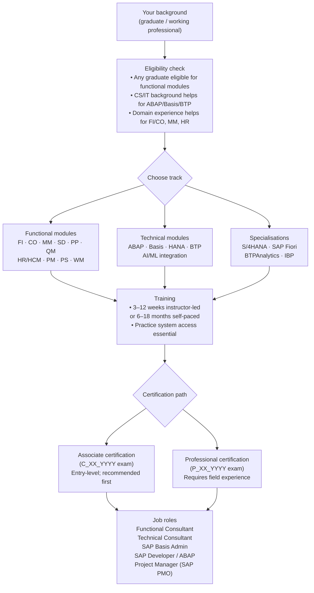

# All About SAP Courses: Overview, Eligibility, Duration, and Fee Structure

SAP (Systems Applications and Products) is the world's most widely deployed ERP platform. More than 400,000 companies run SAP — which means SAP-certified professionals are in continuous demand across finance, logistics, human resources, manufacturing, and technology roles.

This guide covers the SAP training landscape: what eligibility is expected, how long courses take, what certifications exist, and how to choose a learning path based on your career target.

## SAP Course Overview

SAP training is module-specific. You don't study "SAP" — you study a specific functional area such as SAP FI (Financial Accounting), SAP MM (Materials Management), or a technical area such as SAP ABAP (programming) or SAP Basis (system administration).

The official training provider is the SAP Learning Hub, which offers:
- **Instructor-led training (ILT)** — classroom or virtual-live sessions
- **SAP Learning Hub subscriptions** — on-demand e-learning and practice systems
- **SAP Certification Exams** — vendor-proctored, module-specific

Authorised training partners (including Koenig Solutions) deliver SAP training with hands-on system access, which the official Learning Hub subscriptions alone do not always provide.

## SAP Learning Path: From Eligibility to Job Role

The diagram below maps the full journey from background check through module selection to certification and employment outcome.

*Figure 1 — SAP learning path from eligibility to job role. Functional and technical tracks are independent starting points; specialisations (S/4HANA, BTP) are typically added after a base module. Associate certification is the entry gate for most consulting and implementation roles.*

## Eligibility Requirements

SAP courses have no formal educational prerequisites at the basic level — any graduate can enrol. In practice:

| Track | Recommended background |
|---|---|
| Functional (FI, CO, MM, SD, PP) | Any degree; domain work experience in finance, procurement, sales, or production accelerates comprehension |
| Technical (ABAP, Basis) | CS, IT, or engineering background; programming experience for ABAP |
| SAP HANA / BTP | Database or cloud architecture experience preferred |
| SAP S/4HANA Migration | Prior ECC experience (functional or technical) strongly recommended |

Most training providers accept candidates immediately after graduation, though employers prefer candidates with 1–2 years of domain experience for functional roles.

## Course Duration by Module

| Module | Typical training duration | Format |
|---|---|---|
| SAP FI (Financial Accounting) | 4–6 weeks | ILT or self-paced |
| SAP CO (Controlling) | 3–4 weeks | ILT or self-paced |
| SAP MM (Materials Management) | 3–5 weeks | ILT or self-paced |
| SAP SD (Sales & Distribution) | 3–5 weeks | ILT or self-paced |
| SAP ABAP (Programming) | 6–10 weeks | ILT recommended (hands-on) |
| SAP Basis (System Admin) | 4–6 weeks | ILT recommended |
| SAP HANA (Database) | 2–4 weeks | ILT or self-paced |
| SAP S/4HANA (end-to-end) | 8–16 weeks | ILT or blended |
| SAP BTP (Business Technology Platform) | 4–8 weeks | Self-paced + labs |

Durations reflect instructor-led intensity. Self-paced through SAP Learning Hub typically takes 2–3× longer due to schedule flexibility.

## Fee Structure

SAP training fees vary significantly by provider, region, and delivery format.

| Provider type | Approximate fee range (INR) | Includes |
|---|---|---|
| SAP official (Learning Hub) | ₹75,000–₹2,00,000/year | E-learning + practice system access |
| Authorised training partner (ILT, India) | ₹40,000–₹1,20,000 per module | Instructor, labs, study materials |
| Online bootcamp / bootcamps | ₹15,000–₹50,000 | Video content only; no live system |
| Certification exam | ₹25,000–₹50,000 per attempt | Proctored exam only; not training |

**Key consideration**: SAP certification exams are separate from training fees. Budget for training + at least one certification exam attempt. Some authorised partners include the first exam voucher in the course fee — verify before enrolling.

## SAP Certification Structure

SAP uses a two-tier certification system:

**Associate (C_XX_YYYY)** — entry-level. 80 questions, 80 minutes, ~65–70% passing score. Tests application knowledge: configuration, transactions, and business process understanding. No experience requirement.

**Professional (P_XX_YYYY)** — advanced. Requires demonstrable project experience. Tests design, configuration, and implementation decisions under ambiguity. Most employers ask for Associate; Professional distinguishes senior consultants.

Certifications are module-specific. A C_TFIN52_2309 (SAP FI Associate) does not imply MM knowledge.

<Callout type="info">
SAP certifications are valid for two years from the exam date. SAP requires a "stay current" annual assessment to extend validity. Missing the stay-current window does not delete the credential — it marks it as expired, which employers can verify. Renewing requires passing a shorter update exam, not the full certification again.
</Callout>

## Choosing Your Module

For first-time learners, three questions narrow the choice:

1. **What is your domain background?** Finance background → SAP FI/CO first. Procurement/supply chain → SAP MM. Sales → SAP SD. No domain preference → SAP MM is the broadest entry point into manufacturing and distribution.

2. **Do you want to be functional or technical?** Functional consultants configure systems and own business processes. Technical consultants (ABAP, Basis) build custom code and manage the platform. Technical roles typically pay slightly higher at senior levels but require programming aptitude.

3. **What version should you learn?** SAP S/4HANA is the current strategic platform. ECC knowledge is still marketable (many enterprises run it), but S/4HANA migration skills are in highest demand. Learn S/4HANA unless you have a specific ECC role in mind.

## Learn More

- [How SAP ABAP and ECC Process Every Enterprise Transaction](/blog/sap-abap-ecc) — a technical deep dive into the ABAP runtime, dispatcher, and database commit cycle.
- [Claude Tool Use From Zero](/learn/claude-tool-use-from-zero) — build agents that interact with SAP and enterprise APIs using structured tool use.
