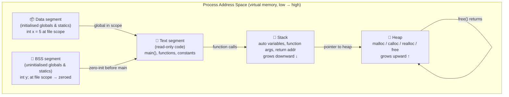

# C Interview Questions and Answers

C technical interviews test three things: how you think about memory, how you reason through pointers, and whether you can predict undefined behaviour before it bites you in production. This guide covers the questions that appear most frequently, with answers that go beyond surface definitions.

## Core C Interview Topics: The Memory and Control-Flow Model

Before answering individual questions, having a clear mental model of how C uses memory eliminates an entire category of confusion. The diagram below maps the C runtime memory layout and the control-flow primitives that interact with it.



*Figure 1 — C runtime memory model: five segments, two dynamic regions. Stack and heap grow toward each other; a collision is a stack overflow or heap corruption. Text and Data/BSS are set at load time. Understanding which segment a variable lives in determines its lifetime and initialisation behaviour.*

**Key rule**: if you can name which segment a variable lives in, you can answer most C memory questions cold.

## Pointer Questions

### What is a pointer and how does it differ from a reference in C++?

A pointer in C is a variable that holds a memory address. It has a type that describes what it points to, allowing the compiler to compute offsets for pointer arithmetic.

```c
int x = 42;
int *p = &x;    // p holds the address of x
*p = 100;       // dereference: writes 100 into x
```

C has no references — `&` in a C expression takes the address of a variable (an lvalue). C++ references are aliases that cannot be reseated; C pointers can point anywhere and can be `NULL`.

### What is a null pointer and what happens when you dereference one?

A null pointer (`NULL` or `(void*)0`) is a pointer guaranteed not to point to any valid object. Dereferencing it is undefined behaviour — typically a segmentation fault on modern systems because address zero is not mapped in the process's virtual address space. Never assume it always crashes; the C standard makes no guarantee about the runtime effect.

### What is pointer arithmetic and when is it valid?

Pointer arithmetic is valid only within a single array (including one past the end):

```c
int arr[5] = {1,2,3,4,5};
int *p = arr;
p += 3;   // valid: points to arr[3]
p++;      // valid: points to arr[4]
p++;      // valid: one past the end (comparison allowed, dereference is UB)
p++;      // undefined behaviour: two past the end
```

Arithmetic on pointers to different objects (even if adjacent in memory) is undefined behaviour. Compilers exploit this: they may optimise loops assuming no UB, producing surprising results when you violate the contract.

### What is the difference between `int *const p` and `const int *p`?

| Declaration | What is const? | Can you change where p points? | Can you change *p? |
|---|---|---|---|
| `int *const p` | The pointer itself | No | Yes |
| `const int *p` | The value pointed to | Yes | No |
| `const int *const p` | Both | No | No |

Read declarations right-to-left: `int *const p` → "p is a const pointer to int."

## Memory Management Questions

### What is the difference between stack and heap allocation?

| | Stack | Heap |
|---|---|---|
| Allocation | Automatic (variable enters scope) | Explicit (`malloc`/`calloc`) |
| Deallocation | Automatic (variable leaves scope) | Explicit (`free`) |
| Lifetime | Tied to function frame | Until `free()` or process exit |
| Size limit | Small (typically 1–8 MB) | Large (limited by virtual memory) |
| Speed | Fast (pointer decrement) | Slower (allocator bookkeeping) |
| Failure mode | Stack overflow (silent UB or crash) | Returns `NULL` on failure |

### What are common memory errors in C and how do you detect them?

1. **Buffer overflow** — writing past the end of an array. Detected by AddressSanitizer (`-fsanitize=address`), Valgrind.

2. **Use-after-free** — accessing memory after `free()`. Also detected by AddressSanitizer; produces undefined behaviour (often: no immediate crash, then corruption later).

3. **Double free** — calling `free()` on the same pointer twice. Undefined behaviour; often corrupts the allocator's internal structures.

4. **Memory leak** — allocated memory never freed. Detected by Valgrind (`--leak-check=full`) or LeakSanitizer.

5. **Uninitialised read** — reading a variable before assignment. Stack variables are not zeroed. Detected by MemorySanitizer (`-fsanitize=memory`).

```c
// Classic use-after-free
int *p = malloc(sizeof(int));
free(p);
*p = 42;   // undefined behaviour — allocator may have reused this memory
```

### What does `volatile` do in C?

`volatile` tells the compiler not to optimise away reads or writes to a variable. Use it for:
- Memory-mapped hardware registers
- Variables modified by signal handlers
- Shared variables in embedded contexts (though `volatile` alone is not sufficient for thread safety)

```c
volatile int hardware_flag;   // every read hits the actual memory address
```

## Control Flow Questions

### What is undefined behaviour and why does it matter?

Undefined behaviour (UB) in C means the language standard makes no guarantee about what happens. The compiler is free to assume UB never occurs and may eliminate code paths that would only execute under UB — producing results that surprise programmers who reason about C as a portable assembler.

Common UB triggers:
- Signed integer overflow (`INT_MAX + 1`)
- Shifting by an amount ≥ the type width
- Dereferencing a null or invalid pointer
- Accessing memory out of bounds
- Violating strict aliasing rules

### What is the difference between `==` and `=` in a condition?

`=` is assignment; `==` is comparison. Writing `if (x = 5)` assigns 5 to x and evaluates to true because 5 is non-zero. Compilers warn about this (`-Wparentheses`). Many style guides require `if (5 == x)` (Yoda conditions) to make accidental assignment a compile error.

### What does `static` mean in different contexts?

| Context | Meaning |
|---|---|
| `static` local variable | Persists across function calls; initialised once |
| `static` global variable | Scope limited to the translation unit (file scope) |
| `static` function | Scope limited to the translation unit |

<Callout type="info">
C interview questions at senior level often test edge cases: what happens to a `static` local variable in a recursive function, or whether you can `free()` a pointer returned by `getenv()`. The answer to both: the static variable is shared across all recursive frames (one copy), and you must not `free()` `getenv()` results (they point into the environment, which the C runtime owns).
</Callout>

## Preparation Tips

Three practices that separate candidates who pass from those who don't:

1. **Write code on paper.** Interviewers expect you to trace through pointer operations without IDE assistance. Practice pointer arithmetic on paper until it is automatic.

2. **Know your tools.** Mentioning Valgrind, AddressSanitizer, and GDB by name signals production experience, not just academic knowledge.

3. **Predict undefined behaviour before being asked.** When shown code with a potential buffer overflow or use-after-free, identify it proactively — don't wait to be told it is a bug.

## Learn More

- [Claude Tool Use From Zero](/learn/claude-tool-use-from-zero) — build agents that generate and analyse C code using structured tool use and function calling.
- [Secure Coding With Claude](/learn/secure-coding-with-claude) — security-focused code review covering buffer overflows, injection vulnerabilities, and memory safety patterns.
