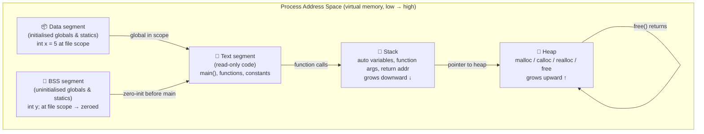

# Answer C Interview Questions and Answers in 2026

C interview questions and answers usually center on memory layout, pointers, allocation, undefined behavior, and C syntax edge cases. A strong answer names the relevant rule, predicts the failure mode, and says which tool would catch it.

The trap is treating C interviews like vocabulary quizzes. Actually, interviewers are usually testing whether you can connect a language rule to an address, a lifetime, and a debugging strategy. "Dangling pointer" is not enough; the useful answer is "a pointer outlived its object, dereferencing it is undefined behavior, and ASan should catch the heap-use-after-free path" [5].


## Map Each C Question to Memory First

Before answering individual questions, having a clear mental model of how C uses memory eliminates an entire category of confusion. The diagram below maps the C runtime memory layout and the control-flow primitives that interact with it. cppreference frames the C memory model around memory locations, objects, and data races; for interviews, that abstraction becomes useful only when you can map it back to stack frames, heap allocations, globals, and function calls [1].



*Figure 1 — C runtime memory model: five segments, two dynamic regions. Stack and heap grow toward each other; a collision is a stack overflow or heap corruption. Text and Data/BSS are set at load time. Understanding which segment a variable lives in determines its lifetime and initialisation behaviour.*

**Key rule**: if you can name which segment a variable lives in, you can answer most C memory questions cold. Automatic locals normally die when the block exits; heap allocations live until `free()`; initialized and zero-initialized globals are prepared before `main()` starts. That is why returning `&local` is a lifetime bug, while returning a heap pointer is allowed but transfers cleanup responsibility.

## Explain Pointers by Lifetime and Valid Ranges

### What is a pointer and how does it differ from a reference in C++?

A pointer in C is a variable that holds a memory address. It has a type that describes what it points to, allowing the compiler to compute offsets for pointer arithmetic.

```c
int x = 42;
int *p = &x;    // p holds the address of x
*p = 100;       // dereference: writes 100 into x
```

C has no references; `&` in a C expression takes the address of a variable (an lvalue). C++ references are aliases that cannot be reseated; C pointers can point anywhere and can be `NULL`.

### What is a null pointer and what happens when you dereference one?

A null pointer (`NULL` or `(void*)0`) is a pointer guaranteed not to point to any valid object. Dereferencing it is undefined behaviour; the C standard does not promise a trap, a clean crash, or any recoverable result [2]. On many modern operating systems it becomes a segmentation fault because address zero is not mapped, but the interview-safe answer is that the program has already left the language contract.

### What is pointer arithmetic and when is it valid?

Pointer arithmetic is valid only within a single array (including one past the end):

```c
int arr[5] = {1,2,3,4,5};
int *p = arr;
p += 3;   // valid: points to arr[3]
p++;      // valid: points to arr[4]
p++;      // valid: one past the end (comparison allowed, dereference is UB)
p++;      // undefined behaviour: two past the end
```

Arithmetic on pointers to different objects, even if adjacent in memory, is undefined behaviour. Compilers exploit this: they may optimise loops assuming no UB, producing surprising results when you violate the contract [2].

### What is the difference between `int *const p` and `const int *p`?

| Declaration | What is const? | Can you change where p points? | Can you change *p? |
|---|---|---|---|
| `int *const p` | The pointer itself | No | Yes |
| `const int *p` | The value pointed to | Yes | No |
| `const int *const p` | Both | No | No |

Read declarations right-to-left: `int *const p` → "p is a const pointer to int."

<KnowledgeCheck
  question="In C, what does `const int *p` mean, and what does it prevent?"
  options={[
    "p is a const pointer — you cannot change where p points, but you can change *p",
    "p is a pointer to const int — you cannot change *p (the value), but you can change where p points",
    "Both p and *p are const — neither the pointer nor the value can be changed",
    "p is a volatile pointer — the compiler will not optimise reads through p"
  ]}
  correctIndex={1}
  explanation="Read C declarations right-to-left: `const int *p` means 'p is a pointer to const int.' The `const` applies to the pointed-to value, so *p cannot be modified. The pointer p itself can be reseated to point elsewhere. Contrast with `int *const p` where the pointer is fixed but the value is mutable."
/>

## Tie Allocation Answers to Ownership

### What is the difference between stack and heap allocation?

Stack allocation is automatic and tied to scope; heap allocation is explicit and tied to ownership. Say that first, then give the allocator rule: `malloc()` returns uninitialized storage, `calloc()` zero-initializes the allocated bytes, and both return pointers that must be released with `free()` when no longer needed [3].

| | Stack | Heap |
|---|---|---|
| Allocation | Automatic (variable enters scope) | Explicit (`malloc`/`calloc`) |
| Deallocation | Automatic (variable leaves scope) | Explicit (`free`) |
| Lifetime | Tied to function frame | Until `free()` or process exit |
| Size limit | Platform and process dependent | Limited by address space, overcommit policy, and allocator behavior |
| Speed | Fast (pointer decrement) | Slower (allocator bookkeeping) |
| Failure mode | Stack overflow (silent UB or crash) | Returns `NULL` on failure [3] |

### How do `malloc`, `calloc`, `realloc`, and `free` differ?

`malloc(size)` gives you a block of uninitialized bytes. `calloc(n, size)` gives you room for an array and initializes the bytes to zero. `realloc(ptr, new_size)` may move the block, so any interior pointer into the old block becomes suspicious after the call. `free(ptr)` releases a block that came from an allocator; freeing the same block twice is undefined behavior. The Linux `malloc(3)` page is the cleanest short source for these interview answers because it describes the allocation, initialization, failure, and deallocation contracts in one place [3].

The gotcha is `realloc`. Do not write `p = realloc(p, n)` in production code unless you are willing to leak the original block on failure. Use a temporary pointer:

```c
int *tmp = realloc(p, new_count * sizeof *p);
if (tmp == NULL) {
    /* p is still valid here */
    return -1;
}
p = tmp;
```

### What are common memory errors in C and how do you detect them?

1. **Buffer overflow** — writing past the end of an array. Detected by AddressSanitizer (`-fsanitize=address`) [4][5] and Valgrind Memcheck [8].

2. **Use-after-free** — accessing memory after `free()`. Also detected by AddressSanitizer; produces undefined behaviour, often with no immediate crash and corruption later [5].

3. **Double free** — calling `free()` on the same pointer twice. Undefined behaviour; often corrupts the allocator's internal structures.

4. **Memory leak** — allocated memory never freed. Detected by Valgrind (`--leak-check=full`) [8] or LeakSanitizer.

5. **Uninitialised read** — reading a variable before assignment. Stack variables are not zeroed. Detected by MemorySanitizer (`-fsanitize=memory`) [6].

6. **Data race** — two threads access the same memory location, at least one access writes, and the program has no synchronization. ThreadSanitizer instruments C and C++ binaries with `-fsanitize=thread` to report these races at runtime [7].

```c
// Classic use-after-free
int *p = malloc(sizeof(int));
free(p);
*p = 42;   // undefined behaviour — allocator may have reused this memory
```

<RunPromptCell language="bash">
```bash
cat > uaf.c <<'C'
#include <stdlib.h>

int main(void) {
    int *p = malloc(sizeof *p);
    free(p);
    return *p;
}
C

clang -fsanitize=address -g uaf.c -o uaf
./uaf
```

Expected output:

```text
AddressSanitizer reports heap-use-after-free and prints the allocation, free, and invalid read stack traces.
```
</RunPromptCell>

### What does `volatile` do in C?

`volatile` tells the compiler not to optimise away reads or writes to a variable. Use it for:
- Memory-mapped hardware registers
- Variables modified by signal handlers
- Shared variables in embedded contexts (though `volatile` alone is not sufficient for thread safety)

```c
volatile int hardware_flag;   // every read hits the actual memory address
```

## Treat Undefined Behavior as a Compiler Contract

### What is undefined behaviour and why does it matter?

Undefined behaviour (UB) in C means the language standard makes no guarantee about what happens [2]. The compiler is free to assume UB never occurs and may eliminate code paths that would only execute under UB, producing results that surprise programmers who reason about C as a portable assembler.

Common UB triggers:
- Signed integer overflow (`INT_MAX + 1`)
- Shifting by an amount ≥ the type width
- Dereferencing a null or invalid pointer
- Accessing memory out of bounds
- Violating strict aliasing rules

One interview pattern is a snippet that "works on my machine" until optimization changes the result. The answer should not be "the compiler is buggy." It should be "the source invoked UB, so the optimizer is allowed to reason from impossible assumptions." That distinction is why C security reviews use both compiler warnings and runtime instrumentation: GCC's sanitizer flags instrument memory operations for out-of-bounds and use-after-free checks [4], while Valgrind's Memcheck runs the binary under a shadow-memory engine that reports invalid reads, invalid writes, and leaks [8].

### What is the difference between `==` and `=` in a condition?

`=` is assignment; `==` is comparison. Writing `if (x = 5)` assigns 5 to x and evaluates to true because 5 is non-zero. Compilers warn about this (`-Wparentheses`). Many style guides require `if (5 == x)` (Yoda conditions) to make accidental assignment a compile error.

### What does `static` mean in different contexts?

| Context | Meaning |
|---|---|
| `static` local variable | Persists across function calls; initialised once |
| `static` global variable | Scope limited to the translation unit (file scope) |
| `static` function | Scope limited to the translation unit |

<Callout type="info">
C interview questions at senior level often test edge cases: what happens to a `static` local variable in a recursive function, or whether you can `free()` a pointer returned by `getenv()`. The answer to both: the static variable is shared across all recursive frames (one copy), and you must not `free()` `getenv()` results because they point into environment storage the C runtime owns.
</Callout>

## Prepare by Practicing Failure Modes

Three practices that separate candidates who pass from those who don't:

1. **Write code on paper.** Interviewers expect you to trace through pointer operations without IDE assistance. Practice pointer arithmetic on paper until it is automatic.

2. **Know your tools.** Mentioning Valgrind [8], AddressSanitizer [5], MemorySanitizer [6], ThreadSanitizer [7], and GDB by name signals production experience, not just academic knowledge. If the interviewer gives you an allocator-heavy bug, name ASan first for fast local repros, Valgrind Memcheck for leak and invalid-access reports, and glibc probes when you need allocator visibility in a GNU libc environment [9].

3. **Predict undefined behaviour before being asked.** When shown code with a potential buffer overflow or use-after-free, identify it proactively — don't wait to be told it is a bug.

<KnowledgeCheck
  question="Which tool detects use-after-free bugs in C programs at runtime?"
  options={[
    "Valgrind --leak-check=full",
    "GCC -Wall -Wextra flags",
    "AddressSanitizer (-fsanitize=address)",
    "MemorySanitizer (-fsanitize=memory)"
  ]}
  correctIndex={2}
  explanation="AddressSanitizer (ASan) detects use-after-free, buffer overflows, and heap corruption at runtime by instrumenting memory accesses. Valgrind with --leak-check=full detects memory leaks. MemorySanitizer detects reads of uninitialised memory. GCC warning flags catch static issues at compile time but cannot catch runtime memory errors."
/>

If this is part of interview preparation for systems or security work, continue with [[course/secure-coding-with-claude]] and [[course/ai-agent-security-for-developers]]; the same habits used here, especially naming the failure mode and validating it with tooling, transfer directly to code review, vulnerability triage, and sandbox design.
