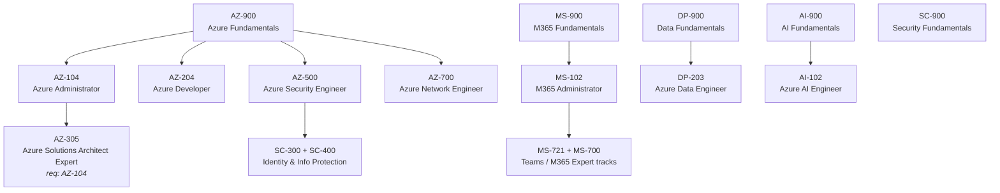

# Microsoft Certification Roadmap: Fundamentals to Expert

Microsoft's certification portfolio spans more than 40 credentials across cloud infrastructure, data, security, AI, and productivity. The ladder has three rungs — Fundamentals, Associate, Expert — and most technical paths require completing lower rungs before earning the top-level credential.

This guide maps the full certification ladder by role family so you can pick the shortest path from where you are to the credential you need.

## The Three Certification Levels

| Level | Audience | Prerequisite |
|---|---|---|
| **Fundamentals** | Anyone new to a technology area | None |
| **Associate** | Practitioners with 6–12 months of hands-on experience | None (but Fundamentals helps) |
| **Expert** | Senior engineers, architects, and specialists | Typically one or more Associate credentials |

Fundamentals exams (AZ-900, MS-900, AI-900, DP-900, SC-900) are optional prerequisites for Associate exams but are strongly recommended if you lack hands-on experience. Expert credentials have hard prerequisites.

## Microsoft Certification Ladder by Role Family

*Figure 1 — Microsoft certification ladder from Fundamentals to Expert by role family. Arrows show the recommended prerequisite path; no arrow means no hard prerequisite, only assumed knowledge. Role family branches: Azure infrastructure (left), productivity/M365 (centre), data and AI (right).*

## Azure Role Family

**AZ-900 → AZ-104 → AZ-305** is the highest-demand path in the Microsoft ecosystem.

- **AZ-900 Azure Fundamentals** — optional but useful. Covers cloud concepts, Azure services, pricing, and compliance. No hands-on required.
- **AZ-104 Azure Administrator Associate** — the core Azure admin credential. VMs, networking, storage, identity, and monitoring. Required before AZ-305.
- **AZ-305 Azure Solutions Architect Expert** — requires AZ-104. Architecture patterns, resiliency, cost optimisation, and multi-service design.

Parallel tracks from AZ-900:
- **AZ-204 Azure Developer Associate** — building applications on Azure (App Service, Functions, Cosmos DB, Key Vault).
- **AZ-500 Azure Security Engineer Associate** — identity protection, threat management, Key Vault, Defender for Cloud. Pairs naturally with AZ-104.
- **AZ-700 Azure Network Engineer Associate** — advanced VNets, hub-and-spoke, ExpressRoute, Azure Firewall. AZ-104 knowledge assumed.

## Microsoft 365 Role Family

**MS-900 → MS-102** covers Microsoft 365 administration: Exchange Online, Teams, SharePoint, Entra ID, and compliance.

Expert-level M365 credentials require multiple Associate exams and are typically pursued by Microsoft 365 Administrators who own tenant-wide identity and compliance posture.

## Data and AI Role Family

- **DP-900 Data Fundamentals** → **DP-203 Azure Data Engineer Associate** — Synapse Analytics, Azure Data Factory, Azure Databricks, data lake architecture.
- **AI-900 AI Fundamentals** → **AI-102 Azure AI Engineer Associate** — Azure OpenAI Service, Cognitive Services, AI Search, bot frameworks.

Data Engineer and AI Engineer are the fastest-growing Microsoft credential tracks as enterprises adopt AI pipelines built on Azure.

## Security Role Family

**SC-900 Security Fundamentals** introduces Microsoft's security stack. From there:
- **SC-300** — Microsoft Identity and Access Administrator
- **SC-400** — Microsoft Information Protection Administrator
- **AZ-500** — Azure Security Engineer (sits in the Azure role family but heavily overlaps with SC)

Expert security credentials require combinations of SC-300 and SC-400 plus operational experience.

## Choosing Your Path

| Career target | Recommended path |
|---|---|
| Cloud infrastructure / ops | AZ-900 → AZ-104 → AZ-305 |
| Application developer | AZ-900 → AZ-204 |
| Security engineer | AZ-900 → AZ-500 (+ SC-300 for identity depth) |
| Data engineer | DP-900 → DP-203 |
| AI / ML engineer | AI-900 → AI-102 |
| M365 admin / productivity | MS-900 → MS-102 |
| Network specialist | AZ-104 → AZ-700 |

<Callout type="info">
Microsoft retires and replaces exams regularly. Always verify that a certification is still active and that prerequisite requirements haven't changed on the official credentials browse page [1] before booking.
</Callout>

## Exam Format and Logistics

All Microsoft exams:
- Score 1000 points; passing is 700
- Include multiple-choice, case studies, and lab simulations (for some exams)
- Can be taken online proctored or at a testing centre
- Expire after one year and require renewal via a free online assessment

Expert credentials renew in two stages: the base Associate credential must stay current first, then the Expert credential renews separately.

## Learn More

- [Guide to Pass AZ-104](/blog/guide-to-pass-az-104-microsoft-certified-azure-administrator-exam) — domain map, study sequence, and exam logistics for the core Azure admin credential.
- [Claude Tool Use From Zero](/learn/claude-tool-use-from-zero) — build AI agents that interact with Azure management APIs using function calling.
