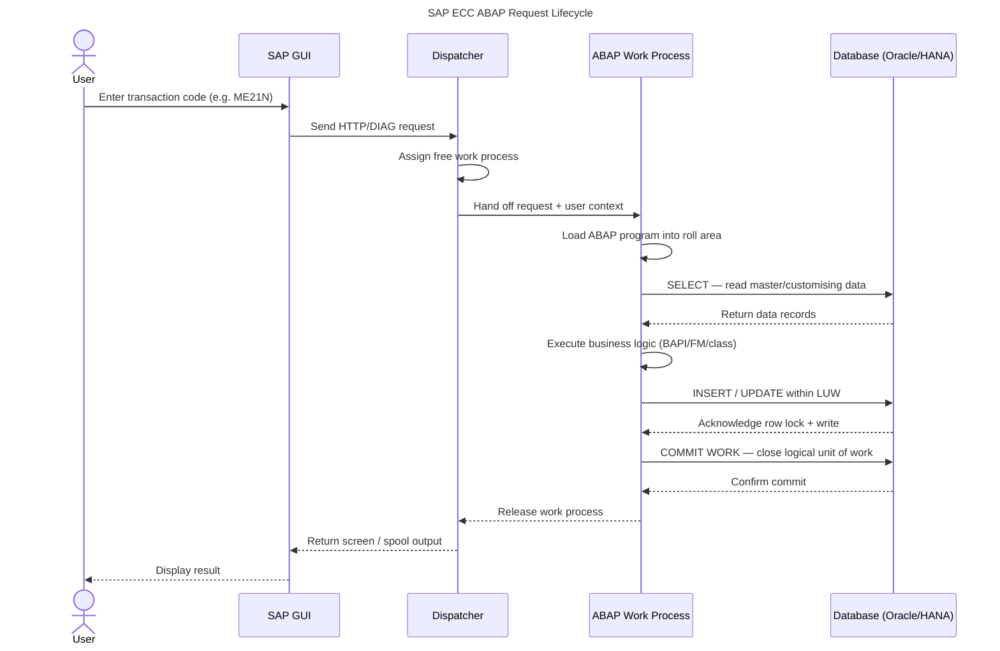

# How SAP ABAP and ECC Process Every Enterprise Transaction

Every purchase order, goods receipt, and payroll run in an SAP ECC system follows a predictable path through the ABAP runtime — dispatcher, work process, database, and back. Understanding that path helps you debug performance issues, write efficient ABAP code, and reason about concurrency in enterprise environments.

## What Is SAP ECC?

SAP ECC (ERP Central Component) is the on-premises predecessor to SAP S/4HANA. It runs on the ABAP Application Server (AS ABAP) and remains the production backbone for thousands of enterprises worldwide. ECC processes business logic through ABAP programs executed in work processes managed by a central dispatcher.

## What Is the SAP ABAP/ECC Relationship?

ABAP (Advanced Business Application Programming) is both the programming language and the runtime for all SAP ECC application logic. Every screen, every report, and every background job runs as an ABAP program inside an ABAP work process. The diagram below traces the full path a user transaction takes — from the moment you press Enter in SAP GUI to the moment the database commits your change.

*Figure 1 — SAP ECC ABAP request lifecycle: 12 steps from user action to database commit. Mobile-optimised; screen reader caption provided above.*

## Step-by-Step: The 12-Step Lifecycle

**Step 1 — Transaction code entry.** The user types a transaction code (T-code) such as `ME21N` (create purchase order) in SAP GUI and presses Enter.

**Step 2 — DIAG/HTTP dispatch.** SAP GUI sends the screen data to the message server, which forwards it to the ABAP application server. The request arrives at the dispatcher queue.

**Step 3 — Work process assignment.** The dispatcher selects a free dialog work process from its pool. If all work processes are busy, the request waits in the queue — the most common cause of SAP "slow dialog" incidents. <CitationFootnote source="https://help.sap.com/docs/SAP_S4HANA_ON-PREMISE/6c28b5a9ec734c35a39bdfa8e41b3ec3/4ec3c11c6e391014adc9fffe4e204223.html">SAP Help — ABAP Runtime Environment [1]</CitationFootnote>

**Step 4 — Roll area load.** The work process loads the ABAP program and the user's roll area (context memory — field values, internal tables, call stack) from shared memory or the roll file.

**Step 5 — Database SELECT.** The program issues Open SQL `SELECT` statements to read master data, customising entries, or existing documents. The ABAP kernel translates Open SQL into the native dialect of the underlying database (Oracle, MS SQL, or SAP HANA). <CitationFootnote source="https://help.sap.com/docs/ABAP_PLATFORM_NEW/fc4c71aa50014fd1b43721701471913d/4ec389696e391014adc9fffe4e204223.html">SAP Help — Work Processes [2]</CitationFootnote>

**Step 6 — Business logic execution.** The ABAP program runs its core logic: field validation, pricing determination, availability check, tax calculation. This is where BAPIs, function modules, and ABAP OO classes execute.

**Step 7 — Database write within the LUW.** The program issues `INSERT`, `UPDATE`, or `DELETE` statements within the open Logical Unit of Work (LUW). The database holds row locks but has not yet made the changes visible to other sessions.

**Step 8 — COMMIT WORK.** When the ABAP program issues `COMMIT WORK`, the database commits the entire LUW atomically. If any step in the LUW fails, a `ROLLBACK WORK` undoes all changes — giving SAP ECC ACID-compliant transaction semantics. <CitationFootnote source="https://learning.sap.com/learning-journeys/acquire-core-abap-skills">SAP Learning — Core ABAP Skills [3]</CitationFootnote>

**Steps 9–12 — Release and response.** The work process releases back to the dispatcher pool, the dispatcher sends the screen output to SAP GUI, and the user sees the result (confirmation message, document number, or error).

## Why This Matters for Developers

Three things to carry into your next ABAP project:

1. **Work process starvation is a capacity problem, not a code problem.** If your system slows under load, check SM50/SM66 before profiling ABAP code. A work-process queue tells you to add application server instances, not to rewrite SELECT statements.

2. **Open SQL is database-agnostic; native SQL is not.** Stick to Open SQL unless you genuinely need database-specific features — it keeps migrations from Oracle to HANA straightforward.

3. **The LUW is your atomicity boundary.** Everything between the start of dialog processing and `COMMIT WORK` is a single transaction. Avoid calling external RFC destinations inside an open LUW if rollback semantics matter.

<Callout type="info">
SAP S/4HANA retains the same ABAP runtime model. The dispatcher, work processes, and LUW semantics are unchanged — what changes is that the database layer is always SAP HANA, enabling in-memory pushdown of analytics and eliminating some aggregate tables.
</Callout>

## Learn More

- [Claude Tool Use From Zero](/learn/claude-tool-use-from-zero) — Build agent workflows and understand how LLM tool calls map to similar request-lifecycle patterns.
- [Secure Coding With Claude](/learn/secure-coding-with-claude) — Best practices for writing safe enterprise code, including SQL injection prevention in ABAP Open SQL contexts.

The SAP ABAP/ECC request lifecycle is one of the most stable design patterns in enterprise software — unchanged across decades of SAP versions. Once you can trace a transaction through the dispatcher to `COMMIT WORK`, you have the mental model to diagnose most SAP performance and reliability issues without needing to read the source code.
