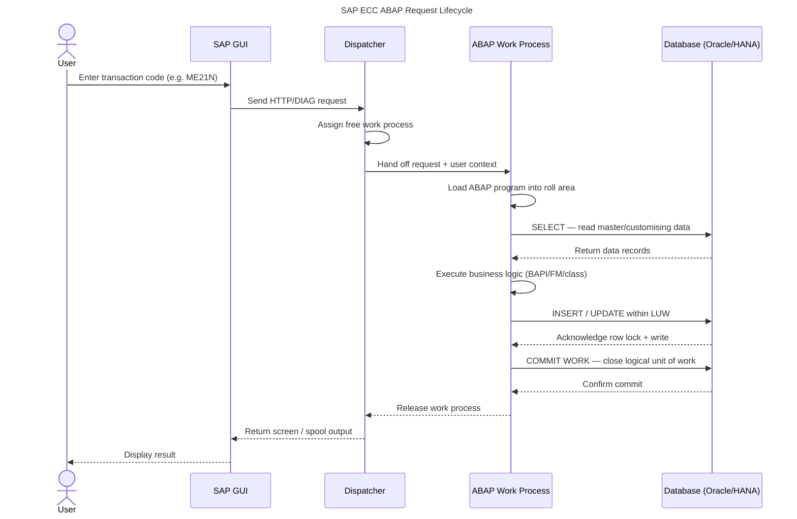

# How SAP ABAP and ECC Process Every Enterprise Transaction

Every purchase order, goods receipt, and payroll run in an SAP ECC system follows a predictable path through the ABAP runtime — dispatcher, work process, database, and back. Understanding that path helps you debug performance issues, write efficient ABAP code, and reason about concurrency in enterprise environments.

## What Is SAP ECC?

SAP ECC (ERP Central Component) is the on-premises predecessor to SAP S/4HANA [4]. It runs on the ABAP Application Server (AS ABAP) and remains the production backbone for thousands of enterprises worldwide. ECC processes business logic through ABAP programs executed in work processes managed by a central dispatcher.

## What Is the SAP ABAP/ECC Relationship?

ABAP (Advanced Business Application Programming) is both the programming language and the runtime for all SAP ECC application logic. Every screen, every report, and every background job runs as an ABAP program inside an ABAP work process. The diagram below traces the full path a user transaction takes — from the moment you press Enter in SAP GUI to the moment the database commits your change.

*Figure 1 — SAP ECC ABAP request lifecycle: 12 steps from user action to database commit. Mobile-optimised; screen reader caption provided above.*

## Step-by-Step: The 12-Step Lifecycle

**Step 1 — Transaction code entry.** The user types a transaction code (T-code) such as `ME21N` (create purchase order) in SAP GUI and presses Enter.

**Step 2 — DIAG/HTTP dispatch.** SAP GUI sends the screen data to the message server, which forwards it to the ABAP application server. The request arrives at the dispatcher queue.

**Step 3 — Work process assignment.** The dispatcher selects a free dialog work process from its pool. If all work processes are busy, the request waits in the queue — the most common cause of SAP "slow dialog" incidents. <CitationFootnote source="https://help.sap.com/docs/SAP_S4HANA_ON-PREMISE/6c28b5a9ec734c35a39bdfa8e41b3ec3/4ec3c11c6e391014adc9fffe4e204223.html">SAP Help — ABAP Runtime Environment [1]</CitationFootnote>

**Step 4 — Roll area load.** The work process loads the ABAP program and the user's roll area (context memory — field values, internal tables, call stack) from shared memory or the roll file.

**Step 5 — Database SELECT.** The program issues Open SQL `SELECT` statements to read master data, customising entries, or existing documents. The ABAP kernel translates Open SQL into the native dialect of the underlying database (Oracle, MS SQL, or SAP HANA). <CitationFootnote source="https://help.sap.com/docs/ABAP_PLATFORM_NEW/fc4c71aa50014fd1b43721701471913d/4ec389696e391014adc9fffe4e204223.html">SAP Help — Work Processes [2]</CitationFootnote>

**Step 6 — Business logic execution.** The ABAP program runs its core logic: field validation, pricing determination, availability check, tax calculation. This is where BAPIs, function modules, and ABAP OO classes execute.

**Step 7 — Database write within the LUW.** The program issues `INSERT`, `UPDATE`, or `DELETE` statements within the open Logical Unit of Work (LUW). The database holds row locks but has not yet made the changes visible to other sessions.

**Step 8 — COMMIT WORK.** When the ABAP program issues `COMMIT WORK`, the database commits the entire LUW atomically. If any step in the LUW fails, a `ROLLBACK WORK` undoes all changes — giving SAP ECC ACID-compliant transaction semantics. <CitationFootnote source="https://learning.sap.com/learning-journeys/acquire-core-abap-skills">SAP Learning — Core ABAP Skills [3]</CitationFootnote>

**Steps 9–12 — Release and response.** The work process releases back to the dispatcher pool, the dispatcher sends the screen output to SAP GUI, and the user sees the result (confirmation message, document number, or error).

<KnowledgeCheck
  question="In the SAP ECC/ABAP request lifecycle, what does the dispatcher do when all work processes are busy?"
  options={[
    "It creates a new work process dynamically to handle the incoming request",
    "It queues the incoming request until a work process becomes free — the most common cause of SAP 'slow dialog' incidents",
    "It sends the request directly to the database, bypassing the work process",
    "It rejects the request and returns an error to SAP GUI"
  ]}
  correctIndex={1}
  explanation="When all dialog work processes are busy, the SAP dispatcher queues incoming requests. This queue buildup is the most common cause of 'slow dialog' performance incidents — not slow ABAP code. The diagnostic check is SM50/SM66 (work process monitor), which shows queue depth and work process status. Adding application server instances increases the work process pool."
/>

## Why This Matters for Developers

Three things to carry into your next ABAP project:

1. **Work process starvation is a capacity problem, not a code problem.** If your system slows under load, open SM50 before profiling ABAP code. Focus on the Reason column: consecutive `PRIV` entries mean work processes are held in private mode — triggered when a program holds too many internal tables in memory — and those processes cannot be reassigned until the user logs off or the session time limit elapses. `CPIC` means an RFC connection is occupying a dialog slot. If waiting time dominates response time in transaction ST05 rather than CPU time, the problem is queue depth. The fix is to add application server instances, not to rewrite SELECT statements.

2. **Open SQL is database-agnostic; native SQL is not.** Stick to Open SQL unless you genuinely need database-specific features — it keeps migrations from Oracle to HANA straightforward [5]. A concrete migration scenario: ABAP programs that embed database-specific hints or use analytical windowing functions such as `ROW_NUMBER() OVER (PARTITION BY ...)` must do so via `EXEC SQL` (native SQL), and the syntax differs between Oracle and HANA. Every `EXEC SQL` block in your codebase becomes a line item on the database migration checklist. Reserve native SQL for genuine edge cases, document each usage clearly, and the migration team will thank you.

3. **The LUW is your atomicity boundary.** Everything between the start of dialog processing and `COMMIT WORK` is a single transaction. Avoid calling external RFC destinations inside an open LUW if rollback semantics matter. The failure mode is concrete: a purchase order creation program calls a synchronous RFC to the warehouse system to reserve stock. The RFC executes on the warehouse system's own LUW and commits independently. If the local PO creation then fails and issues `ROLLBACK WORK`, the stock reservation on the warehouse system is not reversed — inventory is decremented for a purchase order that does not exist. Use queued RFC (qRFC) or transactional RFC (tRFC), and invoke them after your local `COMMIT WORK`, to preserve ACID integrity across system boundaries.

## How to Monitor Work Processes

SAP provides two built-in transactions for work process monitoring, and reading them is the first step in diagnosing any dialog performance issue.

**SM50 — local work process monitor.** SM50 shows every work process on the current application server: Process ID, type (D = dialog, B = background, S = spool, U = update, E = enqueue), current status, and the ABAP program running inside it. The most diagnostic field is the Reason column. A blank Reason with status `Running` is normal dialog work. `PRIV` means the process is in private mode and is unavailable for new requests — a sign that the active program is holding excessive memory or has exceeded session limits. `CPIC` means an RFC connection is occupying the slot. Seeing multiple consecutive `PRIV` or `CPIC` entries during a slowdown almost always points to a capacity shortage rather than slow code.

**SM66 — global work process overview.** SM66 replicates the SM50 view across every application server in the SAP landscape simultaneously. Use it when a slowdown is system-wide rather than isolated to one server. If SM66 shows all dialog slots occupied fleet-wide with a growing queue depth, the corrective action is to add a new application server instance — registered via transaction SM51 — not to tune SQL. Correlate with transaction ST05 (SQL trace) to confirm whether wait time or processing time is the bottleneck before making any infrastructure change.

<KnowledgeCheck
  question="Why should ABAP developers avoid calling external RFC destinations inside an open Logical Unit of Work (LUW)?"
  options={[
    "RFC calls are slower than local function module calls",
    "The RFC destination may not support ABAP's Open SQL dialect",
    "If rollback semantics matter, external RFC calls inside an open LUW cannot be rolled back — they commit independently on the remote system",
    "External RFC calls require ABAP Objects syntax, not traditional ABAP"
  ]}
  correctIndex={2}
  explanation="The LUW (Logical Unit of Work) is ABAP's atomicity boundary — everything between the start of dialog processing and COMMIT WORK is a single transaction. External RFC calls to remote systems execute on the target system's own LUW, not the caller's. If the local LUW rolls back, the RFC side effect on the remote system is not automatically reversed, breaking ACID semantics."
/>

## From ECC to S/4HANA: Same Runtime, Different Database Layer

SAP S/4HANA preserves the dispatcher, work process pool, and LUW mechanics described throughout this article — the core ABAP runtime model is unchanged [5]. What changes is that the underlying database is always SAP HANA, and that shift has real consequences for how SAP stores and calculates business data.

In SAP ECC, many business totals were held in pre-computed aggregate tables. Planned and actual costs by cost element were stored in COSS and COSP; material stock quantities and values were maintained in MARD and related aggregate structures. Computing these totals from raw line items on Oracle or SQL Server in real time was too slow for interactive transactions, so SAP maintained the aggregates via periodic update programs and posting routines.

In S/4HANA, those aggregate tables are removed. Real-time inventory valuation and cost reporting now query the Universal Journal (table ACDOCA) directly, and HANA's in-memory columnar engine calculates totals fast enough that pre-aggregation is no longer necessary. For ABAP developers this has a direct impact: any custom program that reads COSS, COSP, or similar aggregate tables directly will need to be rewritten to query ACDOCA or its compatibility views. Custom logic that updates aggregates on posting also becomes redundant — and should be removed rather than left as a maintenance burden.

<Callout type="info">
SAP S/4HANA retains the same ABAP runtime model [5]. The dispatcher, work processes, and LUW semantics are unchanged — what changes is that the database layer is always SAP HANA, enabling in-memory pushdown of analytics and eliminating aggregate tables like COSS and COSP in favour of the Universal Journal (ACDOCA).
</Callout>

## Learn More

- [Claude Tool Use From Zero](/learn/claude-tool-use-from-zero) — Build agent workflows and understand how LLM tool calls map to similar request-lifecycle patterns.
- [Secure Coding With Claude](/learn/secure-coding-with-claude) — Best practices for writing safe enterprise code, including SQL injection prevention in ABAP Open SQL contexts.

The SAP ABAP/ECC request lifecycle is one of the most stable design patterns in enterprise software — unchanged across decades of SAP versions. Once you can trace a transaction through the dispatcher to `COMMIT WORK`, you have the mental model to diagnose most SAP performance and reliability issues without needing to read the source code.
