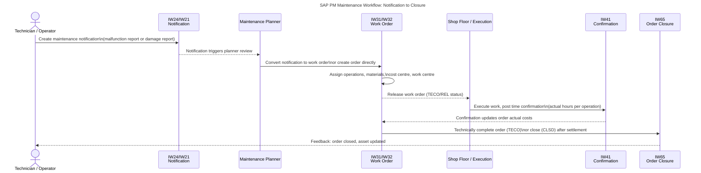

# SAP PM Interview Questions and Answers

SAP Plant Maintenance (PM) is the module that tracks and manages physical assets — machinery, equipment, functional locations — and the maintenance work orders that keep them running. PM consultants are expected to understand both the business process (from notification to completion) and the SAP configuration that implements it.

## The SAP PM Maintenance Workflow

Before answering individual questions, tracing the end-to-end workflow anchors the concepts. Every SAP PM implementation follows this sequence.

*Figure 1 — SAP PM maintenance workflow: 8 steps from technician notification to order closure. Notifications (IW24/IW21) feed planners; work orders (IW31/IW32) drive execution and cost capture; confirmations (IW41) close the loop; TECO/CLSD status triggers settlement to cost centre or asset.*

The diagram shows the standard corrective maintenance path. Preventive maintenance follows a similar order cycle but is triggered by a maintenance plan (IP10) rather than a technician notification.

## Master Data Questions

### What are the key master data objects in SAP PM?

| Object | Transaction | Purpose |
|---|---|---|
| Functional Location | IL01 | Logical position in plant hierarchy (building, floor, machine area) |
| Equipment | IE01 | Individual physical asset (pump, motor, conveyor) |
| Measuring Point | IK01 | Point on equipment where readings are taken (temperature, pressure) |
| Work Centre | IR01 | Team or resource that performs maintenance (mechanical team, electrical team) |
| Maintenance Plan | IP01 | Schedule for preventive maintenance tasks |
| Task List | IA01/IA05 | Standard operations for recurring maintenance types |

### What is the difference between a Functional Location and Equipment?

A **Functional Location** is a place in the plant — a position in the physical or logical hierarchy. It is permanent and location-specific: "Pump Station 2, Floor 3."

**Equipment** is an individual asset that can be installed at a Functional Location. Equipment can be moved: you can deinstall a pump from one location and install it at another, creating a full history of where the equipment has been.

When equipment is installed at a functional location, maintenance notifications and orders can be created against either object, but costs and history accumulate on the equipment master.

### What is a Measuring Document and when is it created?

A Measuring Document (transaction IK11) records a reading taken at a Measuring Point — such as a temperature reading from a sensor or an odometer reading from a vehicle. SAP PM uses measuring documents to:
- Track counter readings (kilometres, operating hours, cycles)
- Trigger maintenance plans based on counter thresholds rather than calendar dates
- Provide a history of equipment operating conditions

<KnowledgeCheck
  question="What is the key difference between a Functional Location and Equipment in SAP PM?"
  options={[
    "Functional Locations are for equipment installed outdoors; Equipment is for indoor assets",
    "Functional Locations are permanent positions in the plant hierarchy; Equipment is individual movable assets that can be installed and deinstalled at different Functional Locations",
    "Functional Locations store maintenance cost history; Equipment stores inspection records",
    "Functional Locations are created in MM; Equipment is created in PM"
  ]}
  correctIndex={1}
  explanation="A Functional Location is a permanent position in the plant hierarchy — it does not move. Equipment is an individual physical asset (pump, motor) that can be deinstalled from one Functional Location and reinstalled at another. Maintenance history, costs, and measuring documents accumulate on the Equipment master as it moves through Functional Locations."
/>

## Work Order Questions

### What is the difference between PM01, PM02, PM03, and PM04 order types?

SAP PM ships with default order types that can be configured:

| Order type | Name | Typical use |
|---|---|---|
| PM01 | Corrective maintenance | Reactive repair after a breakdown or malfunction |
| PM02 | Preventive maintenance | Scheduled inspection or service |
| PM03 | Refurbishment | Overhaul of a repairable spare for return to stock |
| PM04 | Investment measure | Maintenance work capitalised as an asset improvement |

Order types control which settlement rules, status profiles, and cost centre assignments are available. Projects with capital expenditure requirements use PM04 so costs flow to a WBS element rather than a cost centre. <CitationFootnote source="https://help.sap.com/docs/SAP_ERP/03b5af6c2e124b25a2e2b8e4b33f9c09/c3e5c45c2e4a4df0862fb4de8e3a3e6e.html">SAP Help — PM Maintenance Orders [3]</CitationFootnote>

### What is the difference between TECO and CLSD order status?

**TECO (Technically Complete)** means the physical work is done. The order can no longer have confirmations posted, but it is still open for financial settlement. Costs can still be settled to cost centres or assets. <CitationFootnote source="https://help.sap.com/docs/SAP_S4HANA_ON-PREMISE/5f2f8b1f44a64d7b8c699ac3f000cdb5/b07dea20c61447588080e24af24e9dc5.html">SAP Help — PM in S/4HANA [1]</CitationFootnote>

**CLSD (Closed)** means financial settlement is complete. The order is locked — no more confirmations, goods movements, or settlements. This is the terminal status.

The typical sequence: REL → TECO → CLSD (after month-end settlement).

### What is order settlement and how does it work in PM?

Settlement transfers costs from the work order (a cost collector) to a receiver object — typically a cost centre, a fixed asset, or a WBS element. Settlement runs at month-end via transaction KO88 (order-by-order) or KO8G (mass settlement).

If equipment is directly linked to a fixed asset in the Asset Accounting module, maintenance costs can be capitalised and depreciated over the asset's remaining life — connecting PM to FI-AA.

## Preventive Maintenance Questions

### What is a Maintenance Plan and what are the two cycle types?

A Maintenance Plan (IP01) defines the schedule for recurring maintenance. Two cycle types:

1. **Time-based** — triggers a work order every N days/weeks/months (e.g. every 90 days).
2. **Counter-based** — triggers a work order when a counter reaches a threshold (e.g. every 5,000 km or 500 operating hours).

Multi-cycle plans can combine both: "every 90 days or 5,000 km, whichever comes first."

### What is the transaction to schedule and start a maintenance plan?

- **IP10** — Schedule maintenance plan (generates maintenance calls)
- **IP30** — Deadline monitoring (background job that converts maintenance calls into work orders automatically)
- **IP19** — Maintenance plan overview / planning board

## Integration Questions

### How does SAP PM integrate with other modules?

| Module | Integration point |
|---|---|
| MM (Materials Management) | Work orders issue spare parts as goods issues; PM triggers purchase requisitions for parts not in stock |
| FI/CO (Finance) | Work order costs settle to cost centres (CO), assets (FI-AA), or WBS elements (PS); planned/actual cost comparison |
| PP (Production Planning) | Maintenance downtime can be recorded against production orders; PM work centres share capacity planning with PP |
| WM/EWM (Warehouse Management) | Spare parts storage, bin management, and goods movement integration |

### What is the role of Plant Maintenance in SAP S/4HANA vs ECC?

In S/4HANA, the PM module is rebranded as **Asset Management** [4] and tightly integrated with the SAP Asset Intelligence Network and IoT capabilities. Key differences:

- Linear asset management for pipelines, roads, and cable networks (not available in ECC)
- SAP Fiori apps replace classic transactions (IW21, IW31, IW41 → Fiori equivalents)
- Predictive maintenance via sensor data integration through SAP BTP [5] <CitationFootnote source="https://learning.sap.com/courses/exploring-business-processes-in-sap-s-4hana-asset-management">SAP Learning — S/4HANA Asset Management Business Processes [2]</CitationFootnote>

Core configuration (order types, status profiles, settlement rules) remains similar between ECC and S/4HANA.

<KnowledgeCheck
  question="In SAP PM, what is the correct order of work order statuses from creation to final closure?"
  options={[
    "CLSD → TECO → REL → OSNO",
    "OSNO → REL → TECO → CLSD",
    "REL → OSNO → CLSD → TECO",
    "TECO → REL → OSNO → CLSD"
  ]}
  correctIndex={1}
  explanation="SAP PM work orders follow the status sequence OSNO (Outstanding) → REL (Released, work can begin) → TECO (Technically Complete, physical work done, no more confirmations) → CLSD (Closed, financial settlement complete). CLSD is the terminal status. Month-end settlement via KO88 or KO8G must run before CLSD can be set. Candidates who can trace this sequence typically advance to the next interview round."
/>

<Callout type="info">
In SAP PM interviews, the notification-to-closure workflow is the most frequently tested area. Know the status sequence (OSNO → REL → TECO → CLSD), what each status allows and blocks, and why costs must settle before CLSD. Candidates who can trace a work order through all statuses with the correct transactions almost always advance to the next round.
</Callout>

## Key Transaction Codes Quick Reference

| Transaction | Purpose |
|---|---|
| IW21 | Create PM notification (general) |
| IW24 | Create malfunction report |
| IW31 | Create maintenance order |
| IW32 | Change maintenance order |
| IW33 | Display maintenance order |
| IW41 | Enter time confirmation |
| IW65 | Complete or close order |
| IP01 | Create maintenance plan |
| IP10 | Schedule maintenance plan |
| IP30 | Deadline monitoring |
| IE01 | Create equipment master |
| IL01 | Create functional location |
| IK01 | Create measuring point |

## Learn More

- [How SAP ABAP and ECC Process Every Enterprise Transaction](/blog/sap-abap-ecc) — understand the ABAP runtime behind every SAP transaction, including the PM transactions listed above.
- [All About SAP Courses](/blog/all-about-sap-course-overview-eligibility-duration-and-fee-structure) — SAP PM certification path, duration, and fee structure for training providers.
