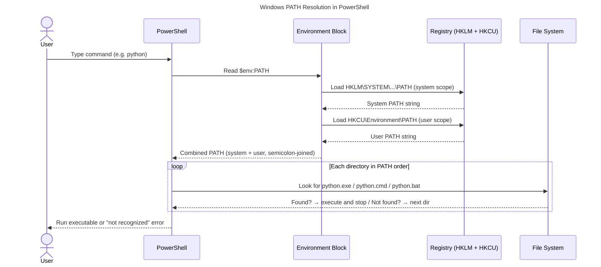

# Windows PATH and PowerShell: How Command Resolution Actually Works

When you type `python` in PowerShell and press Enter, Windows doesn't search your entire hard drive. It looks through a list of directories called PATH, in order, and runs the first executable it finds with that name. Understanding how PATH is structured — and how PowerShell reads and modifies it — eliminates a category of "command not found" errors that stump most Windows users.

## What Is PATH?

PATH is a Windows environment variable that holds a semicolon-separated list of directories. When you run a command without a full path, Windows searches each directory in the list left-to-right until it finds a matching `.exe`, `.cmd`, `.bat`, or `.ps1` file.

```
C:\Windows\System32;C:\Windows;C:\Program Files\Git\bin;C:\Users\You\AppData\Local\Microsoft\WindowsApps
```

PowerShell inherits PATH from two sources: the **system-wide** PATH (set in `HKLM` registry, applies to all users) and the **user-level** PATH (set in `HKCU` registry, applies to the current user). Windows merges them — user PATH is appended to system PATH — before exposing the combined result as `$env:PATH` inside your session.

## How Windows Resolves a PowerShell Command

The diagram below traces what happens when you type a command in PowerShell.



*Figure 1 — Windows PATH resolution sequence in PowerShell. System PATH loads first from the HKLM registry hive; user PATH loads from HKCU and is appended. PowerShell searches each directory in the merged list in order. The first match wins.*

**Key behaviour**: the session's `$env:PATH` is a snapshot taken when the PowerShell process started. Changes you make in another session (including via System Properties) are not visible until you open a new PowerShell window — unless you reload the variable explicitly.

## How to View Your Current PATH

```powershell
# View the combined PATH (system + user merged)
$env:PATH -split ';'

# View system PATH only
[Environment]::GetEnvironmentVariable('PATH', 'Machine')

# View user PATH only
[Environment]::GetEnvironmentVariable('PATH', 'User')
```

The `-split ';'` converts the semicolon-delimited string into an array, making it easier to read and search.

## Adding a Directory to PATH

### Temporary (current session only)

```powershell
$env:PATH += ";C:\MyTools"
```

This modifies the in-memory environment block for the current PowerShell process. It is lost when the session closes.

### Permanent (user scope, persists across sessions)

```powershell
$current = [Environment]::GetEnvironmentVariable('PATH', 'User')
[Environment]::SetEnvironmentVariable('PATH', "$current;C:\MyTools", 'User')
```

Changes at user scope write to `HKCU\Environment`. Windows broadcasts a `WM_SETTINGCHANGE` message so open applications can reload; PowerShell sessions that are already running will NOT automatically pick up the change. Open a new window to see it.

### Permanent (system scope, requires admin)

```powershell
# Run PowerShell as Administrator
$current = [Environment]::GetEnvironmentVariable('PATH', 'Machine')
[Environment]::SetEnvironmentVariable('PATH', "$current;C:\SharedTools", 'Machine')
```

System scope writes to `HKLM\SYSTEM\CurrentControlSet\Control\Session Manager\Environment`. This affects all users on the machine.

## Diagnosing PATH Problems

**Problem: `python` is not recognised**
```powershell
# Find where python.exe is hiding
Get-Command python -ErrorAction SilentlyContinue
# Check if it's in PATH at all
$env:PATH -split ';' | Where-Object { Test-Path "$_\python.exe" }
```

**Problem: wrong version of a tool is running**
```powershell
# See which python.exe wins the PATH race
Get-Command python | Select-Object -ExpandProperty Source
```

**Problem: a PATH change isn't visible in the current session**
```powershell
# Reload user PATH into current session without restarting
$env:PATH = [Environment]::GetEnvironmentVariable('PATH','Machine') + ';' +
            [Environment]::GetEnvironmentVariable('PATH','User')
```

**Problem: PATH is too long** (Windows has a 2048-character limit for user PATH in some tools)
```powershell
$env:PATH.Length
# If > 2000, audit and remove stale directories
$env:PATH -split ';' | Where-Object { -not (Test-Path $_) }
```

## Environment Variable Scopes at a Glance

| Scope | Registry hive | Who can modify | When effective |
|---|---|---|---|
| Process | In-memory only | Current process | Immediately, current session |
| User | `HKCU\Environment` | Current user | New sessions |
| Machine (system) | `HKLM\SYSTEM\...\Environment` | Administrators | New sessions (all users) |

<Callout type="info">
PowerShell 7+ on Windows reads PATH the same way as Windows PowerShell 5.1. The `[Environment]::SetEnvironmentVariable` .NET method works identically in both. If you use `winget` or `scoop` to install tools, they typically update the user PATH automatically — but you still need a new PowerShell window to see the change.
</Callout>

## Learn More

- [Claude Tool Use From Zero](/learn/claude-tool-use-from-zero) — build automation agents that run PowerShell commands via tool use.
- [Secure Coding With Claude](/learn/secure-coding-with-claude) — best practices for safe scripting, including environment variable handling.
