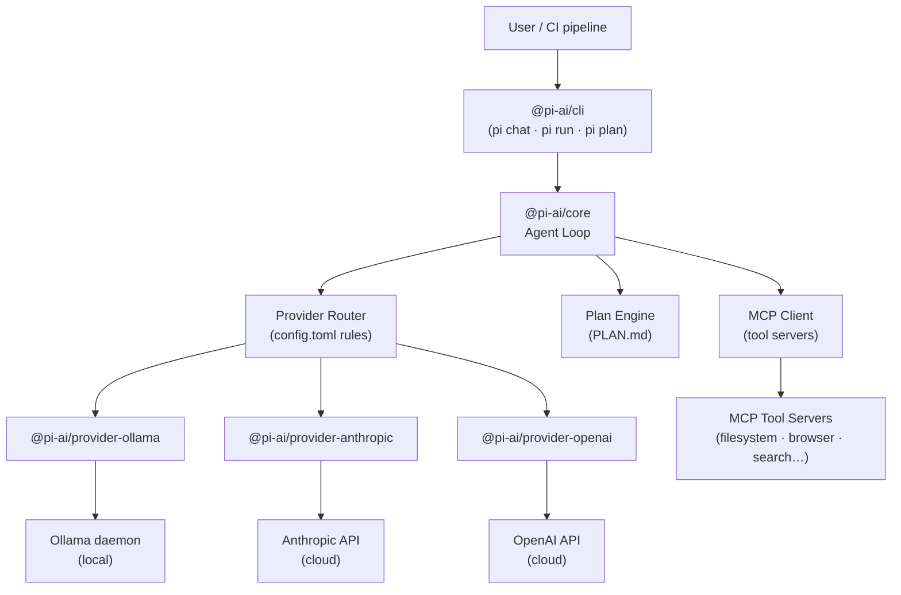
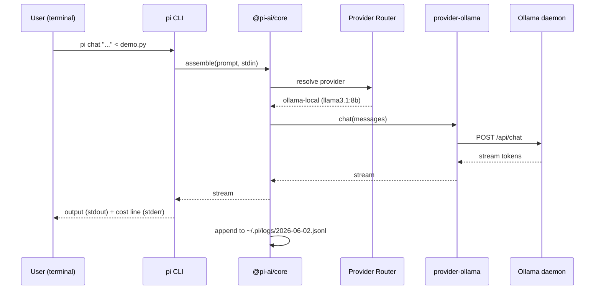

# Chapter 1: What Is Pi Agent + Why It Matters

> **Chapter 1 of 4 · 90 min (30 min reading + 60 min hands-on)**

Pi agent is a provider-agnostic, open-source AI coding agent that routes tasks across local models, Anthropic Claude, and OpenAI from a single CLI and a single config file. Install it with `npm install -g @pi-ai/cli`, point it at one or more providers in `~/.pi/config.toml`, and run `pi chat` to start. Pi owns the agent loop; you choose the model — and you can change that choice per session, per task, or based on an auto-escalation budget rule.

This chapter covers what Pi is, why it exists, how its architecture works, and how to get from a blank terminal to a running first task in under 30 minutes.

---

## 1.1 The Problem: Model Fragmentation in 2026

If you have been using AI coding tools for more than six months, you have probably accumulated a small graveyard of configuration files. `.cursorrules`. `AGENTS.md`. `CLAUDE.md`. A `codex.toml` somewhere. An `.aider.conf.yml` you forgot about.

Each tool has its own:

- **Context model** — how it understands your project (file-tree reading, embeddings, explicit pinning)
- **Config format** — TOML, YAML, JSON, bespoke markdown headers
- **CLI surface** — `claude`, `codex`, `aider`, `cursor`, each with different flags
- **Billing dashboard** — separate API keys, separate spend alerts, separate monthly invoices

When your team decides to add a local-model option for sensitive code, you add a fourth tool. When you need GPT-5.5 for a long-context reasoning task, you context-switch to a fifth interface. The cognitive overhead compounds quickly, and the operational overhead — keeping configs in sync across team members, managing API key rotation, auditing which tool spent what — becomes a real maintenance burden.

**Pi's answer:** a single agent loop with a swappable provider layer underneath. You write one config file, use one CLI, and Pi routes each invocation to the right model based on your rules.

---

## 1.2 What Pi Agent Is

Pi (short for **P**rovider-agnostic **I**ntelligence) is an MIT-licensed TypeScript project published under the `@pi-ai` npm namespace. The three core packages are:

| Package | Role |
|---|---|
| `@pi-ai/cli` | Terminal interface — `pi chat`, `pi run`, `pi plan`, `pi cost` |
| `@pi-ai/core` | Agent loop — turn management, tool dispatch, plan engine, cost tracking |
| `@pi-ai/provider-*` | Adapter plugins — one package per provider family (ollama, anthropic, openai) |

Pi is **not** a wrapper around a single model's API. It implements its own agent loop that manages multi-turn context, tool invocations, and plan-mode execution independently of the underlying model. The provider adapters translate Pi's internal message format to each provider's wire protocol.

### What Pi is not

- It is not an IDE extension. Pi is terminal-first; IDE integrations exist as community plugins but are not part of the core project.
- It is not a model. Pi does not run inference; it delegates entirely to providers.
- It is not a replacement for Claude Code or Codex CLI on their home turf. Pi is designed to interop with both, not displace them. (Chapter 3 covers the handoff pattern in detail.)

---

## 1.3 Architecture Overview



The key design insight is that the **agent loop and the provider are decoupled**. When you change `provider = "anthropic"` to `provider = "ollama"` in your config, Pi's turn management, plan generation, cost tracking, and MCP tool wiring all continue to work exactly the same way. Only the inference endpoint changes.

### The agent loop

Pi's core loop runs like this on every `pi chat` or `pi run` invocation:

1. **Config load** — read `~/.pi/config.toml` (global) merged with `./.pi.toml` (project-local)
2. **Provider resolution** — select the active provider based on config rules and any `--provider` flag
3. **Context assembly** — collect stdin, file arguments, and any active MCP tool manifests
4. **Turn execution** — send the assembled context to the provider; process tool-call responses if the model requests them
5. **Output** — stream the final response to stdout; append to the session log

In plan-mode (`pi plan`), step 4 is split into two sub-steps: the model first generates a `PLAN.md` file, which Pi displays for confirmation before executing each step.

### The provider router

The router reads a priority-ordered list of provider blocks from config. Each block can have:

- A `budget_usd` ceiling — if the session crosses this threshold, Pi refuses to route to this provider
- A `match` field — a glob or task-type filter that limits which invocations go to this provider
- A `fallback` field — the provider to use when this one is unavailable or over-budget

This is the mechanism behind the hybrid workflows in Chapter 4: you configure local models as primary with a low budget ceiling, and frontier models as fallback with a higher (but still bounded) ceiling.

---

## 1.4 Why Pi Matters Right Now

Three trends converged in 2025–2026 to make Pi's design relevant:

**1. Local models crossed the quality threshold for everyday coding tasks.** Llama 3.1:8b handles boilerplate generation, test scaffolding, and single-function refactors with quality comparable to frontier models from 18 months ago. Qwen 3.6:14b covers more complex reasoning tasks. DeepSeek V4:14b adds strong multilingual code support. For a large fraction of daily coding work, local inference is sufficient — and costs nothing per token.

**2. Frontier model pricing diverged sharply.** The gap between a capable local model (zero marginal cost) and a frontier reasoning model (several dollars per million tokens) widened as context windows grew. Teams that previously used a single frontier model for everything started building routing logic — but building it themselves, in ad hoc scripts, without a consistent interface.

**3. MCP standardised the tool layer.** The Model Context Protocol, standardised in late 2024 and widely adopted through 2025, means that tool servers — filesystem access, browser automation, web search — can be wired to any MCP-capable client without provider-specific integration work. Pi implements an MCP client natively, so the same tool servers you use with Claude Code work unchanged when you route through Pi.

Pi's contribution is to package the routing logic, the MCP client, the plan engine, and the cost tracking into a single auditable, open-source tool, rather than leaving each team to re-implement it.

---

## 1.5 Installing Pi Agent

### Prerequisites

- **Node.js 20 LTS or later.** Check with `node --version`. If you need to install or upgrade:

```bash
# Using nvm (recommended)
nvm install 20
nvm use 20
nvm alias default 20

# Verify
node --version   # should print v20.x.x or higher
npm --version    # should print 10.x.x or higher
```

- **Ollama** (for local models, covered fully in Chapter 2). For this chapter's exercise, install it now so it is ready:

```bash
# macOS (Homebrew)
brew install ollama

# Linux (official install script)
curl -fsSL https://ollama.com/install.sh | sh

# Verify
ollama --version
```

### Installing Pi

```bash
npm install -g @pi-ai/cli
```

The install pulls three packages: `@pi-ai/cli`, `@pi-ai/core`, and `@pi-ai/provider-ollama` (included by default as the local-first provider). Anthropic and OpenAI adapters are installed lazily when you first configure those providers.

Verify the install:

```bash
pi --version
# Pi agent v0.9.x (core v0.9.x, cli v0.9.x)
```

### macOS Homebrew tap (alternative)

If you prefer Homebrew over npm globals:

```bash
brew tap pi-agent/tap
brew install pi-agent

pi --version
```

The Homebrew formula bundles a pinned Node runtime, so you do not need Node installed separately for this path. The npm path is recommended if you already have Node 20+ — it keeps Pi on the same runtime as your project tooling.

---

## 1.6 Initial Configuration

Pi looks for configuration in two places, merged in this order (project-local wins):

1. `~/.pi/config.toml` — global defaults, API keys, provider list
2. `./.pi.toml` — project-local overrides (commit this file to set project-level defaults for your team)

Create the global config:

```bash
mkdir -p ~/.pi
touch ~/.pi/config.toml
```

The minimal working config for a local-only setup:

```toml
# ~/.pi/config.toml

[defaults]
provider = "ollama-local"   # which provider block to use by default
log_dir  = "~/.pi/logs"    # session logs (append-only JSONL)
plan_dir = "."              # where PLAN.md is written in plan-mode

[[providers]]
name        = "ollama-local"
type        = "ollama"
base_url    = "http://127.0.0.1:11434"
model       = "llama3.1:8b"
timeout_sec = 120

# Optional: budget ceiling for this provider (no ceiling = no local limit)
# budget_usd = 0.00   # local models cost $0, so this is informational only
```

If you want to add an Anthropic provider now (you will configure it fully in Chapter 3):

```toml
[[providers]]
name    = "claude-sonnet"
type    = "anthropic"
model   = "claude-sonnet-4-6"
# api_key = "sk-ant-..."  ← set via environment variable instead:
# export ANTHROPIC_API_KEY=sk-ant-...
```

> **Never put API keys in config.toml.** Pi reads `ANTHROPIC_API_KEY` and `OPENAI_API_KEY` from the environment automatically. If you put a key in the file, it will end up in version control when you commit `.pi.toml`.

Pull the model you will use in the exercise:

```bash
ollama pull llama3.1:8b
# Pulls ~4.7 GB; takes 2–5 minutes on a typical connection
```

Verify Ollama is serving:

```bash
ollama list
# NAME            ID              SIZE    MODIFIED
# llama3.1:8b     ...             4.7 GB  ...
```

---

## 1.7 First Run: `pi chat`

The `pi chat` command opens an interactive session (or runs one turn if you pipe input). Let's start with a piped one-shot to verify the stack end-to-end:

```bash
# Create a small Python file to explain
cat > /tmp/demo.py << 'EOF'
def merge_sorted(a, b):
    result, i, j = [], 0, 0
    while i < len(a) and j < len(b):
        if a[i] <= b[j]:
            result.append(a[i]); i += 1
        else:
            result.append(b[j]); j += 1
    return result + a[i:] + b[j:]
EOF

# Pipe it into pi chat with a question
pi chat "Explain what this function does and identify its time complexity" < /tmp/demo.py
```

You should see Pi emit a streaming response from `llama3.1:8b`. The first token typically appears within 1–3 seconds on modern hardware.

### What Pi printed to stderr

Pi writes a one-line status header to stderr (not stdout, so it does not pollute piped output):

```
[pi] provider=ollama-local model=llama3.1:8b tokens=in:247 out:312 cost=$0.00
```

This is the cost log line. Every invocation appends an equivalent JSON record to `~/.pi/logs/<YYYY-MM-DD>.jsonl`. The `pi cost` command reads these logs:

```bash
pi cost --today
# Provider        Invocations  Tokens In   Tokens Out  Cost USD
# ollama-local    1            247         312         $0.00
# ─────────────────────────────────────────────────────────────
# Total                                                $0.00
```

For local models, cost is always `$0.00` — but the token counters are still tracked, which matters when you add frontier providers and want to see where spend concentrates.

### Sequence diagram: what just happened



---

## 1.8 Interactive Mode

For longer conversations, drop the input pipe and start an interactive session:

```bash
pi chat
```

Pi opens a REPL with readline support. Type your message and press Enter; Pi streams the response. Use `/exit` or Ctrl-D to end the session.

Useful flags you will reach for immediately:

| Flag | Effect |
|---|---|
| `--provider <name>` | Override the default provider for this session |
| `--model <id>` | Override the model within the provider (must be compatible) |
| `--no-log` | Skip appending to the session log |
| `--plan` | Start in plan-mode (generates PLAN.md before acting) |
| `--context <file>` | Add a file to the context without piping it via stdin |

Example: switch to Claude for this one session without changing config:

```bash
pi chat --provider claude-sonnet
```

---

## 1.9 Project-Local Config

For team setups, commit a `.pi.toml` at the repo root so every team member gets the same provider defaults and model aliases:

```toml
# .pi.toml — commit this file

[defaults]
provider = "ollama-local"

[context]
# Files Pi always adds to context for every invocation in this project
always_include = ["CLAUDE.md", "AGENTS.md", ".cursorrules"]

[[providers]]
name  = "ollama-local"
type  = "ollama"
model = "qwen3.6:14b"   # larger model for this project's complexity

# Team members who have an Anthropic key can override locally:
# export ANTHROPIC_API_KEY=sk-ant-...
# and add a [[providers]] block to their ~/.pi/config.toml
```

The merge order means a team member's `~/.pi/config.toml` can add personal API-key providers, while the project `.pi.toml` sets the shared defaults. The project file should never contain API keys.

---

## 1.10 Hands-On Exercise

**Goal:** Install Pi, configure the ollama provider, and run three verification commands.

**Time-box:** 60 minutes. If Ollama pull is slow on your connection, substitute `llama3.1:8b` with a smaller model: `ollama pull tinyllama` (~637 MB).

**Step 1 — Install Pi and verify**

```bash
npm install -g @pi-ai/cli
pi --version
```

Expected: version string printed, no errors.

**Step 2 — Install Ollama and pull llama3.1:8b**

```bash
# macOS
brew install ollama && ollama serve &

# Then pull
ollama pull llama3.1:8b
ollama list   # confirm the model appears
```

**Step 3 — Write `~/.pi/config.toml`**

Use the minimal config from section 1.6. Confirm it loads cleanly:

```bash
pi config check
# ✓ Loaded ~/.pi/config.toml
# ✓ Provider "ollama-local" — ollama @ http://127.0.0.1:11434 (llama3.1:8b)
# ✓ No syntax errors
```

**Step 4 — First one-shot**

```bash
echo "def fib(n): return n if n < 2 else fib(n-1) + fib(n-2)" | \
  pi chat "What is the time complexity of this function and why?"
```

Expected: a streaming response explaining O(2^n) exponential time complexity. Pi prints cost line to stderr: `cost=$0.00`.

**Step 5 — Check the cost log**

```bash
pi cost --today
```

Expected: one row for `ollama-local` with 1 invocation, `$0.00`.

**Success criteria:** You see a coherent response from the local model and `pi cost` shows the invocation logged. If you see an error, check that `ollama serve` is running (`curl http://127.0.0.1:11434/api/tags`) and that the model name in `config.toml` exactly matches the output of `ollama list`.

---

## Summary

Pi agent is a provider-agnostic coding agent that decouples the agent loop from the inference provider. You install it once, configure one `config.toml`, and get a consistent CLI surface (`pi chat`, `pi run`, `pi plan`, `pi cost`) regardless of whether you are routing to a local Ollama model, Claude, or GPT-5.5.

The core value is not any single integration — it is the unified operational model: one config, one cost log, one plan format, one tool-server wiring. That consistency is what makes the hybrid workflows in Chapters 2–4 practical rather than theoretical.

**Next:** Chapter 2 dives into the local model layer — how to pull and configure Llama 3.1, Qwen 3.6, and DeepSeek V4 in Ollama, how to choose between them per workload type, and how to use Pi's plan-mode to generate auditable PLAN.md files from a local model before any code is written.
