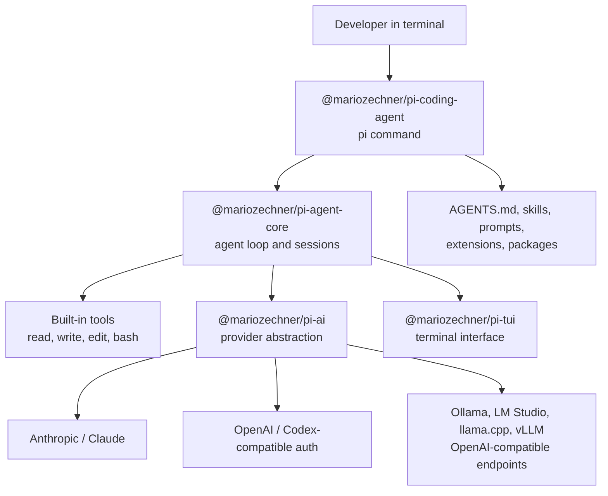

# Chapter 1: What Pi Is and How to Start Safely

> **Chapter 1 of 4 - 90 min (30 min reading + 60 min hands-on)**

Pi is a minimal terminal coding agent for developers who want a small, extensible harness instead of a large opinionated framework. Install the current package with `npm install -g --ignore-scripts @mariozechner/pi-coding-agent`, start it with `pi`, authenticate through `/login` or an API key, and configure JSON files under `~/.pi/agent/`.

This chapter gets the product surface right before you touch a real repository. Pi is not configured with TOML provider blocks, it does not launch through a chat subcommand, and it does not have a dedicated plan subcommand. It is an interactive terminal agent with slash commands, JSON settings, file-backed instructions, sessions, and an extension system.

---

## 1.1 Why Pi Exists

Most coding-agent tools make strong product choices for you: which model family to use, which permissions UI to trust, which planning workflow to follow, which tools appear in every prompt, and how much abstraction sits between the developer and the model.

Pi takes the opposite posture. Its core is intentionally small. By default, the model gets four practical tools:

| Tool | Purpose |
|---|---|
| `read` | Read files and directories |
| `write` | Create or overwrite files |
| `edit` | Patch existing files |
| `bash` | Run shell commands |

Everything else is layered on top only when you need it: project instructions, skills, prompt templates, TypeScript extensions, installable Pi packages, or community adapters. This is why Pi appeals to developers who want a composable harness rather than a full IDE-like assistant.

The tradeoff is clear: Pi gives you control, but it expects you to understand your setup. A good Pi workflow starts with accurate installation, explicit provider auth, clear project instructions, and a versioned rollback habit such as Git.

---

## 1.2 What Pi Is

Pi is an open-source terminal coding agent. The current home is the `badlogic/pi` GitHub repository, and the current npm scope is `@mariozechner`.

| Package | Role |
|---|---|
| `@mariozechner/pi-coding-agent` | Interactive CLI installed by users; provides the `pi` command |
| `@mariozechner/pi-agent-core` | Agent runtime with tool calling, state management, sessions, and compaction |
| `@mariozechner/pi-ai` | Multi-provider LLM API layer for Anthropic, OpenAI, Google, local OpenAI-compatible endpoints, and others |
| `@mariozechner/pi-tui` | Terminal UI layer |

If you encounter a different package scope in older drafts or notes, treat it as stale for this course revision. For a new install, use the `@mariozechner` package.

Do not use the stale draft's nonexistent package namespace. The real Pi Coding Agent packages are under `@mariozechner`.

---

## 1.3 Architecture Overview



Notice what is not in the core diagram: native MCP, built-in sub-agents, a built-in todo system, or a special plan mode. Pi can be extended in those directions, but the base agent stays small.

The most important configuration files are JSON:

| Path | Purpose |
|---|---|
| `~/.pi/agent/settings.json` | Global settings such as default provider, model, thinking level, UI, project trust, and resource paths |
| `.pi/settings.json` | Project-local settings that override global settings after project trust |
| `~/.pi/agent/models.json` | Custom providers and models, especially local OpenAI-compatible endpoints |
| `~/.pi/agent/auth.json` | Stored credentials from `/login` |
| `~/.pi/agent/AGENTS.md` | Global instructions |
| `AGENTS.md` or `CLAUDE.md` | Project instructions loaded from parent directories and the current directory |

There is no global TOML config contract in the current Pi docs.

---

## 1.4 Installation

Install Pi from npm:

```bash
npm install -g --ignore-scripts @mariozechner/pi-coding-agent
```

The `--ignore-scripts` flag is recommended by the current quickstart because Pi does not need dependency lifecycle scripts for a normal install.

Then start Pi from the project directory you want it to work in:

```bash
cd /path/to/project
pi
```

If you already have an older Pi install, update through Pi's update path or uninstall it and install `@mariozechner/pi-coding-agent`. The CLI command remains `pi`, and existing settings and sessions remain under `~/.pi/agent/`.

---

## 1.5 Authenticate a Provider

Pi can authenticate providers in two common ways.

### Option A: `/login`

Start Pi and run:

```text
/login
```

Then choose a subscription-backed provider or an API-key provider. Current Pi docs list subscription flows for Claude Pro/Max and Cursor (the Cursor path requires `pi install npm:pi-cursor-sdk` first). Credentials are stored in `~/.pi/agent/auth.json`.

Important caveat for Claude: current Pi docs say Claude Pro/Max subscription auth is active, but third-party harness usage can draw from extra usage and be billed per token instead of counting against normal plan limits. If billing predictability matters, use an Anthropic API key and verify the current provider docs before recording a lesson.

### Option B: Environment variable

Set a provider API key before launching Pi:

```bash
export ANTHROPIC_API_KEY=sk-ant-...
pi
```

Other providers use their own variables, such as `OPENAI_API_KEY`, `GEMINI_API_KEY`, `DEEPSEEK_API_KEY`, `OPENROUTER_API_KEY`, or `MISTRAL_API_KEY`. Pi also supports local OpenAI-compatible endpoints through `models.json`, which Chapter 2 covers.

---

## 1.6 First Session

Once Pi starts, type a request and press Enter:

```text
Summarize this repository and tell me how to run its checks.
```

Pi runs in the current working directory. It can read files, edit files, write files, and run shell commands. Treat it like a powerful local development tool, not a chatbot in a sandbox. Start in a practice repository, keep Git clean, and review diffs.

You can also run one-shot prompts without opening the full interactive TUI:

```bash
pi -p "Summarize this codebase"
cat README.md | pi -p "Summarize this text"
pi @README.md "Extract the setup steps from this file"
```

These replace the stale chat-subcommand examples. The command is `pi`; non-interactive output uses `-p`.

---

## 1.7 Project Instructions

Add an `AGENTS.md` file to the project root:

```markdown
# Project Instructions

- Run `npm test` after code changes.
- Do not run production migrations locally.
- Keep edits scoped to the requested task.
- Explain any command that modifies files outside the repository.
```

Pi loads global instructions from `~/.pi/agent/AGENTS.md` and project instructions from `AGENTS.md` or `CLAUDE.md` files in parent directories and the current directory. Restart Pi or run `/reload` after changing instruction files.

This is the right place to define local guardrails. Pi's default posture is powerful and direct; it does not rely on permission popups as a substitute for project discipline.

---

## 1.8 Core Commands to Know

Pi's in-session controls are slash commands and keyboard shortcuts, not separate chat, run, plan, or cost subcommands.

| Command or shortcut | Use |
|---|---|
| `/login` | Add, change, or remove provider credentials |
| `/model` or Ctrl+L | Select a model |
| Shift+Tab | Cycle thinking level |
| `/session` | Inspect session stats |
| `/compact` | Summarize old messages to free context |
| `/resume` | Resume a prior session |
| `/tree` | View session branches |
| `/fork` | Branch the current session |
| `/new` | Start a fresh session |
| `/reload` | Reload instructions, extensions, and resources |

For planning, ask Pi to write or revise a file:

```text
Create a PLAN.md for this migration. Keep it in three phases and include verification commands.
```

That is a normal file-backed workflow, not a dedicated built-in plan mode.

---

## 1.9 MCP and Extensions

Pi does not support MCP natively. That is a deliberate product choice: loading large MCP tool manifests into every session can waste context before the agent has done useful work.

Pi's preferred extension path is:

- Use `AGENTS.md` for project behavior
- Use skills for reusable playbooks
- Use prompt templates for repeated prompts
- Use TypeScript extensions for new tools, commands, hooks, or UI changes
- Install Pi packages when a shared extension solves a specific problem

If your organization already depends on MCP servers, evaluate the community `pi-mcp-adapter` package as an interoperability bridge. Treat it as an optional extension with context and security tradeoffs, not as a native Pi feature.

---

## 1.10 Hands-On Exercise

**Goal:** Install Pi, authenticate one provider, add project instructions, and run a first repository-safe task.

**Time-box:** 60 minutes.

### Step 1 - Install Pi

```bash
npm install -g --ignore-scripts @mariozechner/pi-coding-agent
pi --version
```

Expected: Pi prints a version string and exits without errors.

### Step 2 - Start in a safe repository

```bash
mkdir -p ~/pi-practice
cd ~/pi-practice
git init
printf '# Pi practice\n\n' > README.md
git add README.md
git commit -m "Initial practice repo"
pi
```

If you are using a real repository, start with a clean working tree so you can inspect every change Pi makes.

### Step 3 - Authenticate

Inside Pi:

```text
/login
```

Choose a provider you can actually use. If you prefer API-key auth, exit Pi, export a key, and start again:

```bash
export ANTHROPIC_API_KEY=sk-ant-...
pi
```

### Step 4 - Add instructions

Create `AGENTS.md`:

```markdown
# Project Instructions

- This is a practice repository.
- Before editing files, explain the intended change.
- After editing files, run `git diff -- README.md`.
- Do not install dependencies.
```

Restart Pi or run:

```text
/reload
```

### Step 5 - Run a first task

Ask:

```text
Read README.md, propose a two-section outline for documenting this practice repository, then apply it.
```

After Pi finishes, inspect:

```bash
git diff -- README.md
```

### Step 6 - Locate the real config files

Check the Pi home directory:

```bash
ls ~/.pi/agent
```

You should see files and folders such as `settings.json`, `auth.json`, sessions, skills, extensions, or package resources depending on what you configured. You should not be looking for a global TOML config file.

**Success criteria:** You installed the current package, launched `pi`, authenticated a provider, added project instructions, completed a small task, and found the JSON-backed Pi configuration directory.

---

## Summary

Pi is a minimal, extensible terminal coding agent. The current install package is `@mariozechner/pi-coding-agent`, the CLI command is `pi`, configuration lives in JSON files under `~/.pi/agent/`, and the first controls to learn are `/login`, `/model`, `/session`, `/compact`, `/resume`, `/tree`, `/fork`, `/new`, and `/reload`.

The important negative facts are just as useful: the stale draft's package namespace, TOML setup, chat subcommand, plan subcommand, and native-MCP claims were wrong. When you need planning, write a `PLAN.md`. When you need tools beyond read/write/edit/bash, reach for skills, prompt templates, TypeScript extensions, packages, or a carefully reviewed community adapter.

**Next:** Chapter 2 configures local models through `~/.pi/agent/models.json`, using OpenAI-compatible endpoints such as Ollama, LM Studio, llama.cpp, or vLLM.
